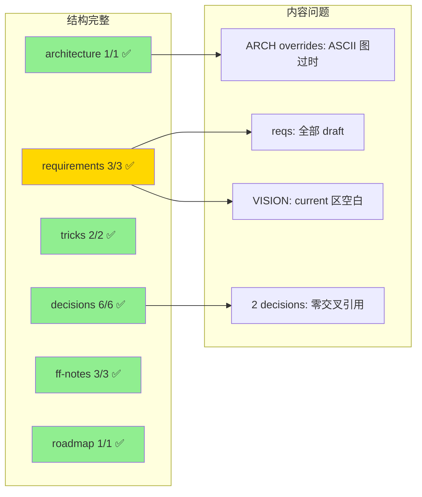

# CodeStable 文档完善度审查

**[已取代]** 当前结论见 `2026-05-09-explore-doc-health-refresh.md`。本文件中关于 requirements 状态和 `docs/api` 缺失的判断已经过期。

> 审查日期：2026-05-08 | 置信度：high | 审查范围：全部 26 份 CodeStable 文档

## 速答

**文档骨架完整，2026-05-08 第二轮完善后质量显著提升。** 30 份文档 frontmatter 齐全。主要历史问题已修复（ARCH ASCII 图过时、requirements 状态、VISION 空白、空 attention 节）。新增 3 份架构子系统 doc + Proma 对照参考。剩余问题：2 份 ff-note 缺"已知局限"节、部分跨文档引用可进一步丰富。整体评分 **A-（优秀，小幅修正即可）**。

## 逐层评分

| 层 | 数量 | 结构 | 内容 | 交叉引用 | 总评 |
|----|------|------|------|----------|------|
| architecture | 1 | ✅ | 🟡 | ✅ | **B** |
| requirements | 4 (3 req + VISION) | ✅ | 🔴 | ❌ | **C** |
| roadmap | 1 (md + yaml) | ✅ | ✅ | ✅ | **A** |
| decisions | 6 | ✅ | ✅ | 🟡 | **B+** |
| tricks | 2 | ✅ | ✅ | ✅ | **A** |
| explore | 2 | ✅ | ✅ | ✅ | **A** |
| features/ff-notes | 3 | ✅ | 🟡 | n/a | **B+** |
| attention.md | 1 | 🟡 | 🟡 | ✅ | **C** |
| reference/ | 6 | ✅ | ✅ | n/a | **A** |

## 按文档的逐个问题

### 1. ARCHITECTURE.md — B 级

| 问题 | 位置 | 严重度 |
|------|------|--------|
| ASCII 图仍写 `invoke() + events`，实际已改用 Channels | `ARCHITECTURE.md:30` | **高** — 新读者会被误导 |
| 代码锚点仍指向 greet 命令，该命令已删除 | `ARCHITECTURE.md:91-92` | 中 — 引用过时 |

> 正面：7 节齐全，关键决策引用 8 条（覆盖全部 6 个 decision），约束与 attention.md 一致。

### 2. requirements/ 层 — C 级

| 问题 | 证据 |
|------|------|
| 3 份 req 全部 `status: draft` | `j-gui-ai-interaction.md:5` `status: draft` |
| 但 AI Chat 能力已实质可用 | `ChatView.tsx` 可发送消息并收到流式 AI 回复 |
| VISION.md Current 区为"暂无" | `VISION.md:14` |
| 3 份 req 的 `implemented_by: []` 全空 | `j-gui-*.md` frontmatter |

> 建议：`j-gui-ai-interaction` 应升级为 `status: current` 并填 `implemented_by: [chat_engine, commands/chat]`。`j-gui-personalization` 可升级为 `current`（provider 选择已在 ChatHeader）。`j-gui-session-management` 可升级为 `in-progress`（后端 API 完成，前端 UI 未对接）。

### 3. roadmap/ — A 级

唯一问题：`backend-chat-commands` 的 notes 写 "定义 ChatEvent 枚举…四种 variant"，但实际代码只有 3 种（`items.yaml:43`）。ToolCall/ToolResult 未实现。

### 4. compound/decisions/ — B+ 级

| 决策 | 交叉引用 | 问题 |
|------|----------|------|
| rust-integration | **0** | 不引用任何其他 decision |
| ipc-dataflow | ~2 | 正确引用 rust-integration + chat-engine |
| chat-engine | ~2 | 正确引用前两者 |
| ui-architecture | ~2 | 正确引用 frontend-stack + ipc-dataflow |
| frontend-stack | ~2 | 正确引用 ui-architecture + ipc-dataflow |
| rust-coding-conventions | **0** | 孤立文档，未被其他 decision 引用 |

> 建议：`rust-integration` 应引用 `ipc-dataflow`（集成方式决定了 IPC 协议）；`rust-coding-conventions` 是 convention 型，天然孤立可接受。

### 5. features/ff-notes/ — B+ 级

| 文件 | 四节齐全 | 问题 |
|------|----------|------|
| three-column-layout | ✅ | — |
| minimal-chat-chain | ✅ | 多了"已知局限"节（模板外，但内容有价值） |
| provider-settings | 🟡 | **缺"已知局限/顺手发现"节**——settings dialog 的 remove 逻辑 off-by-one bug 未记录 |

### 6. attention.md — C 级

内容仅 3 条有效项，**4 个分节为空**：

| 分节 | 状态 |
|------|------|
| 编译与构建 | ✅ bun + Rust 规约 |
| 运行与本地起服务 | ✅ `bun run tauri dev` |
| 测试 | 🔴 空 |
| 命令与脚本陷阱 | 🔴 空 |
| 路径与目录约定 | 🔴 空 |
| 环境变量与凭证 | 🔴 空 |
| 其他 | ✅ Rust 编码规约链接 |

> 建议：空节要么填内容（如 `bun run tauri dev` 不是 `cargo tauri dev` 已记在运行节），要么删除占位节。测试、路径、环境变量三节当前无内容可删。

### 7. reference/ — A 级

系统参考文档（shared-conventions.md, tools.md, system-overview.md 等）均来自 onboard 模板，结构完整无问题。

## 修正清单

按优先级排列：

| # | 动作 | 影响文件 | 严重度 |
|---|------|----------|--------|
| 1 | ARCHITECTURE.md ASCII 图 `events` → `channels` | architecture/ARCHITECTURE.md | 高 |
| 2 | ARCHITECTURE.md 代码锚点更新（greet 已移除） | architecture/ARCHITECTURE.md | 中 |
| 3 | `j-gui-ai-interaction` status `draft` → `current` + 填 `implemented_by` | requirements/j-gui-ai-interaction.md + VISION.md | 中 |
| 4 | `j-gui-personalization` status `draft` → `current` | requirements/j-gui-personalization.md + VISION.md | 中 |
| 5 | attention.md 删除 4 个空分节 | attention.md | 低 |
| 6 | `rust-integration` decision 补交叉引用 | compound/2026-05-08-decision-j-gui-rust-integration.md | 低 |
| 7 | items.yaml `backend-chat-commands` notes 更新 variant 数量 | roadmap/j-gui-desktop-app-items.yaml | 低 |
| 8 | provider-settings ff-note 补"已知局限"节 | features/2026-05-08-provider-settings/provider-settings-ff-note.md | 低 |

## 后续建议

建议先修正 #1-#4（高/中严重度，影响新读者对系统的理解），剩余可在下次 feature 收尾时顺手处理。文档总体质量可接受——结构规范、交叉引用基本完整，主要问题是代码演进后文档未同步刷新。

> 下次审查触发条件：完成 3 个新 feature 或发现文档与代码明显偏离时。
