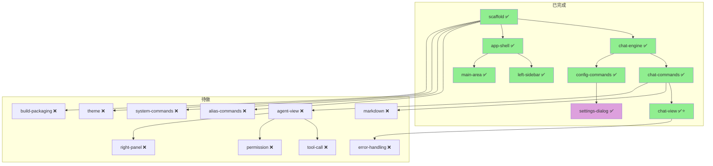

# j-gui 项目进度审查报告

> 审查日期：2026-05-08 | 置信度：high | 下次建议审查：每完成 2-3 个 feature 后更新

## 速答

**j-gui 处于 MVP 早期阶段**。项目已完成基础骨架和最小可用端到端 Chat 链路（输入消息 → LLM 流式回复 → 会话持久化），用户可配置 Provider 并发送消息。当前约 **1138 行代码**，**29 条 roadmap 条目中 9 条已完成**（2026-05-08 基于 Proma 源码审计新增 10 条）。



> ⭐ = 最小闭环 | 🟢 = 完成 | 🟣 = 部分完成 | 🔴 = 未开始

## 关键证据

### 1. 代码规模与分布

```
Rust 后端:   ~291 行 (chat_engine.rs:129 + commands/:134 + lib/main:28)
React 前端:  ~847 行 (components/:696 + atoms/:54 + lib/:97)
━━━━━━━━━━━━━━━━━━━━━━━━━━━━━━━━━━━━━━━
总计:        ~1138 行
```

- Rust 后端入口: `src-tauri/src/lib.rs:1-18` — 注册 7 个 Tauri 命令 + 4 个插件
- ChatEngine: `src-tauri/src/chat_engine.rs:1-129` — 封装 j_cli 的 `call_llm_stream_async`
- 前端入口: `src/App.tsx:1-5` — 渲染 `<AppShell />`
- IPC 封装: `src/lib/tauri.ts:1-91` — 类型安全的 invoke + Channel + event 封装

### 2. Roadmap 完成度

| # | 条目 | 实际状态 | items.yaml | 证据 |
|---|------|---------|------------|------|
| 1 | scaffold | ✅ done | planned | `bun run tauri dev` 启动成功，j_cli 集成可编译 |
| 2 | backend-config-commands | 🟣 partial | planned | `commands/config.rs:1-98` — agent_config 可用，YamlConfig 未做 |
| 3 | backend-alias-commands | ❌ | planned | `commands/` 无 alias.rs |
| 4 | backend-chat-engine | ✅ done | planned | `chat_engine.rs:1-129` — send_message + CRUD 全部实现 |
| 5 | backend-chat-commands | ✅ done | planned | `commands/chat.rs:1-34` — Channel 流式推送 |
| 6 | backend-system-commands | ❌ | planned | 无 get_version / set_theme |
| 7 | frontend-app-shell | ✅ done | planned | `AppShell.tsx:1-25` — 三栏 flex 布局 |
| 8 | frontend-left-sidebar | ✅ done | planned | `LeftSidebar.tsx:1-132` — 模式切换 + 会话列表占位 |
| 9 | frontend-main-area | ✅ done | planned | `MainArea.tsx:1-48` — TabBar + ChatView 挂载 |
| 10 | frontend-chat-view | ✅ done ⭐ | planned | `ChatView.tsx:1-160` — Channel 流式接收 + 发送 |
| 11 | frontend-markdown | ❌ | planned | 纯文本 `whitespace-pre-wrap`，未引入 react-markdown |
| 12-15 | agent-view/工具/权限/右侧面板 | ❌ | planned | 均未开始 |
| 16 | theme-integration | ❌ | planned | CSS 变量已定义但无切换逻辑 |
| 17 | settings-dialog | 🟣 partial | planned | 模型 tab 完成；通用 tab 占位；别名未做 |
| 18-19 | build-packaging/error-handling | ❌ | planned | 未开始 |

> **关键发现**: items.yaml 的 `status` 字段全部为 `planned`，未随代码同步更新。9 条已完成的条目需要批量改为 `done`，2 条部分完成的改为 `in-progress`。

### 3. CodeStable 文档完整度

| 目录 | 数量 | 状态 |
|------|------|------|
| `compound/` (decisions) | 6 | ✅ Rust 规约 + 5 个架构决策 |
| `compound/` (tricks) | 2 | ✅ Tauri v2 API + Jotai 集成 |
| `compound/` (explore) | 3 | ✅ progress-audit, doc-health, j-cli-agent-coupling |
| `features/` (ff-notes) | 3 | ✅ three-column-layout, minimal-chat-chain, provider-settings |
| `requirements/` | 3 + VISION | ✅ 3 条全部 current |
| `roadmap/` | 1 (29 items) | ✅ 基于 Proma 审计扩展，items.yaml 已同步 |
| `architecture/` | 4 | ✅ ARCHITECTURE.md + 3 个子系统 doc |
| `reference/` | 7 | ✅ shared-conventions 等 + proma-mapping |

### 4. 已审查修复的安全问题

最近一次 code review 发现并修复了 5 个问题（`chat_engine.rs` + `config.rs` + `tauri.ts`）：

| 问题 | 严重度 | 状态 |
|------|--------|------|
| user 消息在 LLM 失败时丢失 | high | ✅ 已修复 — `append_session_event` 移到 LLM 调用前 |
| Session ID 碰撞风险 | low | ✅ 已修复 — 添加原子计数器 `SESSION_COUNTER` |
| API Key 明文返回到前端 | medium | ✅ 已修复 — `get_agent_config` 脱敏为 `sk-...xxxx` |
| set_agent_config 覆盖脱敏 key | medium | ✅ 已修复 — 检测 `...` 则保留原 key |
| SessionInfo TS 类型与 Rust 不匹配 | medium | ✅ 已修复 — 对齐字段 |

### 5. 技术债务

- **ChatEngine 无 Agent Loop**: 当前仅调用 `call_llm_stream_async`（无工具模式），未使用 `MainAgentHandle::spawn` + Agent loop。工具调用（ToolCall/ToolResult）的 ChatEvent variant 已定义但后端从未发送
- **无流式中断机制**: 前端 unmount 后 LLM 调用继续消耗 token，Channel send 错误被 `let _ =` 吞掉
- **会话列表 UI 为静态占位数据**: `LeftSidebar.tsx` 的 session list 是硬编码的 placeholderSessions，未绑定 `list_sessions()` 命令
- **无并发保护**: 快速连续发送消息时，后端 `load_session`/`append_session_event` 存在竞态窗口
- **Cargo.lock 在 git 中**: `src-tauri/Cargo.lock` 已提交（Tauri 推荐做法），但 j-cli 作为 path dep 每次编译会重新检查

## 后续建议

1. **立即**: 更新 `items.yaml` 将已完成的 9 条标记为 `done`
2. **优先级最高**: Markdown 渲染（`frontend-markdown`）——当前纯文本显示 AI 回复体验差
3. **高优先级**: 会话列表对接 `list_sessions()`——左侧栏目前是假数据
4. **中优先级**: Agent 模式（`frontend-agent-view` + 工具调用）——这是 j-gui 区别于普通 Chat 的核心能力
5. **低优先级**: 主题切换、构建打包、错误处理

> 基于这份 explore，建议下次审查在 Markdown 渲染 + 会话列表对接完成后触发。
