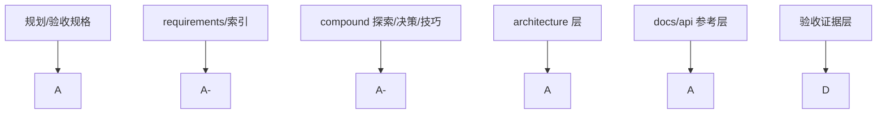

# j-gui 文档完善度刷新审查

## 问题与范围

问题：当前文档已经完善到什么程度，还剩哪些真正影响 1:1 实现和后续接手效率的缺口？

范围：检查 `.codestable`、`docs/api`、Proma parity 规格/验收文档、feature note 覆盖情况；不评价代码实现质量本身。

## 速答

**当前文档完善度已经从“骨架完整”提升到“规划层强、架构层基本成套、参考层基本完整”，整体可评为 `A`。** 这次最大的变化不是多了几份文档，而是几个原先会误导实现者的断点已经被补平：

1. **架构总入口已刷新**，不再停留在 greet / 脚手架叙述。
2. **API 参考层已从清单起步推进到 12 篇正文**，命令、状态和四组主要组件参考都已经落盘。
3. **架构目录已补到 7 篇有效文档，其中包含 6 篇子文档**，覆盖了总入口、Chat 后端、Agent 后端、Chat 前端、Agent 前端、Settings 前端、AppShell 外壳。

现在最主要的缺口已经变成三类：

1. **参考层已经基本齐全，但后续如果 UI 继续扩展，仍需要增量维护而不是放任过期。**
2. **架构层虽然已成套，但更细的 settings/governance UI 分层仍未单独拆文档**，复杂度继续上升时可能需要再细化。
3. **Proma parity 验收证据层还没启动**，`.codestable/acceptance/` 仍不存在，暂时只能说明“规划够了”，不能说明“1:1 已证明”。

结论：当前文档**已经够作为 1:1 复刻实现输入**，也足够支持继续大规模推进；但它**还不够作为 1:1 已完成证明**，因为最终仍缺验收证据闭环。

## 关键证据

1. requirements 三份基础能力文档仍是 `current`，`VISION.md` 也已按 Current / Draft 分区维护。证据：`.codestable/requirements/j-gui-ai-interaction.md:5`、`.codestable/requirements/j-gui-session-management.md:5`、`.codestable/requirements/j-gui-personalization.md:5`、`.codestable/requirements/VISION.md:8` 到 `:18`。
2. Proma parity 规格链已经完整覆盖实施、映射与验收输入。证据：`.codestable/roadmap/j-gui-desktop-app/proma-parity-implementation-spec.md:2` 到 `:11`、`.codestable/reference/proma-parity-acceptance.md:2` 到 `:10`、`.codestable/reference/proma-mapping.md:1` 到 `:10`、`.codestable/roadmap/j-gui-desktop-app/proma-parity-matrix.yaml` 已存在。
3. 架构总入口已经刷新为当前工作台结构，而不是 greet 脚手架。证据：`.codestable/architecture/ARCHITECTURE.md:4` 到 `:8`、`:14` 到 `:21`、`:44` 到 `:51`。
4. 架构层现在已有 7 篇有效文档，覆盖总入口、Chat、Settings、Agent 后端、Agent 前端和 AppShell。证据：`.codestable/architecture/` 目录当前包含 `ARCHITECTURE.md`、`backend-chat-engine.md`、`backend-agent-engine.md`、`frontend-chat-ui.md`、`frontend-agent-ui.md`、`frontend-settings-ui.md`、`frontend-app-shell.md`。
5. API 参考层已经从“只有 manifest”推进到 12 篇正文。证据：`docs/api/manifest.yaml` 当前已把 12 个条目全部标成 `draft`，覆盖命令、状态和四组主要组件参考。
6. `manifest.yaml` 当前已无 `pending` 条目，说明第一轮 API 参考层已经补齐。证据：`docs/api/manifest.yaml` 当前所有条目状态均为 `draft`。
7. Proma parity 的最终验收证据目录仍未创建。证据：本次检查 `.codestable/acceptance` 仍返回 `NO_ACCEPTANCE_DIR`。

## 细节展开

### 1. 规划层与验收层

这一层仍然是最完整的。Proma parity 现在已经有：

- 实施规格：`proma-parity-implementation-spec.md`
- 机器可读矩阵：`proma-parity-matrix.yaml`
- 验收清单：`proma-parity-acceptance.md`
- 源码映射：`proma-mapping.md`

它们已经足够给实现阶段提供稳定输入。这里当前不是“缺规格”，而是“缺做完后的验收证据”。

### 2. Requirements / Compound 层

这层已经比较健康：

- requirements 基础能力文档状态一致。
- `j-gui-proma-parity` 继续保持 `draft` 是合理的，因为它描述目标态而不是现状。
- compound 层已经覆盖技术选型、Proma 差距、文档层缺口、Codex app UI 观察等高价值沉淀。

这一层的风险已经不在“空白”，而在于后续推进时要记得把旧 explore 及时标 `outdated` 或 supersede，避免继续引用过时判断。

### 3. Architecture 层

这次补档后，architecture 已经从明显短板变成“基本能看”：

- `ARCHITECTURE.md` 负责总入口和横切关系。
- `backend-chat-engine.md` / `frontend-chat-ui.md` / `frontend-settings-ui.md` 负责已存在的细化子系统。
- `backend-agent-engine.md` 把 claude CLI、事件流、timeline 持久化补了进去。
- `frontend-app-shell.md` 把 AppShell、LeftSidebar、MainArea、SearchDialog、RightSidePanel 的编排补齐了。

剩下最明显的空洞已经不再是大块 architecture，而是组件参考层还没把这些 UI 面拆成可检索条目。

### 4. API 参考层

`docs/api` 现在已经不是“刚起步”，而是有了第一批可用样板：

- `agent-commands`
- `chat-commands`
- `config-commands`
- `governance-commands`
- `tauri-frontend-bridge`
- `frontend-state-atoms`

这批样板已经覆盖：

- 后端 IPC 命令组
- 前端 `invoke()` façade
- 流式事件类型
- Jotai 状态面

目前 API 层更准确的评价已经从“可用，但还不完整”提升到“**第一轮已经补齐，可直接作为实现参考层使用**”。

### 5. 验收证据层

Proma parity 相关文档已经说明最终证据应落到 `.codestable/acceptance/proma-parity/{YYYY-MM-DD}/`，但目录尚未建立。这意味着：

- “做什么”已经清楚
- “做到了没有”还没有证据文件

这也是为什么当前文档只能支撑实现，不能单靠文档宣称已经 1:1。

## 未决问题

- `docs/api` 后续是否要继续往更细粒度拆，比如把 `MessageBubble` / `ReasoningBlock` 或 `Settings primitives` 独立成条目，需要等 UI 再稳定一些再决定。
- 是否需要再拆出 `frontend-settings-governance-ui` 这类更细 architecture 文档，当前还没有必要，但后续 settings 继续变复杂时可能会触发。
- ff-note 是否要统一补 `已知局限` / `顺手发现` 段落，当前各 feature 记录质量仍不一致。

## 后续建议

优先做三件事：

1. 真正进入 parity 实现验收后，立即建立 `.codestable/acceptance/proma-parity/{YYYY-MM-DD}/` 证据目录，把“实现输入”闭环成“完成证明”。
2. 如果设置层继续膨胀，再考虑补更细的 `frontend-settings-governance-ui` 一类 architecture 文档。

## 相关文档

- `.codestable/compound/2026-05-08-explore-doc-health.md`
- `.codestable/compound/2026-05-09-explore-doc-layer-gaps.md`
- `.codestable/architecture/ARCHITECTURE.md`
- `.codestable/architecture/backend-agent-engine.md`
- `.codestable/architecture/frontend-agent-ui.md`
- `.codestable/architecture/frontend-app-shell.md`
- `docs/api/manifest.yaml`
