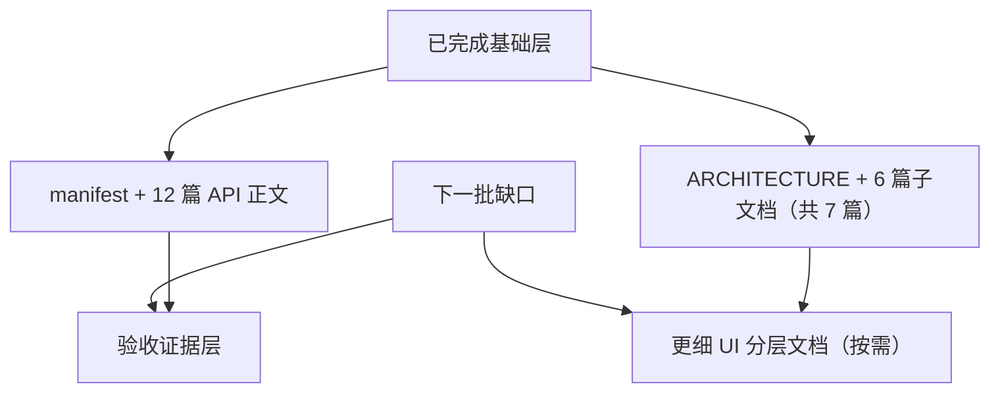

# j-gui 文档层缺口探索

## 问题与范围

问题：在 Proma parity 规划文档之外，当前还值得补哪些文档层，才能让后续实现人员少读重复代码、少靠口头记忆？

范围：本次只检查 CodeStable 文档体系中的 API 参考层、architecture 子层和 explore 发现报告层；不评估用户指南、开发者指南和最终验收报告。

## 速答

**当前最值得补的，已经不再是 `docs/api` 本身，而是后续验收证据层和按需细化的 UI 子层文档。** `docs/api` 已经有 manifest 和 12 篇正文，architecture 也已经补到了 Agent 前端；当前真正的缺口已经收敛成这两块：

- 验收证据层：`.codestable/acceptance/proma-parity/{YYYY-MM-DD}/`
- 可能后续才需要的更细 UI 分层文档：例如 settings/governance 的进一步拆分

结论：文档层现在已经过了“从 0 到 1”阶段，下一步应进入**实现与验收闭环**，而不是继续补同层级的参考文档。

## 关键证据

1. `docs/api` 目录现在已经存在，并包含 12 篇已落盘正文。证据：`docs/api/` 当前包含命令、状态以及 `app-shell-components`、`agent-components`、`chat-components`、`settings-components` 四组组件参考。
2. `manifest.yaml` 已经把这 12 个条目标成 `draft`，说明第一轮命令/状态/组件参考层都已建立。证据：`docs/api/manifest.yaml` 当前所有条目均为 `draft`。
4. 架构目录已经有总入口、Chat、Settings、Agent 后端、Agent 前端和 AppShell。证据：`.codestable/architecture/` 当前包含 `ARCHITECTURE.md`、`backend-chat-engine.md`、`backend-agent-engine.md`、`frontend-chat-ui.md`、`frontend-agent-ui.md`、`frontend-settings-ui.md`、`frontend-app-shell.md`。
5. `src/lib/tauri.ts` 与 `src/atoms/*.ts` 已经形成稳定的前端公开状态面，因此 `tauri-frontend-bridge` 和 `frontend-state-atoms` 已能作为后续组件文档的基础参考。证据：`docs/api/tauri-frontend-bridge.md:16` 到 `:25`、`docs/api/frontend-state-atoms.md` 已存在。
6. 旧 `explore-doc-health` 的核心结论已经过时，说明继续做“搭骨架”型文档已不再是高优先级。证据：`.codestable/compound/2026-05-09-explore-doc-health-refresh.md` 当前已把 API 层和 architecture 层评价更新到新的状态。

## 细节展开

### 1. API 参考层

当前 API 参考层已经有了一批高价值样板，覆盖了：

- IPC 命令：Agent / Chat / Config / Governance
- 前端桥接：`src/lib/tauri.ts`
- 状态面：`src/atoms/*`

接下来最合理的补法是：

当前这一层已经补齐，后续不再是“再补哪篇 API 文档”，而是进入实现/验收阶段使用这些文档。

### 2. Architecture 层

当前 architecture 已不再是“完全短板”。后续如果继续补 architecture，更可能是 settings/governance 继续复杂后，再拆更细的 UI 分层文档，而不是再补一份大的总图。

### 3. Explore 发现报告层

这层当前已经基本够用了，除非后续又出现新的大块空洞，否则没必要继续为了“文档完善度”再起更多宏观 explore。更高价值的做法是：

- 在新模块真正补档前，做一次定向 `cs-explore`
- 在做完后用 `cs-arch` / `cs-libdoc` 落成正式现状文档

也就是说，explore 层下一步应服务于实施，而不是继续自我增殖。

## 未决问题

- 组件参考是否全部都适合长期作为外部 API 文档，还是要先把其中一部分标 `skipped`，需要在第一批组件样板落地时确认。
- 如果后续 UI 继续复杂化，是否要把 `MessageBubble`、`ReasoningBlock` 或 Settings primitives 升格成独立条目，需要等功能稳定后再决定。
- 用户指南 / 开发者指南是否现在就该启动，当前看优先级仍低于 API / architecture / acceptance 证据层。

## 后续建议

下一步建议按这个顺序：

1. 建立 `.codestable/acceptance/proma-parity/{YYYY-MM-DD}/` 证据目录模板
2. 在推进 parity 实现时按模块回填实际验收记录

## 相关文档

- `.codestable/reference/system-overview.md`
- `.codestable/compound/2026-05-09-explore-doc-health-refresh.md`
- `docs/api/manifest.yaml`
- `.codestable/architecture/ARCHITECTURE.md`
