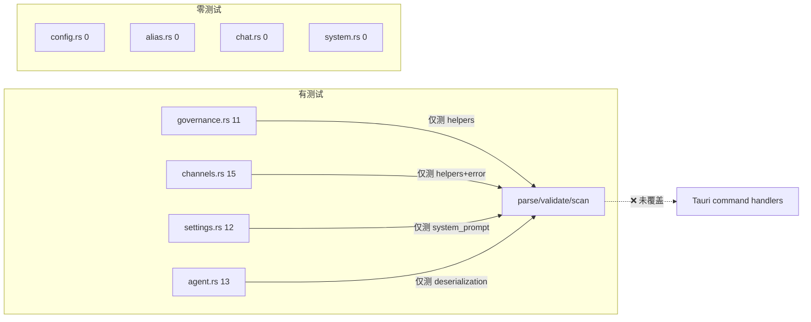

# 后端测试覆盖度

## 速答

**51 个测试分布在 4 个文件，4 个命令文件零测试。所有测试均为单元测试（辅助函数/解析器/序列化），Tauri 命令本身无直接测试。**



| 文件 | 测试数 | 覆盖内容 | 缺失 |
|------|--------|---------|------|
| governance.rs | 11 | parse/validate/scan helpers | 全部 8 个 Tauri 命令 |
| channels.rs | 15 | mask_api_key, parse_models, 错误路径 | create/update channel 正常流 |
| settings.rs | 12 | system_prompt CRUD 逻辑, parse_version | update_settings, workspaces, user_profile |
| agent.rs | 13 | InterruptResponse 反序列化, 数值映射 | start_agent, send_agent_message 流式链路 |
| **config.rs** | **0** | — | get/set_config, get/set_agent_config, system_prompt |
| **alias.rs** | **0** | — | list/set/remove_alias |
| **chat.rs** | **0** | — | stop_generation, send_message (流式) |
| **system.rs** | **0** | — | get_version, set_theme |

## 关键证据

### 证据 1：4 个命令文件零测试

- `config.rs` — 无 `#[cfg(test)]` 块 (config.rs:1-157)
- `alias.rs` — 无 `#[cfg(test)]` 块 (alias.rs:1-45)
- `chat.rs` — 无 `#[cfg(test)]` 块 (chat.rs:1-79)
- `system.rs` — 无 `#[cfg(test)]` 块 (system.rs:1-22)

这 4 个文件包含 14 个 Tauri 命令，全部零覆盖。

### 证据 2：governance.rs 仅测 helpers，不测命令

```
governance.rs 测试 11 个：
  parse_skill_frontmatter ×3   ← 纯函数
  validate_slug ×4              ← 纯函数
  scan_skills_dir ×2            ← 纯函数
  validate_source_dir ×2        ← 纯函数
```

8 个 `#[tauri::command]`（list_skills, list_hooks, list_mcp_servers, save_mcp_servers, list_chat_tools, set_tool_enabled, scan_global_skills, copy_skill_to_workspace）全部无测试。

### 证据 3：channels.rs 测 helpers，不测正常流 CRUD

15 个测试覆盖：
- `mask_api_key` × 6（辅助函数）
- `parse_fetch_models` × 4（辅助函数）
- `provider_to_channel_info` × 1（辅助函数）
- `list_channels` 空列表 × 1
- delete/update 无效索引各 × 1（仅错误路径）
- mask_key dots 检测 × 1

`create_channel` 正常创建、`update_channel` 正常更新、`delete_channel` 正常删除、`test_channel_direct` 连接测试、`fetch_models` 异步 HTTP——零覆盖。

### 证据 4：settings.rs 两个独立测试模块

- `#[cfg(test)] mod tests` (line 761)：system_prompt CRUD × 9 + serde 序列化 × 2
- `#[cfg(test)] mod version_tests` (line 905)：parse_version × 3

覆盖了 system_prompt 的创建/更新/删除/默认/回退逻辑（#15 补的），但 `update_settings`、`list_agent_workspaces`、`create_agent_workspace`、`delete_agent_workspace`、`update_user_profile`、`check_environment` 无测试。

### 证据 5：agent.rs 仅测数据转换，不测 Agent 生命周期

13 个测试全部是 `serde_json::from_value` → 断言的结构测试：
- AgentInterruptResponse 反序列化 × 3
- PermissionRequest 反序列化 × 3
- AskUserRequest/Answer 反序列化 × 3
- 数值映射逻辑 × 1
- UpdateSessionTitle 序列化/反序列化 × 2

`start_agent`、`send_agent_message`、`respond_agent_interrupt`、`stop_agent`、`generate_agent_title`（异步 LLM 调用）全部无测试。

### 证据 6：无集成测试

所有 51 个测试均为 `fn test_xxx()` 纯函数/结构体级别的单元测试。无跨模块集成测试（如：创建渠道 → 列出来验证 → 删除 → 再列出验证）。

## 建议

1. **P0**：给零测试文件补基础测试——config.rs (7 命令)、alias.rs (3 命令)、chat.rs (4 命令)、system.rs (2 命令)
2. **P1**：补 Tauri 命令的单元测试——governance.rs 8 命令 + channels.rs CRUD 正常流
3. **P2**：加集成测试——渠道 CRUD 端到端、Chat 流式链路
4. 建议关联到 Phase D #26 `tdd-coverage`
