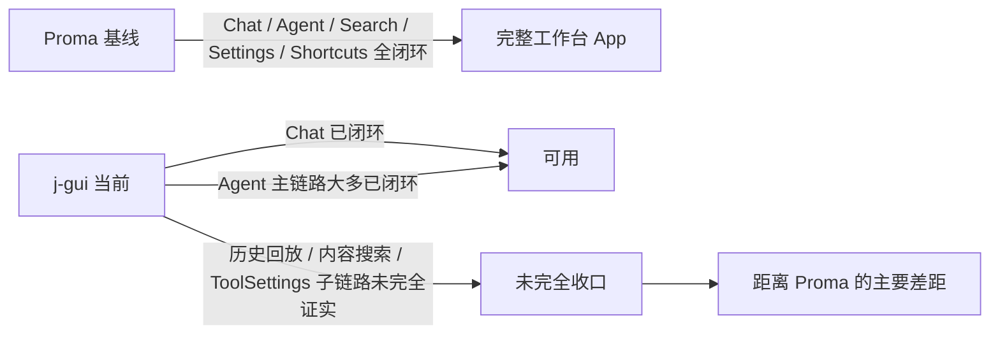

# j-gui 与 Proma 的能力闭环差距

## 问题与范围

问题：如果只看“实际能力闭环”，而不是看 roadmap 上写了多少 `done`，当前 j-gui 距离 Proma 这个已经可用的完整 App 还有多远。

范围：

- `j-gui`：以 `src/`、`src-tauri/` 当前代码为准。
- `Proma`：以本地基线仓库 `E:\Coding\AI\Proma` 为准，参考 `.codestable/reference/proma-parity-acceptance.md` 中记录的基线 commit `d1d07e7`。
- 本报告只写**代码当前能直接证实**的事实，不把 roadmap、文档和预期状态当成真相。

额外说明：

- 当前 `j-gui` 代码正在持续变动，所以这是一份 **2026-05-11 的快照报告**。
- `Proma` 这边结论偏 `high`，`j-gui` 这边因为部分接口存在 fallback / 注册分叉，所以整体置信度降到 `medium`。

## 速答

**结论很直接：j-gui 已经具备“可用工作台”的主体骨架，但离 Proma 这种“能力闭环型 App”还差最后一层关键收口。**

更具体地说：

1. **Chat 主链路，j-gui 已经追上了 Proma 的最低可用闭环。**
2. **Agent 主链路，j-gui 已经不再是骨架，审批、中断、工具调用、任务进度、文件上下文这些核心环节大多都接上了。**
3. **真正还没追平 Proma 的，不是“有没有页面”，而是几条收口链路还不够硬：**
   - Agent 历史回放接口仍有分叉
   - 搜索的“消息内容搜索”后端闭环未证实
   - Settings 里的部分工具治理子链路未证实
4. **所以当前最准确的定位不是“距离 Proma 很远”，而是“离 Proma 的完整闭环只差少数关键断点”，但这些断点都卡在产品可信度很敏感的位置。**

## 对照总表

| 能力域 | Proma | j-gui | 当前差距判断 | 结论 |
|---|---|---|---|---|
| Chat 发送 → 流式回复 → 历史回放 | 闭环 | 闭环 | 低 | 这条链路 j-gui 已基本追平最小闭环 |
| Agent 会话创建 / 切换 / 持久化 | 闭环 | 闭环 | 低 | 基础工作台能力已具备 |
| Agent 历史回放 | 闭环 | 部分闭环 | 高 | 这是当前最重要的 Agent 收口缺口之一 |
| 审批 / AskUser / ExitPlanMode / 中断响应 | 闭环 | 闭环 | 低 | 核心协议与 UI 已接通 |
| 工具调用 / 工具结果渲染 | 闭环 | 闭环 | 低 | 主流程已具备 Proma 式 Agent 工作感 |
| 任务进度 | 基本闭环，任务输出查询有小尾巴 | 闭环 | 低 | 两边都不是 100 分，但 j-gui 在这里不落后 |
| 文件上下文 / 附件 / 目录 / SidePanel | 闭环 | 闭环 | 低 | Agent 工作区体验主体已在 |
| 搜索 | 闭环 | 部分闭环 | 中 | 标题搜索已成，内容搜索闭环未证实 |
| 设置 | 闭环 | 部分闭环 | 中 | 主体设置面已在，工具治理子链路还不够硬 |
| 快捷键 | 闭环 | 闭环 | 低 | 已形成实际可用的内建快捷键层 |

## 差距分级表

| 等级 | 能力 | 为什么是这个等级 |
|---|---|---|
| `P0` | Agent 历史回放 | 这是 Agent 会话工作台是否真的“能恢复、能复盘、能继续”的关键。如果这里只有 UI 壳或 IPC 名字，没有稳定后端命令注册，就还不是 Proma 级闭环。 |
| `P1` | 搜索内容闭环 | 搜索入口和 UI 都有，但 `message content search` 这类能力如果靠 fallback 兜底，就无法算真实产品能力。 |
| `P1` | Settings 中的 ToolSettings 子链路 | 页面已经很像完整能力，但工具凭据、联网搜索、工具状态治理等子链路如果后端未证实，用户一踩就会暴露。 |
| `P2` | 文档 / roadmap 对闭环程度的表述 | 不是功能缺失，但它会放大误判，让人以为“已经和 Proma 一样可用了”。 |

## 关键证据

1. `Proma` 的 Chat 是完整历史 + 流式 + 落盘闭环，而不只是“发请求拿回复”。证据：[chat-service.ts](/E:/Coding/AI/Proma/apps/electron/src/main/lib/chat-service.ts:226)、[chat-service.ts](/E:/Coding/AI/Proma/apps/electron/src/main/lib/chat-service.ts:281)、[chat-service.ts](/E:/Coding/AI/Proma/apps/electron/src/main/lib/chat-service.ts:424)、[ChatView.tsx](/E:/Coding/AI/Proma/apps/electron/src/renderer/components/chat/ChatView.tsx:148)。
2. `j-gui` 的 Chat 也已经形成从输入、流式、消息刷新到历史继续加载的闭环。证据：[ChatView.tsx](/E:/Coding/AI/j-gui/src/components/chat/ChatView.tsx:231)、[ipc.ts](/E:/Coding/AI/j-gui/src/lib/ipc.ts:211)、[useGlobalChatListeners.ts](/E:/Coding/AI/j-gui/src/hooks/useGlobalChatListeners.ts:77)、[chat_engine.rs](/E:/Coding/AI/j-gui/src-tauri/src/chat_engine.rs:127)、[ChatMessages.tsx](/E:/Coding/AI/j-gui/src/components/chat/ChatMessages.tsx:273)。
3. `Proma` 的 Agent 会话是完整索引、消息持久化、搜索、fork、rewind 一体化管理。证据：[agent-session-manager.ts](/E:/Coding/AI/Proma/apps/electron/src/main/lib/agent-session-manager.ts:90)、[agent-session-manager.ts](/E:/Coding/AI/Proma/apps/electron/src/main/lib/agent-session-manager.ts:153)、[agent-session-manager.ts](/E:/Coding/AI/Proma/apps/electron/src/main/lib/agent-session-manager.ts:1053)。
4. `j-gui` 的 Agent 会话“创建 / 列表 / 打开 / 持久化”已闭环，但“历史回放”存在接口分叉。证据：[commands/agent.rs](/E:/Coding/AI/j-gui/src-tauri/src/commands/agent.rs:99)、[agent_session.rs](/E:/Coding/AI/j-gui/src-tauri/src/agent_session.rs:100)、[AgentView.tsx](/E:/Coding/AI/j-gui/src/components/agent/AgentView.tsx:364)、[ipc.ts](/E:/Coding/AI/j-gui/src/lib/ipc.ts:282)、[src-tauri/src/lib.rs](/E:/Coding/AI/j-gui/src-tauri/src/lib.rs:20)。
5. `Proma` 的审批与 AskUser 不是静态 Banner，而是真正走编排层和响应协议。证据：[agent-orchestrator.ts](/E:/Coding/AI/Proma/apps/electron/src/main/lib/agent-orchestrator.ts:1097)、[agent-orchestrator.ts](/E:/Coding/AI/Proma/apps/electron/src/main/lib/agent-orchestrator.ts:1207)、[PermissionBanner.tsx](/E:/Coding/AI/Proma/apps/electron/src/renderer/components/agent/PermissionBanner.tsx:67)、[AskUserBanner.tsx](/E:/Coding/AI/Proma/apps/electron/src/renderer/components/agent/AskUserBanner.tsx:143)。
6. `j-gui` 当前这条审批 / AskUser / ExitPlanMode 链路也已经真实接到 `respond_agent_interrupt`。证据：[useGlobalAgentListeners.ts](/E:/Coding/AI/j-gui/src/hooks/useGlobalAgentListeners.ts:466)、[useGlobalAgentListeners.ts](/E:/Coding/AI/j-gui/src/hooks/useGlobalAgentListeners.ts:483)、[useGlobalAgentListeners.ts](/E:/Coding/AI/j-gui/src/hooks/useGlobalAgentListeners.ts:498)、[ipc.ts](/E:/Coding/AI/j-gui/src/lib/ipc.ts:375)、[commands/agent.rs](/E:/Coding/AI/j-gui/src-tauri/src/commands/agent.rs:120)、[agent_engine.rs](/E:/Coding/AI/j-gui/src-tauri/src/agent_engine.rs:367)。
7. `Proma` 的搜索不仅有 UI，还有主进程注册的内容搜索 IPC。证据：[SearchDialog.tsx](/E:/Coding/AI/Proma/apps/electron/src/renderer/components/app-shell/SearchDialog.tsx:103)、[src/main/ipc.ts](/E:/Coding/AI/Proma/apps/electron/src/main/ipc.ts:466)、[src/main/ipc.ts](/E:/Coding/AI/Proma/apps/electron/src/main/ipc.ts:989)。
8. `j-gui` 的搜索 UI 已覆盖标题和内容入口，但内容搜索命令只在前端 `ipc.ts` 中看到 fallback 包装，当前后端注册未直接证实。证据：[SearchDialog.tsx](/E:/Coding/AI/j-gui/src/components/app-shell/SearchDialog.tsx:191)、[ipc.ts](/E:/Coding/AI/j-gui/src/lib/ipc.ts:202)、[ipc.ts](/E:/Coding/AI/j-gui/src/lib/ipc.ts:290)、[src-tauri/src/lib.rs](/E:/Coding/AI/j-gui/src-tauri/src/lib.rs:20)。
9. `Proma` 的设置是多分区真实回写，不是静态控制台。证据：[SettingsPanel.tsx](/E:/Coding/AI/Proma/apps/electron/src/renderer/components/settings/SettingsPanel.tsx:112)、[ToolSettings.tsx](/E:/Coding/AI/Proma/apps/electron/src/renderer/components/settings/ToolSettings.tsx:29)、[ShortcutSettings.tsx](/E:/Coding/AI/Proma/apps/electron/src/renderer/components/settings/ShortcutSettings.tsx:198)、[settings-service.ts](/E:/Coding/AI/Proma/apps/electron/src/main/lib/settings-service.ts:18)。
10. `j-gui` 的基础 settings 已真实接到后端，但 ToolSettings 里部分能力只在前端看到调用，后端注册未全量证实。证据：[SettingsDialog.tsx](/E:/Coding/AI/j-gui/src/components/settings/SettingsDialog.tsx:44)、[ipc.ts](/E:/Coding/AI/j-gui/src/lib/ipc.ts:95)、[ToolSettings.tsx](/E:/Coding/AI/j-gui/src/components/settings/ToolSettings.tsx:35)、[ToolSettings.tsx](/E:/Coding/AI/j-gui/src/components/settings/ToolSettings.tsx:125)、[src-tauri/src/lib.rs](/E:/Coding/AI/j-gui/src-tauri/src/lib.rs:20)。

## 细节展开

### 1. Chat：j-gui 已经跨过“骨架”阶段

在 Chat 这一条上，j-gui 和 Proma 的差距已经不大了。

Proma 的强项是：

- 完整历史先读再发
- 流式过程中的 partial assistant 也会落盘
- 首屏只拉最近消息，需要时再补更多历史

j-gui 当前已经具备这些核心闭环中的大部分：

- `ChatView` 先组装发送输入，再走统一 IPC，[ChatView.tsx](/E:/Coding/AI/j-gui/src/components/chat/ChatView.tsx:231)
- `ipc.ts` 把 `send_message` 的事件转成前端事件总线，[ipc.ts](/E:/Coding/AI/j-gui/src/lib/ipc.ts:211)
- `useGlobalChatListeners` 在完成后刷新消息状态，[useGlobalChatListeners.ts](/E:/Coding/AI/j-gui/src/hooks/useGlobalChatListeners.ts:77)
- `ChatMessages` 还能继续向上拉更多历史，[ChatMessages.tsx](/E:/Coding/AI/j-gui/src/components/chat/ChatMessages.tsx:273)

所以如果只看 Chat，**j-gui 已经不是“还没做完闭环”，而是“闭环已经成立”**。

### 2. Agent：主体闭环已经有了，难点只剩收口

Agent 是这次对比里最重要的部分。

Proma 之所以像“完整 App”，关键不是它有 Agent 页面，而是这些链路同时成立：

- 会话能保存、切换、恢复、搜索
- 工具调用有编排层和渲染层
- 权限审批、AskUser、Plan 模式是真互动，不是占位
- 文件上下文能喂给 Agent，而不是只有文件树 UI

j-gui 当前其实已经追到了很大一段：

- 会话基础持久化已在 [agent_session.rs](/E:/Coding/AI/j-gui/src-tauri/src/agent_session.rs:100)
- 审批 / AskUser / ExitPlanMode 已接到统一中断响应
- 工具调用、工具结果和任务进度已经进入全局监听器和状态层
- 文件附件、附加目录、SidePanel、workspaceDirs 都接上了

所以从产品感觉上说，**j-gui 已经有明显的“Agent 工作台感”**，不再只是一个会显示流式文本的面板。

### 3. 现在最大的真缺口，是 Agent 历史回放还不够硬

这是本次最需要单独拎出来的差距。

Proma 这边，Agent 历史会话的读取、恢复和后续操作是一整套能力，索引和消息存储也比较统一。  
j-gui 这边，目前能直接证实的是：

- `create/list/get/delete` 等基础会话命令真实存在
- 前端会尝试调用 `getAgentSessionSDKMessages`
- 但当前 `src-tauri/src/lib.rs` 的命令注册里，没有直接看到 `get_agent_session_sdk_messages`

这意味着：

- “会话存在”不等于“历史回放已经完全闭环”
- “页面能打开”也不等于“Proma 式恢复能力已经成立”

如果这里不收口，j-gui 的 Agent 体验就还是会停在“当前会话好用”，而不是“长期工作台好用”。

### 4. 搜索与设置的问题，本质上是“看起来像完成，实际上还没证实”

这两块和前面的 Agent 回放不一样，它们更像是**可信度缺口**。

搜索：

- UI 明显存在
- 标题搜索闭环能成立
- 但内容搜索这条链路，前端走的是 fallback 包装，当前没在后端注册里直接证实

设置：

- `SettingsDialog + SettingsPanel` 主体存在
- 基础 settings 命令已注册
- 但 ToolSettings 里的部分工具治理、凭据、联网搜索相关能力，当前看起来更像“前端能力声明”，还不是完全证实的后端闭环

它们的问题不是“完全没做”，而是**距离 Proma 这种可放心依赖的 App，只差最后一层命令注册和链路自证**。

## 建议结论

如果你要把这份报告转成 roadmap 或整改优先级，我建议按下面的口径理解：

| 优先级 | 先补什么 | 原因 |
|---|---|---|
| `P0` | Agent 历史回放闭环 | 这是 j-gui 从“当前会话可用”升级到“长期工作台可信”的关键断点 |
| `P1` | 搜索内容链路自证 | 现在最容易出现“UI 有了但搜不到”的落差 |
| `P1` | ToolSettings 子链路自证 | 这是设置区最容易暴露伪闭环的位置 |
| `P2` | roadmap / 文档状态去泡沫 | 让后续判断基于代码真相，而不是基于“done”字样 |

一句话总结：

**当前 j-gui 距离 Proma 的差距，已经不是“大量功能没做”，而是“少数高价值闭环还没真正收口”；其中最关键的是 Agent 历史回放，其次是搜索和工具设置的真实后端闭环。**

## 相关文档

- [E:\Coding\AI\Proma\apps\electron\src\main\lib\chat-service.ts](/E:/Coding/AI/Proma/apps/electron/src/main/lib/chat-service.ts)
- [E:\Coding\AI\Proma\apps\electron\src\main\lib\agent-session-manager.ts](/E:/Coding/AI/Proma/apps/electron/src/main/lib/agent-session-manager.ts)
- [E:\Coding\AI\Proma\apps\electron\src\main\lib\agent-orchestrator.ts](/E:/Coding/AI/Proma/apps/electron/src/main/lib/agent-orchestrator.ts)
- [E:\Coding\AI\Proma\apps\electron\src\renderer\components\app-shell\SearchDialog.tsx](/E:/Coding/AI/Proma/apps/electron/src/renderer/components/app-shell/SearchDialog.tsx)
- [src/components/chat/ChatView.tsx](/E:/Coding/AI/j-gui/src/components/chat/ChatView.tsx)
- [src/hooks/useGlobalChatListeners.ts](/E:/Coding/AI/j-gui/src/hooks/useGlobalChatListeners.ts)
- [src/components/agent/AgentView.tsx](/E:/Coding/AI/j-gui/src/components/agent/AgentView.tsx)
- [src/hooks/useGlobalAgentListeners.ts](/E:/Coding/AI/j-gui/src/hooks/useGlobalAgentListeners.ts)
- [src/lib/ipc.ts](/E:/Coding/AI/j-gui/src/lib/ipc.ts)
- [src-tauri/src/lib.rs](/E:/Coding/AI/j-gui/src-tauri/src/lib.rs)
- [.codestable/reference/proma-parity-acceptance.md](/E:/Coding/AI/j-gui/.codestable/reference/proma-parity-acceptance.md)
