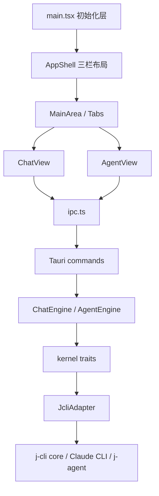

# j-gui 项目现状审查

## 问题与范围

问题：当前项目到底已经做到了什么，结构边界是否清楚，Chat / Agent / j-cli core / Claude CLI 这几层是如何协作的，以及从软件工程角度看，它现在最主要的质量风险在哪里。

范围：检查 `src/`、`src-tauri/`、`docs/api/`、`.codestable/architecture/` 的当前实现；不修改代码，不做产品建议扩写。

## 速答

**j-gui 当前已经是一个“可运行的桌面 AI 工作台”，不是单纯骨架，但它仍处在“功能面已铺开，若干核心链路靠兼容层和未闭环协议支撑”的阶段。**

可以把现状概括成四句话：

1. **功能面已经比较完整**：Chat / Agent 双模式、多标签页、左侧会话栏、右侧文件面板、全局搜索、设置中心、快捷键、通知、工作区能力展示都已存在。
2. **结构边界总体是清楚的**：前端通过 `ipc.ts` 作为唯一 Tauri façade，后端通过 kernel trait + `JcliAdapter` 隔离 `j_cli::` 依赖。
3. **真正复杂的地方已经不在“有没有功能”，而在“链路是否完全闭环”**：尤其是 Agent 审批、中断、历史回放、多会话运行、Chat 增强参数透传。
4. **工程质量处于“架构方向正确，但实现层有漂移和临时桥接”的状态**：文档和 roadmap 存在超前描述，前端监听层也积累了明显兼容逻辑。

## 关键证据

1. 顶层初始化已经从 `AppShell` 剥离到 `main.tsx`，包括主题、Agent 设置、通知、全局监听、tab 状态恢复等，说明项目已形成明确的“初始化层”而不是把所有逻辑堆进主壳组件。证据：[src/main.tsx](/E:/Coding/AI/j-gui/src/main.tsx:39)。
2. `AppShell` 当前只做三栏布局和条件渲染右侧面板，说明布局壳已经被压薄。证据：[src/components/app-shell/AppShell.tsx](/E:/Coding/AI/j-gui/src/components/app-shell/AppShell.tsx:24)。
3. `ipc.ts` 是前端唯一统一通信入口，组件不再直接散调 `invoke()`，这是当前前后端边界的核心。证据：[src/lib/ipc.ts](/E:/Coding/AI/j-gui/src/lib/ipc.ts:16)。
4. Rust 侧 `JcliAdapter` 明确声明为唯一允许出现 `j_cli::` 导入的文件，说明项目已经有意识地把 j-cli core 耦合收束到一个适配层。证据：[src-tauri/src/kernel/adapter.rs](/E:/Coding/AI/j-gui/src-tauri/src/kernel/adapter.rs:1)。
5. Chat 后端实际仍是最小 transcript 流式调用：`ChatEngine -> ChatKernel::stream_chat -> call_llm_stream_async`。证据：[src-tauri/src/chat_engine.rs](/E:/Coding/AI/j-gui/src-tauri/src/chat_engine.rs:127)、[src-tauri/src/kernel/adapter.rs](/E:/Coding/AI/j-gui/src-tauri/src/kernel/adapter.rs:460)。
6. Agent 后端是双路径并存：默认 `Claude CLI` 子进程，另有 `j-agent` in-process 分支，说明当前还处在后端引擎过渡期。证据：[src-tauri/src/agent_engine.rs](/E:/Coding/AI/j-gui/src-tauri/src/agent_engine.rs:45)、[src-tauri/src/kernel/adapter.rs](/E:/Coding/AI/j-gui/src-tauri/src/kernel/adapter.rs:465)。
7. 全局 Agent 监听器中仍有“新 payload -> 旧 AgentEvent”的兼容转换层，说明消息协议尚未完全稳定。证据：[src/hooks/useGlobalAgentListeners.ts](/E:/Coding/AI/j-gui/src/hooks/useGlobalAgentListeners.ts:59)。
8. 文档层已有漂移：`docs/api/app-shell-components.md` 仍把初始化职责写在 `AppShell` 上，而真实代码已经转到 `main.tsx`。证据：[docs/api/app-shell-components.md](/E:/Coding/AI/j-gui/docs/api/app-shell-components.md:45)、[src/main.tsx](/E:/Coding/AI/j-gui/src/main.tsx:39)。

## 细节展开

### 1. 功能范围

当前前端可见功能已经覆盖：

- Chat 模式：流式对话、历史加载、删除、重发、原地编辑、上下文分隔、附件保存与清理，核心在 [src/components/chat/ChatView.tsx](/E:/Coding/AI/j-gui/src/components/chat/ChatView.tsx:61)。
- Agent 模式：会话加载、流式展示、权限审批、AskUser、Plan 模式、文件浏览、附加目录、工作区能力与通知，核心在 [src/components/agent/AgentView.tsx](/E:/Coding/AI/j-gui/src/components/agent/AgentView.tsx:160)。
- 工作台外壳：多标签页、左侧会话栏、搜索、右侧文件面板、设置浮窗，主壳在 [src/components/tabs/MainArea.tsx](/E:/Coding/AI/j-gui/src/components/tabs/MainArea.tsx:16) 和 [src/components/app-shell/LeftSidebar.tsx](/E:/Coding/AI/j-gui/src/components/app-shell/LeftSidebar.tsx:132)。
- 设置中心：已经不是早期的几个 tab，而是完整设置面板，见 [src/components/settings/SettingsPanel.tsx](/E:/Coding/AI/j-gui/src/components/settings/SettingsPanel.tsx:34)。

### 2. 项目结构与模块边界

前端结构目前比较清楚：

- `main.tsx`：初始化层
- `components/app-shell`：工作台骨架
- `components/tabs`：tab 路由与切换
- `components/chat`：Chat 专属视图
- `components/agent`：Agent 专属视图
- `components/settings`：设置中心
- `atoms/*`：Jotai 状态面
- `lib/ipc.ts`：前端后端桥

后端结构也比较清楚：

- `commands/*`：Tauri 命令入口
- `chat_engine.rs` / `agent_engine.rs`：模式级引擎
- `kernel/*`：抽象层
- `adapter.rs`：j-cli 适配层
- `agent_session.rs`：Agent timeline / meta 持久化

这个结构的优点是“知道问题在哪一层解决”；目前的主要问题不是分层混乱，而是**部分分层之间的契约还没完全同步**。

### 3. 前后端引擎与调用链

Chat 实际调用链：

- `ChatView.handleSend` 先组装包含 `thinkingEnabled / enabledToolIds / attachments / systemMessage` 的 `ChatSendInput`，[src/components/chat/ChatView.tsx](/E:/Coding/AI/j-gui/src/components/chat/ChatView.tsx:309)
- 但 `ipc.sendMessage` 最终只调用 `invoke('send_message', { sessionId, content, onEvent })`，[src/lib/ipc.ts](/E:/Coding/AI/j-gui/src/lib/ipc.ts:215)
- Rust 命令也只接 `session_id + content + on_event`，[src-tauri/src/commands/chat.rs](/E:/Coding/AI/j-gui/src-tauri/src/commands/chat.rs:8)

这意味着 **Chat 前端已经组织出较丰富的输入协议，但后端还没有吃下这些字段**。从工程视角看，这不是“坏架构”，但确实是**前端能力定义领先于后端闭环**。

Agent 实际调用链：

- 前端通过 `useAgentSendMessage` 组织发送和会话状态，[src/components/agent/useAgentSendMessage.ts](/E:/Coding/AI/j-gui/src/components/agent/useAgentSendMessage.ts:51)
- 后端既支持 `Claude CLI` 子进程，也支持 `run_agent_loop`，见 [src-tauri/src/agent_engine.rs](/E:/Coding/AI/j-gui/src-tauri/src/agent_engine.rs:71) 和 [src-tauri/src/kernel/adapter.rs](/E:/Coding/AI/j-gui/src-tauri/src/kernel/adapter.rs:589)

所以当前 Agent 侧比 Chat 更接近“工作台产品”而不是“单一聊天窗口”，但复杂度也高得多。

### 4. j-cli core、CC SDK、Chat 模式后端关系

- **j-cli core**：当前后端真正的核心执行与配置来源，Chat 和 j-agent 都最终落到它。
- **Claude CLI**：当前 Agent 默认主路径，用子进程方式启动。
- **CC SDK**：目前主要体现为 hooks / MCP 配置导入兼容位，不是主执行面，见 [src-tauri/src/kernel/governance.rs](/E:/Coding/AI/j-gui/src-tauri/src/kernel/governance.rs:103)。
- **Chat 模式后端**：还停留在最小流式问答层，没有吃到 Agent 那套工具、多轮、治理能力。

这说明当前系统其实不是“一个统一运行时外露两套 UI”，而更像是：

- Chat：轻量问答链
- Agent：更重的工作台链
- 二者共享配置、会话容器、部分组件与状态，但后端能力层级明显不同

### 5. 可维护性、性能、安全与代码质量

可维护性优点：

- 初始化层、壳层、视图层、通信层、后端适配层边界都已经存在。
- `JcliAdapter` 单点收束外部依赖，是正确方向。
- 多数复杂状态都已经从组件里抽到 Jotai atoms 或 hooks。

主要风险：

- **协议兼容层偏厚**：尤其 Agent 监听层还在做旧事件模型桥接，后续容易形成“双协议长期共存”。
- **文档漂移已经发生**：`docs/api` 与当前实现不完全一致。
- **可观测性不足**：`ipc.ts` 有大量 fallback / stub / 默认值，[src/lib/ipc.ts](/E:/Coding/AI/j-gui/src/lib/ipc.ts:29)，这会降低“后端未接好时立刻暴露问题”的能力。
- **调试痕迹较多**：仓库中仍有较多 `console.log`，见 [src/components/chat/ChatView.tsx](/E:/Coding/AI/j-gui/src/components/chat/ChatView.tsx:242)、[src/components/settings/SettingsDialog.tsx](/E:/Coding/AI/j-gui/src/components/settings/SettingsDialog.tsx:48)。

高风险真实问题：

- Chat 流式事件字段名不一致：`ipc.ts` 发 `content`，监听器读 `delta`，见 [src/lib/ipc.ts](/E:/Coding/AI/j-gui/src/lib/ipc.ts:205) 与 [src/hooks/useGlobalChatListeners.ts](/E:/Coding/AI/j-gui/src/hooks/useGlobalChatListeners.ts:77)。
- Agent 审批回传参数名不一致：前端传 `{ response }`，后端收 `request`，见 [src/lib/ipc.ts](/E:/Coding/AI/j-gui/src/lib/ipc.ts:357) 与 [src-tauri/src/commands/agent.rs](/E:/Coding/AI/j-gui/src-tauri/src/commands/agent.rs:349)。

安全风险：

- `ANTHROPIC_API_KEY` 通过子进程环境变量传入，代码已明确这是可接受但有泄露面的 tradeoff，见 [src-tauri/src/agent_engine.rs](/E:/Coding/AI/j-gui/src-tauri/src/agent_engine.rs:91)。

性能/架构边界问题：

- Agent 当前使用单槽位 `AgentState` 管运行态，不支持真正多 Agent 并行执行，这对多标签工作台是一个明显边界，见 [src-tauri/src/commands/agent.rs](/E:/Coding/AI/j-gui/src-tauri/src/commands/agent.rs:11)。

## 未决问题

- Chat 的增强输入协议是否会继续保留为“前端先行定义”，还是会尽快补齐到后端命令层。
- Agent 的默认执行后端未来是继续以 `Claude CLI` 为主，还是完全转向 in-process `j-agent`。
- `docs/api` 是否继续作为公开参考层维护到和当前实现一致，还是会让 `.codestable/architecture` 成为唯一可信文档入口。

## 后续建议

建议下一步先做一次“契约一致性 explore / 文档回写”，把前端实际调用的命令、事件字段、返回结构和后端注册事实对齐后，再继续讨论 roadmap 的 done 状态。

## 相关文档

- [src/main.tsx](/E:/Coding/AI/j-gui/src/main.tsx)
- [src/lib/ipc.ts](/E:/Coding/AI/j-gui/src/lib/ipc.ts)
- [src-tauri/src/chat_engine.rs](/E:/Coding/AI/j-gui/src-tauri/src/chat_engine.rs)
- [src-tauri/src/agent_engine.rs](/E:/Coding/AI/j-gui/src-tauri/src/agent_engine.rs)
- [src-tauri/src/kernel/adapter.rs](/E:/Coding/AI/j-gui/src-tauri/src/kernel/adapter.rs)
- [src/hooks/useGlobalChatListeners.ts](/E:/Coding/AI/j-gui/src/hooks/useGlobalChatListeners.ts)
- [src/hooks/useGlobalAgentListeners.ts](/E:/Coding/AI/j-gui/src/hooks/useGlobalAgentListeners.ts)
- [docs/api/app-shell-components.md](/E:/Coding/AI/j-gui/docs/api/app-shell-components.md)
