# 速答

左右侧边栏卡顿的**主要瓶颈是 CSS 渲染管线**，而非之前认定的 React re-render 范围：

1. **LeftSidebar expand 存在 minWidth 视觉跳变（P0）**：`minWidth` 不在 `transition-property: width` 范围内，展开时从 48px 瞬间跳到 180px，然后 width transition 的前 57% 被 minWidth 钳住不可见，实际视觉动画只有最后 ~86ms（而非 200ms）。
2. **layout-triggering 属性动画（P1）**：左侧栏 animate `width`，右侧栏 animate `width` + `padding`——全是触发布局重排的属性。在 flex 容器中，每帧都触发整棵树 reflow + repaint（shadow-xl、rounded-2xl、gradient 背景）。
3. **Right SidePanel 内容始终挂载（P1）**：关闭时只做 `w-0 opacity-0` 隐藏，两个 FileBrowser 实例始终运行 effects 和 atom 订阅。
4. **React re-render 是次要因素（P2）**：之前探索的 re-render 级联问题（全 Map 订阅、AppShell 级联、折叠态仍挂载）已部分修复（per-session atom、条件渲染），但性能问题依然存在——因为真正的瓶颈在 CSS 层。

```mermaid
flowchart TD
    subgraph "左侧栏 expand（实际发生的事）"
        A1[用户点击展开] --> B1["setSidebarCollapsed(false)"]
        B1 --> C1["minWidth: 48→180 瞬变\nwidth: 48→280 开始 200ms transition"]
        C1 --> D1["Frame 0: 视觉宽度 = max(48,180) = 180\n从 48px 瞬跳到 180px"]
        D1 --> E1["Frame 1~12 (~114ms):\ntransitioning width < 180\nminWidth 钳住 → 无视觉变化"]
        E1 --> F1["Frame 13~12 (~86ms):\ntransitioning width 超过 180\n视觉宽度 180→280"]
        F1 --> G1["Frame 12 (200ms):\ntransitionEnd → 挂载 SessionListItems\n又一帧沉重渲染"]
    end

    subgraph "左侧栏 collapse（正常）"
        A2[用户点击收起] --> B2["minWidth: 180→48 瞬变\nwidth: 280→48 开始 200ms transition"]
        B2 --> C2["每帧 width 递减\nminWidth 48 不钳住\n200ms 平滑动画"]
    end

    subgraph "右侧栏 toggle"
        A3[用户点击] --> B3["width: 0↔320px transition 300ms\npadding transition 300ms"]
        B3 --> C3["flex 容器 reflow\nshadow-xl + rounded-2xl repaint"]
        C3 --> D3["FileBrowser 始终挂载\nO(n) Map copy"]
    end
```



---

# 关键证据

## 1. minWidth 不参与 transition，造成展开时视觉跳变（P0）

**文件:** `src/components/app-shell/LeftSidebar.tsx:1228-1237`

```tsx
// Tailwind class 只声明 transition-[width]
className="... transition-[width]"

// inline style：minWidth 不在 transition-property 中
style={{
  width: sidebarCollapsed ? collapsedSidebarWidth : expandedSidebarWidth,  // 48 ↔ 280
  minWidth: sidebarCollapsed ? collapsedSidebarWidth : 180,                // 48 ↔ 180（瞬变）
  flexShrink: sidebarCollapsed ? 0 : 1,                                    // 0 ↔ 1（瞬变）
  transitionDuration: `${SIDEBAR_WIDTH_TRANSITION_MS}ms`,                  // 200ms
}}
```

`transition-[width]` 生成 `transition-property: width`。`minWidth` 不在过渡范围，展开时从 48 瞬变到 180。

CSS computed width = `max(width, minWidth)`：
- 展开第 0 帧：`width` 从 48 开始过渡（目标 280），`minWidth` = 180 → 视觉宽度 = 180
- 展开前 ~114ms：`width` 仍在 48~180 之间 → 被 minWidth 钳住，视觉宽度始终 180 → **无视觉变化**
- 展开后 ~86ms：`width` 超过 180 → 视觉宽度 180→280 → **突然加速**

结果：展开动画 = 瞬跳 48→180 + 静止 ~114ms + 匆匆 86ms 180→280。收起动画则完全平滑（minWidth 48 不会钳住递减的 width）。

**支撑结论:** 左侧栏展开卡顿的感知主因是 minWidth 视觉跳变，不是 re-render。

---

## 2. 所有过渡都用 layout-triggering 属性，无 GPU 合成提示

**文件:** `src/components/app-shell/LeftSidebar.tsx:1231`

```
transition-[width]  → transition-property: width（触发 layout）
```

**文件:** `src/components/agent/SidePanel.tsx:344`

```
transition-[width] duration-300 ease-in-out  → transition-property: width（触发 layout）
```

**文件:** `src/components/app-shell/AppShell.tsx:95`

```
transition-[padding] duration-300 ease-in-out  → transition-property: padding（触发 layout）
```

三个过渡全用 layout-triggering 属性（`width`、`padding`）。对比 GPU-compositable 属性（`transform`、`opacity`），layout 属性每帧必须：

1. **Layout**: flex 容器重新计算所有子元素位置
2. **Paint**: 重绘 shadow-xl（box-shadow）、rounded-2xl（border-radius clip）、gradient 背景
3. **Composite**: 最终合成

无 `will-change`、`transform: translateZ(0)` 或其他 GPU 合成提示。

**支撑结论:** 动画帧开销主要在 CSS 渲染管线，不在 JS re-render。

---

## 3. Right SidePanel 内容始终挂载，FileBrowser 持续运行

**文件:** `src/components/agent/SidePanel.tsx:341-356`

```tsx
// 外层：w-0 或 w-[320px]，overflow-hidden 裁剪
<div className={cn(
  '... overflow-hidden ...',
  shouldAnimate && 'transition-[width] duration-300 ease-in-out',
  isOpen ? 'w-[320px]' : 'w-0',
)}>

  // 内层：始终 w-[320px]，始终渲染
  <div className={cn(
    'w-[320px] h-full flex flex-col ...',
    isOpen ? 'opacity-100' : 'opacity-0 pointer-events-none',
  )}>
    <FileBrowser ... /> {/* 始终挂载 */}
    <FileDropZone ... /> {/* 始终挂载 */}
    ...
  </div>
</div>
```

面板关闭时只做 `w-0 opacity-0`。两个 `FileBrowser` 实例 + `FileDropZone` + 所有 `AttachedDirTree` 始终在 DOM 中，effects 持续运行，atom 订阅保持活跃。

**支撑结论:** 右侧栏关闭状态下仍有持续的渲染开销，且 toggle 时不需要重新挂载（这是正面），但也意味着任何 atom 更新都会触发这些组件 re-render（这是负面）。

---

## 4. 之前探索的 React 级联问题已部分修复

旧探索的 6 个发现中，3 个已修复：

| # | 旧发现 | 当前状态 |
|---|--------|---------|
| 2 | SidePanel 订阅整个 Map | ✅ 已改用 `sessionSidePanelOpenAtom(sessionId)` (per-session derived atom) |
| 3 | AppShell 也订阅整个 Map | ✅ 已改用 `sessionSidePanelOpenAtom` + 提取 `RightPanelSlot` |
| 4 | 折叠态展开组件仍挂载 | ✅ 已改用条件渲染 `{sidebarCollapsed && ...}` / `{!sidebarCollapsed && ...}` |

未修复的 React 问题：
- LeftSidebar 仍是 1519 行 mega-component，订阅 ~38 atoms（旧探索说 40+）
- SidePanel `setIsOpen` 仍复制整个 Map
- `atomWithStorage` 同步写 localStorage

但这些是 **P2 级别**问题，不是性能卡顿的主因。主因是上面 1-3。

**支撑结论:** 修复 React 级联问题未能解决卡顿，因为根因在 CSS 渲染管线。

---

# 涉及文件清单

| 文件 | 行号 | 角色 |
|------|------|------|
| `src/components/app-shell/LeftSidebar.tsx` | 1228-1237 | minWidth 瞬变 + width-only transition |
| `src/components/app-shell/LeftSidebar.tsx` | 1231 | `transition-[width]` 无 GPU 提示 |
| `src/components/agent/SidePanel.tsx` | 341-356 | 右侧栏内容始终挂载 |
| `src/components/agent/SidePanel.tsx` | 344 | `transition-[width]` layout 触发 |
| `src/components/app-shell/AppShell.tsx` | 95 | `transition-[padding]` layout 触发 |
| `src/atoms/tab-atoms.ts` | 65-68 | `atomWithStorage` localStorage 同步写 |
| `src/atoms/agent-atoms.ts` | 363-377 | per-session atom（已修复，确认改进） |

---

# 后续建议

这份探索证据链已建立。如果要推进优化，建议：

1. **修复 minWidth 跳变（最高优先，改动小）**：展开时 `minWidth` 也加入 transition，或用 CSS `transition-property: width, min-width`，或改用 transform-based 方案让 minWidth 不再需要
2. **减少 layout 触发**：考虑用 `transform: scaleX()` / `translateX()` 替代 width 动画，或用 clip-path 动画；或者至少加 `will-change: width` 让浏览器预优化合成层
3. **Right SidePanel 按需挂载**：关闭时卸载 FileBrowser，打开时再挂载（类似 LeftSidebar 的 sessionListMounted 策略）
