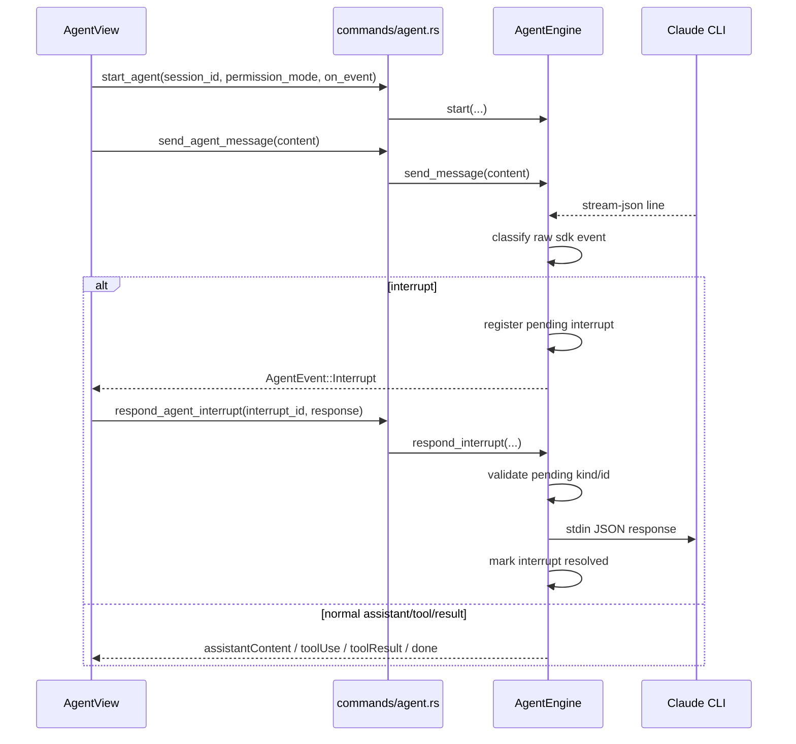

# agent-interrupts design

## 0. 术语约定

| 术语 | 定义 | 防冲突结论 |
|---|---|---|
| interrupt | Claude CLI 在流式执行中暂停，要求宿主提供一个明确选择后才能继续的事件 | 不和现有 `toolUse` / `toolResult` 混用；它是独立事件族 |
| interrupt kind | 中断类别：`permission` / `ask_user` / `plan` | 前后端统一使用这三个字面值，不再发明别名 |
| interrupt response | 前端对某个 interrupt 的一次回传动作 | 不是普通 user message；必须经过专门序列化 |
| pending interrupt | 已发给前端但尚未收到合法回传的中断记录 | 属于 `AgentEngine` 运行时状态，不落到 Jotai |

术语 grep 结果：仓库里当前只有 roadmap / explore 在使用 `interrupt` 语义，源码层尚未出现稳定命名，可直接落这套术语。

## 1. 决策与约束

### 需求摘要

- 做什么：把 Claude CLI 的审批/提问/计划暂停信号提升为一等协议，让前端能基于真实事件渲染 UI 并回传选择。
- 为谁做：Agent 模式用户，需要在 GUI 里看到“为什么停住”和“我现在能做什么”。
- 成功标准：前端不再猜测性地从 `toolUse` 推断审批，而是收到显式 `Interrupt` 事件；后端能校验并发送对应回传 payload。
- 明确不做：本 feature 不实现任何 banner/UI；不做 token 统计；不做多会话并行 Agent runtime；不承诺支持未知中断种类。

### 复杂度档位

走 backend workflow 默认档位，无偏离。

### 关键决策

1. **`Interrupt` 必须是独立 `AgentEvent` 变体，不复用 `toolUse` / `toolResult`。**
   - 原因：审批、问答、计划三类中断的输入结构和回传结构都不同，压进工具调用语义会导致前端继续猜。

2. **`InterruptResponse` 按 kind 分型。**
   - `permission`：`approve` / `approve_always` / `deny`
   - `ask_user`：按 `question_id` 回传用户答案
   - `plan`：`approve_and_run` / `approve_with_manual_permissions` / `reject` / `feedback`
   - 原因：这是 Proma 的关键经验点，也是避免“先做 UI、再返工协议”的最小约束。

3. **`start_agent` 启动参数显式接入 `permission_mode`。**
   - 当前 `src-tauri/src/agent_engine.rs` 把 `--permission-mode bypassPermissions` 写死。
   - 若不在这一层改签名，后续 `frontend-agent-context-tools` 再接权限模式时会破坏命令接口。

4. **后端保留 pending interrupt 注册表。**
   - `AgentEngine` 需能根据 `interrupt_id` 验证回传是否合法、是否已响应、类型是否匹配。
   - 首版允许运行时同时存在多条 pending 记录，但不负责前端多队列 UI。

5. **原始协议信息不丢。**
   - 标准化字段之外，保留 `raw_payload` 供调试和后续协议升级使用。
   - 原因：Claude CLI 的具体字段形状还在变化，不能在第一版适配里把未知字段吃掉。

## 2. 名词与编排

### 2.1 名词层

#### 现状

- `src-tauri/src/agent_engine.rs:10-29` 的 `AgentEvent` 只有 `AssistantContent`、`ToolUse`、`ToolResult`、`Done`、`Error`。
- `src-tauri/src/commands/agent.rs:7-35` 只有 `start_agent` / `send_agent_message` / `stop_agent` 三个命令。
- `src/lib/tauri.ts:133-150` 与 `src/components/agent/AgentView.tsx:47-130` 也只镜像这五类事件。

#### 变化

新增以下协议名词：

1. **`InterruptKind`**
   - `permission`
   - `ask_user`
   - `plan`

2. **`AgentEvent::Interrupt`**

```rust
Interrupt {
    interrupt_id: String,
    kind: InterruptKind,
    title: String,
    body_markdown: Option<String>,
    payload: InterruptPayload,
    raw_payload: serde_json::Value,
}
```

3. **`InterruptPayload`**

```rust
enum InterruptPayload {
    Permission {
        tool_use_id: String,
        tool_name: String,
        tool_input_preview: String,
        risk_level: String, // "safe" | "normal" | "dangerous"
    },
    AskUser {
        questions: Vec<AskUserQuestion>,
    },
    Plan {
        plan_markdown: String,
        suggested_prompts: Vec<String>,
    },
}
```

4. **`InterruptResponse`**

```rust
enum InterruptResponse {
    Permission { decision: PermissionDecision },
    AskUser { answers: Vec<AskUserAnswer> },
    Plan { decision: PlanDecision, feedback: Option<String> },
}
```

5. **`PendingInterrupt`**
   - 运行时结构，只存在 `AgentEngine`
   - 字段：`interrupt_id`、`kind`、`tool_use_id`（若适用）、`created_at`

#### 接口示例

后端 → 前端：

```json
{
  "event": "interrupt",
  "data": {
    "interruptId": "int_01",
    "kind": "permission",
    "title": "Bash command requires approval",
    "bodyMarkdown": "The agent wants to run `rm -rf build`",
    "payload": {
      "toolUseId": "toolu_01",
      "toolName": "Bash",
      "toolInputPreview": "{\"command\":\"rm -rf build\"}",
      "riskLevel": "dangerous"
    },
    "rawPayload": { "type": "assistant", "message": {} }
  }
}
```

前端 → 后端：

```json
{
  "interruptId": "int_01",
  "response": {
    "permission": {
      "decision": "approveAlways"
    }
  }
}
```

来源：
- `src-tauri/src/agent_engine.rs` `AgentEvent`
- `src-tauri/src/commands/agent.rs` 新增 `respond_agent_interrupt`
- `src/lib/tauri.ts` 新增 `respondAgentInterrupt(...)`

### 2.2 编排层



#### 现状

- `AgentView` 首次发送消息时调用 `startAgent(onEvent)`，之后仅通过 `sendAgentMessage(content)` 推进。
- `AgentEngine` 用 `parse_sdk_line` 把 stdout 每行直接翻译成最终 `AgentEvent`。
- 运行时没有“暂停并等待用户响应”的状态。

#### 变化

1. `start_agent` 改成 `start_agent(session_id, permission_mode, on_event)`。
2. `parse_sdk_line` 前加一层 **raw sdk event classifier**，把 stdout 行先归类，再翻译为 `AgentEvent`。
3. 发现 interrupt 时：
   - 生成 `interrupt_id`
   - 注册到 `pending_interrupts`
   - 发 `AgentEvent::Interrupt`
   - 暂不再用 `toolUse` 冒充审批
4. 收到 `respond_agent_interrupt(...)` 时：
   - 校验 `interrupt_id` 是否存在
   - 校验 response kind 与 pending kind 是否匹配
   - 序列化成 Claude CLI 期望的 stdin JSON
   - 写回 stdin
   - 从 `pending_interrupts` 移除

#### 流程级约束

- **非法回传不写 stdin**：`interrupt_id` 不存在、类型不匹配、必填字段缺失都直接返回错误。
- **未知 raw event 不静默伪装成已有语义**：要么忽略为不可渲染系统事件，要么发明确错误日志。
- **兼容旧路径**：没有 interrupt 的流继续产出当前五类事件，已有 AgentView 不应因此失效。
- **权限模式不是 UI 私有概念**：它是 engine 启动参数，后续 selector 只是改变这个值的来源。

### 2.3 挂载点清单

- `src-tauri/src/commands/agent.rs` — 新增 `respond_agent_interrupt` 命令，并扩充 `start_agent` 入参
- `src-tauri/src/agent_engine.rs` — 新增 interrupt 解析、pending registry、stdin 回传序列化
- `src/lib/tauri.ts` — 新增 `interrupt` 事件类型和 `respondAgentInterrupt()` IPC 包装
- `src/components/agent/AgentView.tsx` — 事件分发新增 `interrupt` 识别与状态传递入口（具体 banner/UI 在后续 feature 落地）

### 2.4 推进策略

1. 微重构：拆出 agent 协议解析模块，保持现有 assistant/tool/result 行为不变
   - 退出信号：现有 `parse_sdk_line` 测试仍通过，行为 diff 仅限文件移动
2. 引入 interrupt 协议名词与 `AgentEvent::Interrupt`
   - 退出信号：fixture 能产出 `permission` / `ask_user` / `plan` 三类标准化事件
3. 加入 `pending_interrupts` 与 `respond_agent_interrupt`
   - 退出信号：approve / deny / feedback 路径都能在单测中生成正确 stdin JSON
4. 扩充 Tauri command 与 TypeScript 类型
   - 退出信号：Rust 编译通过，TypeScript 对 `AgentEvent` 穷举无缺项
5. 错误与兼容性收尾
   - 退出信号：无 interrupt 的旧流仍完整通过现有解析测试

### 2.5 结构健康度与微重构

#### 评估

- 文件级 — `src-tauri/src/agent_engine.rs`：当前已 400+ 行，混合了进程启动、stdout 读取、协议解析、CLI 定位与测试；本 feature 还要继续增加 interrupt 解析和响应序列化，职责会进一步发散。
- 文件级 — `src-tauri/src/commands/agent.rs`：当前很薄，仅命令转发，适合继续挂新命令。
- 目录级 — `src-tauri/src/`：当前文件数量可接受，本次不会新增大量同层文件。

#### 结论：微重构（拆文件）

#### 方案

- 搬什么：把 `parse_sdk_line`、`parse_assistant_event`、`parse_user_event`、interrupt 相关标准化与 stdin 回传序列化搬出 `agent_engine.rs`
- 搬到哪：`src-tauri/src/agent_engine/protocol.rs`
- 行为不变怎么验证：现有 agent 解析测试全部通过；`AgentEngine::start/send/close` 对外签名不因拆文件改变
- 步骤序列（provable refactor）：
  1. 新建 `agent_engine/protocol.rs` 并搬运现有解析函数
  2. 仅做 import 路径调整，确保旧测试绿灯
  3. 在协议模块内继续扩展 interrupt 解析与响应序列化

#### 超出范围的观察

- `src/components/agent/AgentView.tsx` 当前既承担 engine 启动又承担事件汇聚，后续 `#34` / `#35` / `#36` 继续叠加后会偏胖
  - → 建议后续在前端 feature 里拆出 `agent-runtime` 状态层，本 feature 不动

## 3. 验收契约

- 当 Claude CLI 输出 permission 中断时，前端能收到 `event=interrupt` 且 `kind=permission`，并带工具名、工具输入预览、风险等级
- 当 Claude CLI 输出 ask_user 中断时，前端能收到问题数组，而不是被错误映射成 assistant 文本
- 当 Claude CLI 输出 plan 中断时，前端能收到计划正文和可选反馈入口，而不是只能看到一段普通文本
- 当调用 `respond_agent_interrupt` 且 `interrupt_id` 有效、response kind 匹配时，后端写入正确 stdin JSON，并清理对应 pending 记录
- 当调用 `respond_agent_interrupt` 但 `interrupt_id` 无效或类型不匹配时，命令返回可读错误，stdin 不应被写入
- 在完全没有 interrupt 的普通 agent 会话中，现有 `assistantContent` / `toolUse` / `toolResult` / `done` / `error` 行为保持不变
- 明确不做反向核对：本 feature 不应新增任何 UI 组件文件；不应把 interrupt 伪装为现有 `toolUse` / `toolResult` 事件继续传递

## 4. 与项目级架构文档的关系

- 需要回写 `.codestable/architecture/ARCHITECTURE.md`：Agent runtime 从“只读流”升级为“可中断、可回传”的协议层
- 建议新增或扩展 agent 相关架构文档：记录 `AgentEvent::Interrupt`、`InterruptResponse`、`permission_mode` 三个跨 feature 可见契约
- 这份 design 落地后，`frontend-agent-interrupt-ui`、`frontend-agent-context-tools` 必须以本协议为硬约束输入
