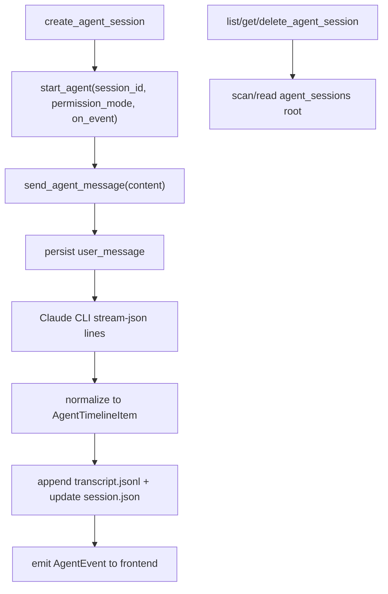

# agent-session-storage design

## 0. 术语约定

| 术语 | 定义 | 防冲突结论 |
|---|---|---|
| agent session | j-gui Agent 模式的一段独立对话历史，包含用户消息、assistant 文本、工具调用、中断记录等 | 不与 j-cli chat `sessions/` 目录混用 |
| transcript | 单个 agent session 的时间线持久化记录 | 首版存“标准化后的 GUI 时间线事件”，不存 stdout 噪音 |
| timeline item | 前端 hydrate Agent 历史时消费的最小单元 | 不是当前 `Message` 的直接镜像，必须保留 tool / interrupt 结构 |
| resume scope | “恢复”这件事在首版中的实际含义 | 首版仅指重新打开 transcript 并继续 GUI 线程，不承诺恢复 Claude 子进程隐藏上下文 |

术语 grep 结果：仓库里已有 `SessionInfo`、chat transcript、`agentMessagesAtom`，但尚无稳定的 agent transcript 结构，可直接引入 `AgentTimelineItem`。

## 1. 决策与约束

### 需求摘要

- 做什么：为 Agent 模式建立独立会话存储与读取命令，让左栏/搜索能像 Chat 一样列出、打开、删除 Agent 历史。
- 为谁做：需要切换、回看、重开 Agent 任务的人。
- 成功标准：Agent 历史不再只在内存里；重启应用后仍能列出并打开历史时间线。
- 明确不做：本 feature 不实现前端导航 UI；不实现全文搜索；不承诺恢复 Claude 子进程隐藏状态；不把 Agent transcript 塞进 j-cli 现有 chat `sessions/`。

### 复杂度档位

走 backend workflow 默认档位，无偏离。

### 关键决策

1. **Agent 会话使用独立存储根。**
   - 路径：`~/.jdata/agent/data/agent_sessions/<id>/`
   - 原因：当前 `j_cli::command::chat::storage::session::SessionPaths` 属于 Chat/teammate/subagent 体系，Agent GUI transcript 的事件类型不同，硬塞进去会污染 j-cli 现有语义。

2. **持久化单位使用 `AgentTimelineItem` JSONL，而不是纯文本消息数组。**
   - 原因：后续 `frontend-agent-session-navigation` 需要完整 hydrate `tool_call` / `interrupt` / `error`，不能退化成 `role + content`。

3. **Agent 会话列表对外仍复用 `SessionInfo` 形状。**
   - 原因：左栏和搜索层已经围绕 `id/title/messageCount/updatedAt` 建模，保持 shape 一致可以减少前端壳层分叉。

4. **resume 首版只恢复“可见历史”，不恢复“隐藏运行时”。**
   - 重开某个 Agent 会话后，可以看到上次时间线并继续在这个 session id 下写新事件。
   - 但未解决 Claude CLI 内部上下文、未决工具调用、未决 interrupt 的真实恢复。

5. **session id 生成口径复用 ChatEngine。**
   - 原因：当前 `ChatEngine::create_session()` 已有稳定、可校验的 id 规则，没必要为 Agent 再发明一套。

## 2. 名词与编排

### 2.1 名词层

#### 现状

- `src/atoms/sessions.ts:32-33` 的 `agentMessagesAtom` / `agentStreamingAtom` 只在内存里。
- `src/components/agent/AgentView.tsx:167-179` 发送消息时只追加前端消息，没有 session id。
- `src-tauri/src/commands/agent.rs` 没有任何 list/get/delete/create Agent 会话命令。
- Chat 侧已有 `SessionInfo` / `MessageInfo` / `SessionPaths`（见 `src-tauri/src/chat_engine.rs:32-39`）。

#### 变化

新增以下持久化名词：

1. **`AgentSessionPaths`**

```rust
struct AgentSessionPaths {
    dir: PathBuf,                 // ~/.jdata/agent/data/agent_sessions/<id>/
    transcript: PathBuf,          // transcript.jsonl
    meta_file: PathBuf,           // session.json
}
```

2. **`AgentTimelineItem`**

```rust
struct AgentTimelineItem {
    id: String,
    kind: String,                 // "user_message" | "assistant_message" | "tool_call" | "interrupt" | "error"
    content: Option<String>,
    tool_call: Option<ToolCallInfo>,
    interrupt: Option<InterruptSnapshot>,
    created_at: u64,
}
```

3. **`AgentSessionMeta`**

```rust
struct AgentSessionMeta {
    id: String,
    title: Option<String>,
    message_count: usize,
    updated_at: u64,
}
```

4. **新命令**

```rust
create_agent_session() -> Result<String, String>
list_agent_sessions() -> Result<Vec<SessionInfo>, String>
get_agent_session(session_id: String) -> Result<Vec<AgentTimelineItem>, String>
delete_agent_session(session_id: String) -> Result<(), String>
```

#### 接口示例

`get_agent_session("ab12")` 返回：

```json
[
  {
    "id": "evt_1",
    "kind": "user_message",
    "content": "帮我检查这个仓库",
    "toolCall": null,
    "interrupt": null,
    "createdAt": 1746700000
  },
  {
    "id": "evt_2",
    "kind": "tool_call",
    "content": null,
    "toolCall": {
      "toolId": "toolu_01",
      "toolName": "Read",
      "toolInput": "{\"path\":\"README.md\"}",
      "toolOutput": "..."
    },
    "interrupt": null,
    "createdAt": 1746700001
  }
]
```

来源：
- `src-tauri/src/chat_engine.rs` `SessionInfo`
- `src/atoms/sessions.ts` `Message` / `ToolCall`

### 2.2 编排层



#### 现状

- Agent 会话没有生命周期起点；`AgentView` 启动引擎时不绑定 session id。
- CLI stdout 只被即时消费，不落盘。
- 左栏/搜索只能操作 Chat session。

#### 变化

1. `create_agent_session()` 生成 id 并初始化 `agent_sessions/<id>/session.json`。
2. `start_agent(session_id, permission_mode, on_event)` 绑定当前运行时和持久化目标 session。
3. 每类可见事件都标准化为 `AgentTimelineItem` 后写入 `transcript.jsonl`：
   - user message
   - assistant text
   - tool call / tool result 聚合后的快照
   - interrupt 快照
   - error
4. `list_agent_sessions()` 只返回 meta，不读整份 transcript。
5. `get_agent_session()` 返回完整时间线，供前端 hydrate。
6. `delete_agent_session()` 删除整个 session 目录。

#### 流程级约束

- **不写 stdout 噪音**：`system` / `stream_event` 一类 Claude 噪音事件不进入 transcript。
- **title 懒生成**：首个 user message 写入时生成标题，后续不自动抖动更新。
- **tool call 更新是覆盖式快照**：同一个 `tool_id` 的运行中/完成态要在读取时能被重建为一个逻辑条目。
- **resume 仅恢复可见历史**：重新打开会话时，如果上一轮有 unresolved interrupt，只作为历史项展示，不自动重开审批。

### 2.3 挂载点清单

- `src-tauri/src/commands/agent.rs` — 新增 `create/list/get/delete_agent_session` 命令，并让 `start_agent` 绑定 `session_id`
- `src-tauri/src/agent_engine.rs` — 在发送/接收 Agent 流时追加 transcript 写入钩子
- `src-tauri/src/agent_session_store.rs`（新文件） — 承担 AgentSessionPaths、meta/transcript 读写
- `src/lib/tauri.ts` — 新增 Agent 会话 CRUD 与 `getAgentSession()` IPC 包装

### 2.4 推进策略

1. 建立 `agent_session_store` 骨架与路径约定
   - 退出信号：能创建 session 目录并读写空 meta
2. 实现 `create/list/get/delete_agent_session`
   - 退出信号：不启动 Claude CLI 也能通过单测操作存储根
3. 把 `start_agent` 绑定到 `session_id`
   - 退出信号：运行时每条 user / assistant / tool / error 事件都能落到指定 transcript
4. 打通 `AgentTimelineItem` hydration
   - 退出信号：读取历史后前端具备还原 `tool_call` / `interrupt` 结构的完整数据
5. 错误与恢复边界收尾
   - 退出信号：重启应用后历史可列出、可打开；未解决 interrupt 不会错误重放为实时审批

### 2.5 结构健康度与微重构

#### 评估

- 文件级 — `src-tauri/src/agent_engine.rs`：已 400+ 行，继续塞持久化逻辑会把“运行时”和“存储”彻底混成一团。
- 文件级 — `src-tauri/src/chat_engine.rs`：虽已有 `SessionInfo` 和会话操作，但语义明确属于 Chat，不适合承接 Agent transcript。
- 目录级 — `src-tauri/src/`：当前文件数量可控，新增一个专职存储文件不会造成目录摊平。

#### 结论：不做微重构

原因：本 feature 的结构性改进应通过**新增专职文件**实现，而不是先拆老文件。`agent_engine.rs` 的大文件问题由 `agent-interrupts` feature 已经单独标记处理；本 feature 只新增 `agent_session_store.rs`，避免在一个 feature 中同时做两类结构性变动。

#### 超出范围的观察

- `src/atoms/sessions.ts` 未来会需要把 Chat 和 Agent session list 分开管理，当前统一 `sessionsAtom` 很快会成为壳层耦合点
  - → 建议后续在 `frontend-agent-session-navigation` 里统一收敛，不在本 backend feature 提前改前端状态树

## 3. 验收契约

- 调用 `create_agent_session()` 后，磁盘上出现 `agent_sessions/<id>/session.json`，并能被 `list_agent_sessions()` 列出
- 在 Agent 会话里发送一条消息并收到 assistant/tool/error 事件后，对应 `transcript.jsonl` 出现结构化 `AgentTimelineItem`
- 调用 `get_agent_session(session_id)` 时，返回值必须保留 `tool_call` / `interrupt` 结构，不能退化成纯文本数组
- 重启应用后，既有 Agent 历史仍可通过 `list_agent_sessions()` 列出并通过 `get_agent_session()` 打开
- 删除 Agent 会话后，该会话目录消失，`list_agent_sessions()` 不再返回它
- 明确不做反向核对：本 feature 不应修改 j-cli 现有 chat `sessions/` 根目录结构；不应承诺恢复 Claude 子进程隐藏上下文或自动重放 pending interrupt

## 4. 与项目级架构文档的关系

- 需要回写 `.codestable/architecture/ARCHITECTURE.md`：Agent 模式从“纯内存流式预览”升级为“有独立 transcript 的可导航历史”
- 建议新增 Agent 存储子系统文档：记录 `agent_sessions/` 路径、`AgentTimelineItem` 结构、resume scope 边界
- `frontend-agent-session-navigation` 必须把本 design 作为硬约束输入，尤其是 `AgentTimelineItem` 不能被前端再次压扁
