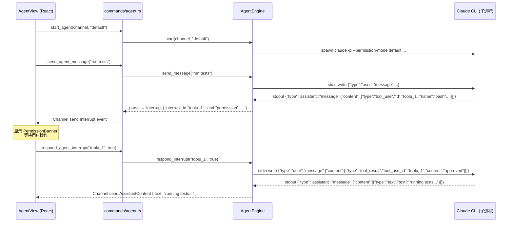

# backend-agent-interrupts design

## 0. 术语

| 术语             | 定义                                                                                                                                                               |
| ---------------- | ------------------------------------------------------------------------------------------------------------------------------------------------------------------ |
| permission_mode  | Claude CLI `--permission-mode` 参数，控制工具审批行为：`default`（暂停等审批）、`bypassPermissions`（自动批准）、`plan`（仅计划模式）                      |
| Interrupt        | CLI 执行过程中暂停等待外部决策的事件，当前实现 `permission` 类（工具审批），预留 `ask_user`/`plan`                                                           |
| tool_result 回写 | 前端响应中断后，通过 stdin 写入 `{"type":"user","message":{"content":[{"type":"tool_result","tool_use_id":"xxx","content":"approved\|denied"}]}}` 让 CLI 继续执行 |

## 1. 范围与决策

### 做什么

- `start_agent` 命令新增 `permission_mode` 参数（`"bypassPermissions"` | `"default"`），透传到 `AgentEngine::start()` 和 `build_claude_args()`
- `AgentEvent` 新增 `Interrupt { interrupt_id, kind, tool_name, tool_input }` 变体，`kind` 当前仅实现 `"permission"`
- 新增 `respond_agent_interrupt(interrupt_id, allowed)` 命令，向前端暴露中断回传能力
- 当 `permission_mode` 不是 `bypassPermissions` 时，将 `tool_use` 事件包装为 `Interrupt(kind="permission")` 推送

### 不做

- **不实现 ask_user / plan 中断类型**——Claude CLI headless 模式下这两种交互的协议未确认，留 `kind` 枚举扩展口
- **不改变前端 UI**——Interrupt 事件的定义给 #34 `frontend-agent-interrupt-ui` 消费，本条只做后端协议
- **不改变默认行为**——`start_agent` 的 `permission_mode` 参数默认 `"bypassPermissions"`，已有调用者无感

### 假设

- 假设 Claude CLI `--permission-mode default` 在 headless（`-p`）模式下发送 `tool_use` 后暂停等待 stdin，父进程可在此期间写入 tool_result
- 假设非 bypass 模式下每条 `tool_use` 精确对应一个 stdin 等待，不存在批量审批或多工具并发
- 假设 `interrupt_id` 可直接复用 `tool_use` 的 `id` 字段（Claude CLI 的 `toolu_xxx` 格式），无需额外生成

### Proma 参考点（吸收经验）

| Proma 做法                                                                    | j-gui 取舍                                                                                  |
| ----------------------------------------------------------------------------- | ------------------------------------------------------------------------------------------- |
| 三类 interrupt `permission` / `ask_user` / `plan` 分型处理              | 首版只做 `permission`，但 `AgentEvent::Interrupt.kind` 预留三种字面量                   |
| `PermissionModeSelector` 三模式循环切换（Auto/ FullyAuto/ Plan）            | `permission_mode` 参数接受 `"bypassPermissions"` / `"default"`；`"plan"` 作为保留值 |
| `respond_agent_interrupt` 支持 `always_allow` 记忆                        | 首版只做单次 `approve` / `deny`，不做 `always_allow` 持久化                           |
| interrupt 回传 payload 区分 `permission` / `ask_user` / `plan` 不同结构 | `InterruptResponse` 枚举按 roadmap 接口契约定义三种分支，首版仅实现 `Permission` 分支   |

## 2. 现状 → 变化

### 2.1 名词层

**现状** (`agent_engine.rs:10-29`, `commands/agent.rs:7-11`):

```rust
// AgentEvent — 无可中断变体
pub enum AgentEvent {
    AssistantContent { text: String },
    ToolUse { tool_id: String, tool_name: String, tool_input: String },
    ToolResult { tool_id: String, content: String },
    Done { total_tokens: u32 },
    Error { message: String },
}

// start_agent — 无 permission_mode
pub fn start_agent(
    state: tauri::State<'_, AgentState>,
    on_event: Channel<AgentEvent>,
) -> Result<(), String>;

// build_claude_args — permission_mode 硬编码
fn build_claude_args(model: &str) -> Vec<String> {
    // "--permission-mode", "bypassPermissions" 硬编码
}
```

**变化**:

```rust
// AgentEvent — 新增 Interrupt 变体
pub enum AgentEvent {
    AssistantContent { text: String },
    ToolUse { tool_id: String, tool_name: String, tool_input: String },
    ToolResult { tool_id: String, content: String },
    Interrupt {                              // ← 新增
        interrupt_id: String,
        kind: String,                        // "permission" | "ask_user" | "plan"
        tool_name: String,
        tool_input: String,
    },
    Done { total_tokens: u32 },
    Error { message: String },
}
```

> `Interrupt` 与 `ToolUse` 互斥——permission_mode=bypass 时发 `ToolUse`，非 bypass 时同一条 tool_use 包装为 `Interrupt(kind="permission")` 发送。

```rust
// start_agent — 新增 permission_mode 参数
pub fn start_agent(
    state: tauri::State<'_, AgentState>,
    on_event: Channel<AgentEvent>,
    permission_mode: String,                 // ← 新增，默认 "bypassPermissions"
) -> Result<(), String>;

// respond_agent_interrupt — 新命令
pub fn respond_agent_interrupt(
    state: tauri::State<'_, AgentState>,
    interrupt_id: String,
    allowed: bool,
) -> Result<(), String>;

// build_claude_args — permission_mode 参数化
fn build_claude_args(model: &str, permission_mode: &str) -> Vec<String>;
```

**TypeScript 侧** (`src/lib/tauri.ts:133-138`):

```typescript
// AgentEvent — 新增 interrupt 变体
export type AgentEvent =
  | { event: "assistantContent"; data: { text: string } }
  | { event: "toolUse"; data: { toolId: string; toolName: string; toolInput: string } }
  | { event: "toolResult"; data: { toolId: string; content: string } }
  | { event: "interrupt"; data: { interruptId: string; kind: string; toolName: string; toolInput: string } }  // ← 新增
  | { event: "done"; data: { totalTokens: number } }
  | { event: "error"; data: { message: string } };

// 新函数
export async function startAgent(onEvent: Channel<AgentEvent>, permissionMode?: string): Promise<void>;
export async function respondAgentInterrupt(interruptId: string, allowed: boolean): Promise<void>;
```

### 2.2 编排层

**主流程**：



**现状**（`agent_engine.rs:38-107`）:

`AgentEngine::start()` 接收 `Channel<AgentEvent>`，调用 `build_claude_args(&model)` 构建参数（含硬编码 `bypassPermissions`），spawn 子进程后启动 stdout/stderr reader 线程。stdout reader 对每行 JSON 调用 `parse_sdk_line()`，结果逐个 `channel.send()`。

`parse_sdk_line()` 返回 `Vec<AgentEvent>`，当前只产出 `AssistantContent` / `ToolUse` / `ToolResult` / `Done` / `Error`。

**变化**:

1. `start()` 新增 `permission_mode: &str` 参数，透传给 `build_claude_args(model, permission_mode)`
2. `parse_sdk_line()` 保持不变——tool_use 的解析逻辑不变
3. **新增 `should_interrupt()` 判断**：在 stdout reader 线程中，当 `permission_mode != "bypassPermissions"` 且事件为 `ToolUse` 时，将其转换为 `Interrupt { interrupt_id: tool_id, kind: "permission", tool_name, tool_input }` 发送，**不发送原始 `ToolUse`**
4. **新增 `respond_interrupt()` 方法**：将 `interrupt_id` + `allowed` 组装为 stdin tool_result JSON 行写入 CLI

**关键实现点**（agent_engine.rs stdout reader 线程内）:

```rust
// 在 stdout reader 线程的 event loop 中
let events = parse_sdk_line(&line);
for event in events {
    let wrapped = match event {
        AgentEvent::ToolUse { tool_id, tool_name, tool_input }
            if permission_mode != "bypassPermissions" =>
        {
            AgentEvent::Interrupt {
                interrupt_id: tool_id,
                kind: "permission".to_string(),
                tool_name,
                tool_input,
            }
        }
        other => other,
    };
    if event_channel.send(wrapped).is_err() {
        return;
    }
}
```

### 2.3 挂载点

按"删了它 feature 是否消失"判据：

| 挂载点                                 | 位置                          | 说明                        |
| -------------------------------------- | ----------------------------- | --------------------------- |
| `AgentEvent::Interrupt` 变体         | `agent_engine.rs` enum 定义 | 中断事件的数据载体          |
| `respond_agent_interrupt` 命令       | `commands/agent.rs`         | 前端回传中断决策的 IPC 入口 |
| `start_agent(permission_mode)` 参数  | `commands/agent.rs` 签名    | 前端控制 CLI 审批行为的入口 |
| `build_claude_args(permission_mode)` | `agent_engine.rs`           | CLI 参数构建                |
| `AgentEngine::respond_interrupt()`   | `agent_engine.rs` impl      | stdin 回写逻辑              |
| `lib.rs` invoke_handler 注册         | `lib.rs`                    | 命令 IPC 登记               |

共 6 条，略超正常区间（3-5），因为涉及 IPC 命令注册的自然登记点。无耦合发散信号。

### 2.4 推进策略

按"先编排骨架、后计算节点、最后持久化与测试"切片：

| 步 | 内容                                                                                                                            | 退出信号                              |
| -- | ------------------------------------------------------------------------------------------------------------------------------- | ------------------------------------- |
| 1  | `build_claude_args` 接受 `permission_mode` 参数，`start()` / `start_agent()` 签名加参数（默认 `"bypassPermissions"`） | `cargo test` 全部通过，已有行为不变 |
| 2  | `AgentEvent::Interrupt` 变体 + `respond_agent_interrupt` 命令骨架（空实现：返回 "Agent 未启动" 错误）                       | `cargo test` 编译通过               |
| 3  | `AgentEngine::respond_interrupt()` 实现：组装 tool_result JSON 写入 stdin                                                     | 手动验证：`cargo clippy` 零告警     |
| 4  | stdout reader 内 tool_use → Interrupt 转换逻辑（仅非 bypass 模式）                                                             | `cargo test` 新增 test 验证转换分支 |
| 5  | TypeScript 侧 `AgentEvent` 类型更新 + `startAgent`/`respondAgentInterrupt` 函数签名更新                                   | `bunx tsc --noEmit` 零错误          |

### 2.5 结构健康度与微重构

**文件级评估**：

| 文件                  | 当前行数 | 职责                                | 本次追加                                | 判断           |
| --------------------- | -------- | ----------------------------------- | --------------------------------------- | -------------- |
| `agent_engine.rs`   | ~418     | Agent 子进程生命周期 + CLI 协议解析 | +1 方法 (~15 行) + 参数变更 + enum 变体 | 健康，职责单一 |
| `commands/agent.rs` | ~35      | Agent Tauri 命令封装                | +1 命令 (~15 行)                        | 健康           |
| `lib.rs`            | ~43      | 命令注册                            | +1 行                                   | 健康           |

**目录级评估**：`src-tauri/src/` 下当前 10 个 .rs 文件，远未到需要分组的阈值。

**结论**：本次不做微重构。原因：改动量小（3 文件，合计 ~30 行业务逻辑），所有文件职责清晰无混杂。

## 3. 验收契约

### 正常路径

1. **permission_mode=bypass 无感知** — `start_agent(channel)` 不传 permission_mode → CLI 以 `bypassPermissions` 启动 → `tool_use` 事件正常发送 `ToolUse` 变体（不触发 Interrupt）
2. **permission_mode=default 触发 Interrupt** — `start_agent(channel, "default")` → CLI 发出 tool_use → 前端收到 `Interrupt { kind: "permission", interrupt_id: "toolu_xxx", ... }` 事件
3. **approve 回传** — `respond_agent_interrupt("toolu_xxx", true)` → CLI stdin 收到 `{"type":"user","message":{"content":[{"type":"tool_result","tool_use_id":"toolu_xxx","content":"approved"}]}}` → CLI 继续执行
4. **deny 回传** — `respond_agent_interrupt("toolu_xxx", false)` → CLI stdin 收到 `content: "denied"` → CLI 拒绝工具

### 边界路径

5. **Agent 未启动时调用 respond** — `respond_agent_interrupt("xxx", true)` 在 AgentEngine 不存在时返回 `Err("Agent 未启动")`
6. **permission_mode 无效值** — 不校验（透传给 CLI，CLI 自行报错），避免 j-gui 和 CLI 版本间校验规则不同步

### 错误路径

7. **stdin 写入失败** — `respond_interrupt()` 若 stdin 管道断开（CLI 已退出），返回 `Err("写入 claude stdin 失败: ...")`

### 明确不做反向核对

- ❌ 不新增 ask_user / plan 的实际解析逻辑
- ❌ 不修改前端 AgentView 的 onEvent 分发
- ❌ 不改变已有 `send_message` / `stop_agent` 的行为
- ❌ 不持久化 permission_mode 偏好

## 4. 与其他 feature / 架构的关系

| 方向                                  | 关系                                                                    |
| ------------------------------------- | ----------------------------------------------------------------------- |
| #34 `frontend-agent-interrupt-ui`   | 下游消费者——Interrupt 事件和 respond 命令是它的硬约束输入             |
| #36 `frontend-agent-context-tools`  | 下游消费者——PermissionModeSelector 依赖 permission_mode 参数          |
| #32 `backend-agent-session-storage` | 并行 feature——start_agent 签名都会变（#32 加 session_id），需协调合并 |

**与 #32 的接口冲突提示**：两条 feature 都会修改 `start_agent` 签名（本 feature 加 `permission_mode`，#32 加 `session_id`）。实现时需注意合并顺序——建议先做本条再做 #32，或两条合并实现以避免重复 rebase。
