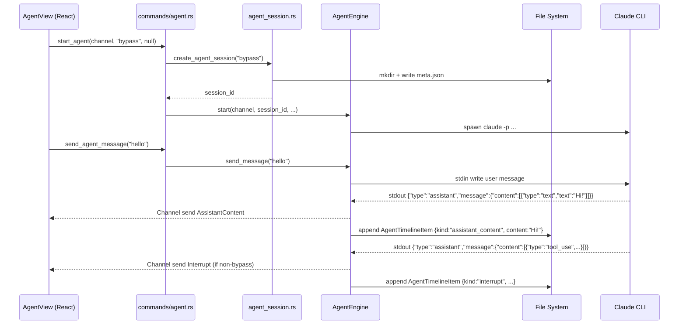

# backend-agent-session-storage design

## 0. 术语

| 术语 | 定义 |
|------|------|
| AgentTimelineItem | Agent 对话的时间线事件单元（user_message / assistant_content / tool_call / interrupt / error），JSONL 持久化格式 |
| transcript.jsonl | 每行一个 JSON AgentTimelineItem，按时间追加，与 Chat 的 SessionEvent JSONL 同模式 |
| resume | 首版仅指"重开 transcript 并在 GUI 中恢复消息历史"，不承诺恢复底层 Claude CLI 子进程的隐藏上下文 |

## 1. 范围与决策

### 做什么

- 新建 `agent_session.rs`：AgentTimelineItem 结构体 + AgentSessionManager（create/list/get/delete + append）
- `start_agent` 新增 `session_id` 参数（`Option<String>`，None 时自动创建）
- `AgentEngine::start()` 在 stdout reader 内将每个 AgentEvent 同步持久化为 AgentTimelineItem 追加到 transcript
- 新增 4 个命令：`create_agent_session` / `list_agent_sessions` / `get_agent_session` / `delete_agent_session`
- Chat 和 Agent 会话分目录存储（`~/.jdata/sessions/` vs `~/.jdata/agent/sessions/`），`list_sessions` 和 `list_agent_sessions` 各自只返回本空间

### 不做

- **不做 Agent 会话的 transcript 全文搜索**（那是 #41 search-enhanced 的事）
- **不承诺 resume 恢复 CLI 子进程内部状态**——resume 只重建消息历史，每次 resume 是新 CLI 子进程
- **不修改 ChatEngine 的 session 逻辑**——两个会话空间独立

### 假设

- 假设 `~/.jdata/agent/` 目录可由 j-gui 直接创建（与 j-cli 的 `~/.jdata/` 约定一致）
- 假设 agent session_id 格式沿用 ChatEngine 的 `{timestamp}-{pid}-{seq}` hex 格式（无需额外校验逻辑）

### Proma 参考点

| Proma 做法 | j-gui 取舍 |
|------------|-----------|
| Agent 与 Chat 同入可搜索、可恢复的会话体系 | 同模式，但分目录存储 |
| transcript 保留 tool_call / interrupt 等完整信息 | AgentTimelineItem 按 kind 多态存储，不退化 |
| resume 可恢复完整 Agent 状态 | 首版只恢复消息历史，不恢复子进程内部上下文 |

## 2. 现状 → 变化

### 2.1 名词层

**现状** (`agent_engine.rs:37-42`, `commands/agent.rs:7-11`):

```rust
// AgentEngine — 无 session_id，无持久化
pub struct AgentEngine {
    process: Option<Child>,
    stdin: Option<ChildStdin>,
    stdout_thread: Option<JoinHandle<()>>,
    stderr_thread: Option<JoinHandle<()>>,
}

// start_agent — 仅 channel + permission_mode
pub fn start_agent(
    state: tauri::State<'_, AgentState>,
    on_event: Channel<AgentEvent>,
    permission_mode: Option<String>,
) -> Result<(), String>;
```

**变化**:

```rust
// AgentTimelineItem — 新结构体（agent_session.rs）
#[derive(Clone, Serialize, Deserialize)]
#[serde(rename_all = "camelCase")]
pub struct AgentTimelineItem {
    pub id: String,           // uuid
    pub kind: String,         // "user_message"|"assistant_content"|"tool_call"|"interrupt"|"error"
    pub content: Option<String>,
    pub tool_call: Option<ToolCallSnapshot>,
    pub interrupt: Option<InterruptSnapshot>,
    pub created_at: u64,      // unix millis
}

#[derive(Clone, Serialize, Deserialize)]
pub struct ToolCallSnapshot {
    pub tool_id: String,
    pub tool_name: String,
    pub tool_input: String,
    pub tool_output: Option<String>,
    pub status: String,
}

#[derive(Clone, Serialize, Deserialize)]
pub struct InterruptSnapshot {
    pub interrupt_id: String,
    pub kind: String,
    pub tool_name: String,
    pub tool_input: String,
    pub response: Option<String>,
}

// AgentEngine — 新字段
pub struct AgentEngine {
    process: Option<Child>,
    stdin: Option<ChildStdin>,
    stdout_thread: Option<JoinHandle<()>>,
    stderr_thread: Option<JoinHandle<()>>,
    session_id: String,                        // ← 新增
    transcript_path: std::path::PathBuf,       // ← 新增
}

// start_agent — session_id 参数
pub fn start_agent(
    state: tauri::State<'_, AgentState>,
    on_event: Channel<AgentEvent>,
    permission_mode: Option<String>,
    session_id: Option<String>,                // ← 新增
) -> Result<(), String>;

// 新命令（4 条）
fn create_agent_session(permission_mode: String) -> Result<String, String>;
fn list_agent_sessions() -> Result<Vec<SessionInfo>, String>;
fn get_agent_session(session_id: String) -> Result<Vec<AgentTimelineItem>, String>;
fn delete_agent_session(session_id: String) -> Result<(), String>;
```

**TypeScript 侧** (`src/lib/tauri.ts`):

```typescript
export interface AgentTimelineItem {
  id: string;
  kind: string;
  content?: string | null;
  toolCall?: { toolId: string; toolName: string; toolInput: string; toolOutput?: string; status: string } | null;
  interrupt?: { interruptId: string; kind: string; toolName: string; toolInput: string; response?: string } | null;
  createdAt: number;
}

export async function startAgent(
  onEvent: Channel<AgentEvent>,
  permissionMode?: string,
  sessionId?: string,        // ← 新增
): Promise<void>;

export async function createAgentSession(permissionMode?: string): Promise<string>;
export async function listAgentSessions(): Promise<SessionInfo[]>;
export async function getAgentSession(sessionId: string): Promise<AgentTimelineItem[]>;
export async function deleteAgentSession(sessionId: string): Promise<void>;
```

### 2.2 编排层

**主流程**:



**现状**: AgentEngine 的 stdout reader 只做 channel.send()，无持久化。AgentEngine 无 session_id 概念。

**变化**:

1. `agent_session.rs` 新增 `AgentSessionManager`:
   - `create(permission_mode) -> session_id` — 生成 ID + 创建目录 + 写 meta.json
   - `append(path, item)` — 追加一行 JSON 到 transcript.jsonl
   - `list() -> Vec<SessionInfo>` — 扫描 `~/.jdata/agent/sessions/` 下的 meta.json
   - `get(session_id) -> Vec<AgentTimelineItem>` — 读取 transcript.jsonl 逐行解析
   - `delete(session_id)` — 删除目录

2. `AgentEngine::start()` 变更:
   - 新参数 `session_id: &str`
   - 存储 `session_id` 和 `transcript_path` 到 struct
   - stdout reader 闭包捕获 `transcript_path`，每次 channel.send() 后同步 `append_item()`

3. `agent_session.rs` 用简单文件操作实现（`std::fs`），不引入新 crate 依赖。

### 2.3 挂载点

| 挂载点 | 位置 | 说明 |
|--------|------|------|
| `agent_session.rs` 模块 | `src-tauri/src/agent_session.rs` | AgentTimelineItem + 会话 CRUD |
| `start_agent(session_id)` 参数 | `commands/agent.rs` | 前端控制会话标识 |
| `AgentEngine` 新字段 | `agent_engine.rs` struct | 持有 session_id + transcript_path |
| stdout reader 持久化 | `agent_engine.rs` reader 闭包 | 事件→timeline item→落盘 |
| `lib.rs` 命令注册 | `lib.rs` invoke_handler | 4 条新命令 + mod agent_session |
| TypeScript IPC | `src/lib/tauri.ts` | 类型 + 函数签名 |

共 6 条，其中 `agent_session.rs` 是全新模块。

### 2.4 推进策略

| 步 | 内容 | 退出信号 |
|----|------|---------|
| 1 | 新建 `agent_session.rs`：AgentTimelineItem 结构体 + `create`/`list`/`get`/`delete`/`append` | `cargo test` 编译通过 |
| 2 | `AgentEngine` 加 `session_id` + `transcript_path` 字段，`start()` 加参数 + stdout reader 内调用 `append()` | `cargo test` 全部通过 |
| 3 | 4 条新 Tauri 命令 + `lib.rs` 注册 + `start_agent` 签名更新 | `cargo test` 全部通过 |
| 4 | TypeScript 侧类型 + 函数签名更新，AgentView.tsx 调用适配 | `bunx tsc --noEmit` 零错误 |

### 2.5 结构健康度与微重构

**文件级**:

| 文件 | 现状 | 本次 | 判断 |
|------|------|------|------|
| `agent_engine.rs` | ~430 行 | +session 字段 + persist 逻辑 (~30 行) | 仍可接受，核心职责未变 |
| `commands/agent.rs` | ~35 行 | +6 条命令签名 (~40 行) | 命令集自然增长 |
| `agent_session.rs` | 不存在 | 全新 ~100 行 | 独立模块，单一职责 |

**目录级**: `src-tauri/src/` 下 10 个 .rs 文件，未到分组阈值。

**结论**: 本次不做微重构。原因：增量小、新模块独立、现有文件职责未混杂。

## 3. 验收契约

**正常路径**:

1. **无 session_id 启动 → 自动创建** — `start_agent(channel)` 不传 session_id → 自动 create → agent 消息落盘到新 transcript
2. **有 session_id 启动 → resume** — `start_agent(channel, "bypass", "existing-id")` → CLI 新进程启动 → 前端通过 `get_agent_session(id)` 恢复历史消息
3. **streaming 同步落盘** — Agent 运行中每个事件同时 channel.send + append to transcript
4. **list 区分空间** — `list_sessions()` 只返回 chat，`list_agent_sessions()` 只返回 agent

**边界路径**:

5. **不存在的 session_id** — `get_agent_session("nonexistent")` → `Err("会话不存在")`
6. **空 transcript** — `get_agent_session(id)` on 新创建的 session → `Ok(vec![])`

**错误路径**:

7. **transcript 写入失败** — append 失败时 eprintln! 日志，不中断 channel 流

**明确不做反向核对**:

- ❌ 不修改 ChatEngine 或 chat session 的文件位置
- ❌ 不实现 transcript 全文搜索命令
- ❌ 不恢复 CLI 子进程的内部上下文

## 4. 与其他 feature 的关系

| 方向 | 关系 |
|------|------|
| #33 `frontend-agent-session-navigation` | 下游消费者——list/get/delete 是它的唯一数据源 |
| #31 `backend-agent-interrupts` | 并行 feature——start_agent 签名两者都会改（#31 加 permission_mode，#32 加 session_id） |
