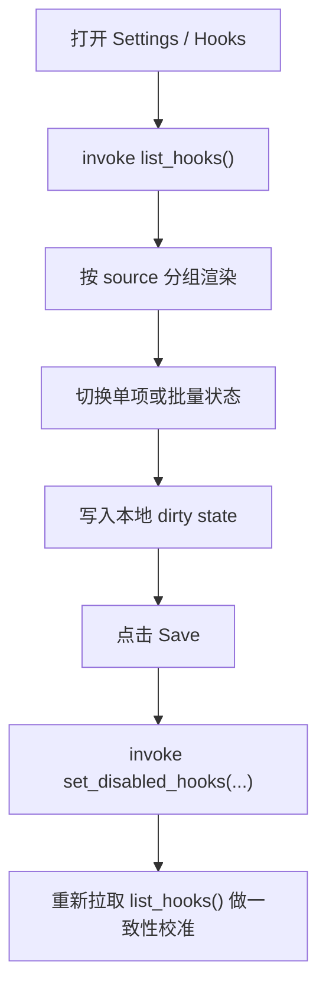

# hooks-ui design

## 0. 术语约定

| 术语 | 定义 | 防冲突结论 |
|---|---|---|
| hook entry | `HookManager::list_hooks()` 返回的一条 hook 摘要 | 不是 hook 文件原文 |
| unique id | hook 的稳定标识，格式如 `builtin:<name>` / `user:<dir>` / `project:<dir>` | GUI 启停必须以它为键 |
| hook source | hook 来源：`builtin` / `user` / `project` / `session` | 首版 Settings 只治理持久型来源；`session` 另行后置 |
| disabled hook | 存在于 `AgentConfig.disabled_hooks` 的唯一标识 | 与“未注册 hook”不同 |

## 1. 决策与约束

### 需求摘要

- 做什么：在 Settings 中新增 Hooks tab，让用户看到当前加载的 hooks，并能启停它们。
- 为谁做：已经依赖 hook 扩展 Agent 行为、但不想回到 TUI 做治理的人。
- 成功标准：GUI 能稳定列出 hooks 的来源/事件/类型/标签摘要，并把启停状态回写到 `disabled_hooks`。
- 明确不做：不在 GUI 内注册 session hook；不编辑 hook 文件；不删除 hook 目录；不把 hook 调试台塞进首版 Settings。

### 关键决策

1. **Hooks UI 首版是治理视图，不是 hook authoring 工具。**
   - 原因：hook 的脚本协议、prompt、filter、on_error 都远比 toggle 复杂，首版不要把“可见治理”和“可写编辑器”绑在一起。

2. **语义直接锚定 `HookManager::list_hooks()`。**
   - 该结构已经定义了 `event/source/hook_type/label/timeout/on_error/filter/unique_id`。
   - GUI 只消费它，不自己重建 hook 摘要。

3. **启停以 `unique_id` 为唯一主键。**
   - 原因：同名 hook 可能来自不同 source；按 name 切会误伤。

4. **首版 Settings 只治理持久型 hook：`builtin / user / project`。**
   - `session` hook 与某次运行时强耦合，更适合未来并入 Agent runtime 面板。
   - 这样可避免“开一个全局设置页却出现临时会话对象”的认知错位。

5. **批量启停行为对齐 j-cli TUI。**
   - 保留“全部启用 / 全部禁用”。
   - 不引入更细的按事件批量切换，以免首版控制面过重。

## 2. 名词与编排

### 2.1 现状

- `src-tauri/src/commands/config.rs` 未暴露 hooks 元数据，也未暴露 `disabled_hooks`。
- `../j/src/command/chat/infra/hook/manager.rs` 已有：
  - `HookEntry`
  - `HookManager::list_hooks()`
  - `unique_id` 规则
- `../j/src/command/chat/ui/config/hooks.rs` 与 `update_config.rs` 已有 TUI 行为：
  - 头部统计已启用数量
  - 单项 toggle
  - 全部启用 / 全部禁用
  - 空态提示用户级/项目级/运行时来源

### 2.2 新接口

后端新增：

```rust
struct HookEntryInfo {
    unique_id: String,
    event: String,
    source: String,      // "builtin" | "user" | "project"
    hook_type: String,   // "bash" | "llm" | "builtin"
    label: String,
    timeout_secs: Option<u64>,
    on_error: Option<String>,
    filter_summary: Option<String>,
    enabled: bool,
}

list_hooks() -> Result<Vec<HookEntryInfo>, String>
set_disabled_hooks(disabled_hook_ids: Vec<String>) -> Result<(), String>
```

### 2.3 编排



## 3. UI 约束

1. 列表项至少展示：
   - source badge
   - event
   - hook type
   - label 摘要
   - enabled toggle

2. 详情区或次级描述展示：
   - timeout
   - on_error
   - filter 摘要

3. 空态必须说明 hooks 可能来自：
   - `~/.jdata/agent/hooks/`
   - `.jcli/hooks/`

4. 首版不在此页处理：
   - session hook 注册/移除
   - hook metrics 实时刷新
   - hook 执行日志查看

## 4. Proma / j-cli 经验吸收

- **Proma 参考点**：Settings 左侧导航、列表型 tab 的视觉组织、统一 Save/Cancel/未保存保护。
- **j-cli 参考点**：Hooks 的真实列表模型、唯一标识规则、批量启停语义、空态文案。
- **j-gui 取舍**：Proma 只借壳，不借语义；Hooks 的实体模型以 j-cli 为准，并明确把 `session` hook 延后。

## 5. 验收闭环

1. 打开 Hooks tab 能稳定列出持久型 hooks，并区分 builtin/user/project 来源。
2. 启停某个 hook 时，不会因重名误改到别的来源条目。
3. 保存后 CLI/TUI 与 GUI 看到的 `disabled_hooks` 结果一致。
