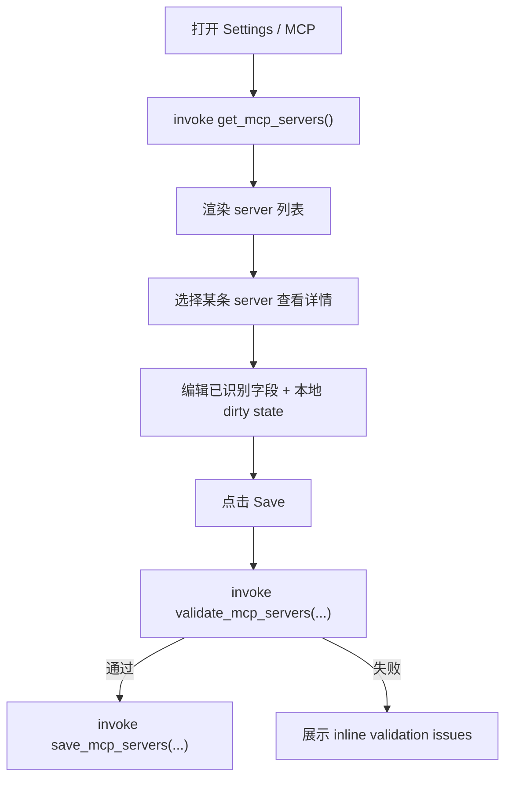

# mcp-config-ui design

## 0. 术语约定

| 术语 | 定义 | 防冲突结论 |
|---|---|---|
| MCP server entry | 一条可被 GUI 展示和编辑的 MCP server 配置 | 不是任意 JSON 片段；必须先归一成稳定结构 |
| transport | server 通信方式，如 `stdio` / `http` / `sse` / `unknown` | GUI 只按 transport 切换对应字段，不猜业务含义 |
| unknown fields | 当前 GUI 不理解、但原配置中存在的字段 | 首版必须保留透传，不能在保存时丢失 |
| validation issue | 后端对 server 配置发现的结构/必填项问题 | 是保存前校验结果，不等于运行时健康检查 |

## 1. 决策与约束

### 需求摘要

- 做什么：在 Settings 中新增 MCP tab，让用户查看、启停、编辑 MCP server 配置。
- 为谁做：需要在 GUI 中治理 Agent 外部工具接入的人。
- 成功标准：GUI 能稳定读取与写回 MCP server 列表，编辑不会破坏未知字段，保存前能给出基本校验错误。
- 明确不做：不做 server marketplace；不做自动安装；不做在线健康探测；不做远程 catalog；不承诺覆盖所有潜在 transport 扩展字段的可视化表单；不把 MCP 接到当前 Chat 命令链路。

### 关键决策

1. **MCP UI 优先参考 Proma/Agent 的实际做法，但不能直接建立在“宽泛 JSON 猜测”上。**
   - 当前 j-cli 仓库内尚无稳定 MCP 配置抽象。
   - 所以前端实现前，后端必须先给出标准化 `McpServerEntry` 契约。

2. **后端负责标准化与保留未知字段。**
   - GUI 只编辑已识别字段。
   - 未识别字段通过 `raw_extra` 或等价机制原样透传，避免保存即损坏配置。

3. **首版采用“列表 + 详情”模型，不做复杂工作区概念。**
   - 列表展示 server 名称、transport、启停、校验状态。
   - 详情面板按 transport 展示基础字段。

4. **保存前做结构校验，不做运行时健康探针。**
   - 例如 stdio 缺 command、http 缺 url，这类问题立即报。
   - 但不在首版承担“尝试连接该 MCP server 是否成功”。

5. **Settings 壳层经验参考 Proma，但语义契约以 j-gui 后端为准。**
   - Proma 能给布局经验，不能替代 j-cli 的真实配置格式。

6. **MCP 只挂 Agent runtime，不进入当前 Chat 路径。**
   - Settings 出现 MCP tab，不代表 `send_message` / Chat session 自动拥有 MCP。
   - 首版只要求 Agent 侧配置可治理，Chat 仍沿当前链路保持无 MCP 假设。

## 2. 名词与编排

### 2.1 现状

- `src-tauri/src/commands/config.rs` / `src/lib/tauri.ts` 没有任何 MCP 配置接口。
- `../j/src` 当前也没有统一的 MCP 配置抽象可直接复用。
- 当前文档范围已明确：MCP tab 服务于 Agent runtime，不要求现有 Chat 命令链路同时消费它。
- 因此，MCP 是这三个新增 UI 中**最不能靠猜**的一项；必须先补后端治理契约。

### 2.2 新接口

后端新增：

```rust
struct McpServerEntry {
    id: String,
    name: String,
    enabled: bool,
    transport: String,          // "stdio" | "http" | "sse" | "unknown"
    command: Option<String>,
    args: Vec<String>,
    url: Option<String>,
    env: Vec<(String, String)>,
    cwd: Option<String>,
    raw_extra: serde_json::Value,
}

get_mcp_servers() -> Result<Vec<McpServerEntry>, String>
save_mcp_servers(servers: Vec<McpServerEntry>) -> Result<(), String>
validate_mcp_servers(servers: Vec<McpServerEntry>) -> Result<Vec<ValidationIssue>, String>
```

### 2.3 编排



## 3. UI 约束

1. 列表至少展示：
   - name
   - transport
   - enabled
   - validation state

2. 详情面板首版支持：
   - `stdio`：command / args / env / cwd
   - `http` / `sse`：url / env

3. 必须保留：
   - 新增 server
   - 删除 server
   - 启停 server
   - 未保存变更保护

4. 首版不处理：
   - GUI 内安装 MCP server
   - 在线 test connection
   - catalog/模板市场
   - 对未知 transport 做专用表单

## 4. Proma / 当前仓库经验吸收

- **Proma 参考点**：Settings 导航结构、详情页布局、脏状态保护。
- **当前仓库约束**：没有现成 MCP 抽象，所以不能假设字段名、文件位置或 transport 子结构。
- **j-gui 取舍**：先把后端契约做稳定，再做首版列表/详情 UI；宁可少字段，也不允许保存时破坏未知配置。

## 5. 验收闭环

1. GUI 能稳定显示 Agent 侧 MCP server 列表，并正确区分 `stdio` 与 `http/sse`。
2. 编辑已识别字段后保存，不会丢掉未知字段。
3. 结构缺失时用户能在保存前看到明确校验错误，而不是写坏配置后才发现。
4. Chat 侧不会因为新增 MCP tab 而被文档或实现误标成“已支持 MCP”。
