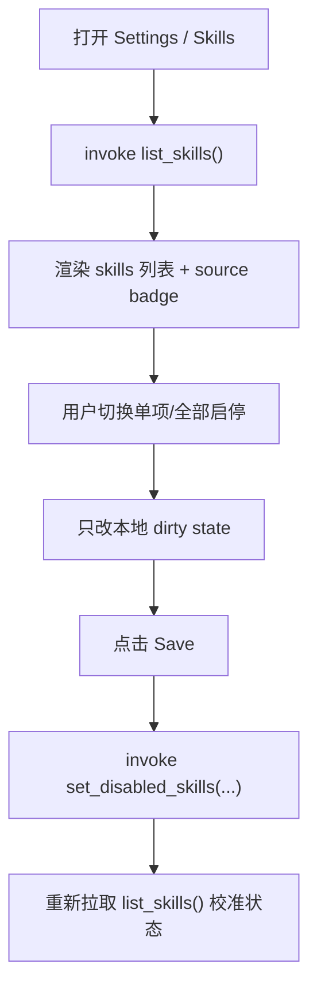

# skills-ui design

## 0. 术语约定

| 术语 | 定义 | 防冲突结论 |
|---|---|---|
| loaded skill | 被 j-cli 从用户级或项目级目录扫描并成功解析出的 skill | 不是目录占位；必须已有可解析 frontmatter |
| skill source | skill 的来源层级：`user` / `project` | 项目级同名 skill 覆盖用户级，UI 必须显式展示 |
| disabled skill | 存在于 `AgentConfig.disabled_skills` 的 skill 名称 | 启停键值以 skill name 为准，不以路径为准 |
| skills governance | 对 skill 的启停与可见元数据治理 | 首版不等于“在 GUI 内编写 skill” |

## 1. 决策与约束

### 需求摘要

- 做什么：在 Settings 中新增 Skills tab，让用户看到当前可用 skills，并能启用/禁用它们。
- 为谁做：已经在 CLI 里使用 skills、希望在 GUI 里治理 Agent 能力边界的人。
- 成功标准：GUI 能稳定列出 skills、反映来源层级与启停状态，保存后真实回写到 `disabled_skills`。
- 明确不做：不在 GUI 内创建/删除 skill 目录；不编辑 `SKILL.md` 正文；不做 skill marketplace；不做正文全文预览。

### 关键决策

1. **Skills UI 是治理界面，不是编辑器。**
   - 原因：j-cli 已有稳定的 skill 目录与 frontmatter 解析逻辑，首版只需要把“哪些 skill 生效”搬到 GUI。

2. **数据源直接锚定 j-cli 的 `load_all_skills()`。**
   - `src/command/chat/infra/skill.rs` 已定义 skill 来源、覆盖规则、排序规则。
   - GUI 不重新扫描文件系统，不自己发明解析器。

3. **项目级覆盖关系必须可见。**
   - j-cli 当前是“同名时项目级覆盖用户级”。
   - GUI 若只展示名字，会让用户误判自己正在启停哪一份 skill。

4. **持久化口径继续复用 `AgentConfig.disabled_skills`。**
   - 首版不新建单独 skills 配置文件。
   - 这样可与 CLI/TUI 保持同一份生效结果。

5. **Settings 脏状态由 `frontend-settings-refined` 统一承担。**
   - Skills tab 不各自发明保存时机；遵守统一的 Save/Cancel/未保存保护行为。

## 2. 名词与编排

### 2.1 现状

- `src-tauri/src/commands/config.rs` 当前 `get_agent_config()` 只返回 `providers/active_index/theme`，拿不到 `disabled_skills` 和 skill 元数据。
- `../j/src/command/chat/infra/skill.rs` 已有：
  - `SkillSource::{User, Project}`
  - `load_all_skills()` 的覆盖与排序逻辑
  - `Skill { frontmatter, dir_path, source }`
- `../j/src/command/chat/ui/config/skills.rs` 与 `update_config.rs` 已定义 TUI 侧行为：
  - 展示“已启用 X/Y”
  - 单项 toggle
  - 全部启用 / 全部禁用

### 2.2 新接口

后端新增：

```rust
struct SkillEntry {
    name: String,
    description: String,
    source: String,         // "user" | "project"
    dir_path: String,
    enabled: bool,
}

list_skills() -> Result<Vec<SkillEntry>, String>
set_disabled_skills(disabled_skill_names: Vec<String>) -> Result<(), String>
```

前端状态建议：

```ts
type SkillEntry = {
  name: string;
  description: string;
  source: "user" | "project";
  dirPath: string;
  enabled: boolean;
};
```

### 2.3 编排



## 3. UI 约束

1. 列表项至少展示：
   - 名称
   - 描述
   - 来源 badge（用户级 / 项目级）
   - 启停开关

2. 首版保留两类批量动作：
   - 全部启用
   - 全部禁用

3. 空态必须说明扫描目录来源：
   - `~/.jdata/agent/skills/`
   - `.jcli/skills/`

4. 不在首版中承诺：
   - 正文预览抽屉
   - 在 GUI 内打开目录并编辑
   - skill 搜索与标签过滤

## 4. Proma / j-cli 经验吸收

- **Proma 参考点**：Settings 导航结构、Skills 列表治理方式、脏状态保护。
- **j-cli 参考点**：skills 的真实来源层级、覆盖规则、启停语义、批量启停动作。
- **j-gui 取舍**：可以参考 Proma 的实际组织方式，但实体语义仍完全跟随 j-cli；不把 skill 做成“可在线编辑模板”。

## 5. 验收闭环

满足以下行为即可认为首版达标：

1. 打开 Skills tab 能看到当前已加载 skills，且项目级覆盖不会被误展示为两份。
2. 单项启停与全部启停保存后，CLI/TUI 读取同一份 `disabled_skills` 能得到一致结果。
3. 没有任何 skill 时，用户仍能从空态知道应该去哪里放置 skill。
