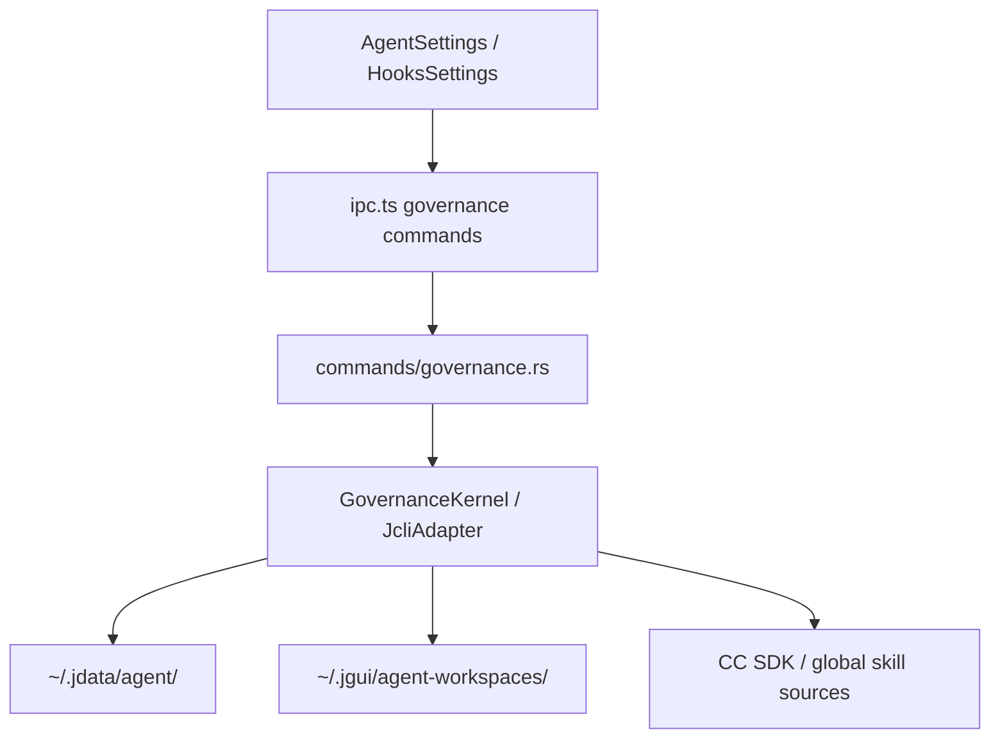

# governance-bidirectional-sync — 治理真相收口

## 0. 术语

| 术语 | 含义 |
|---|---|
| jcli 源 | jcli 自身的 Skills / MCP / Hooks 存储（`~/.jdata/agent/`），由 j-gui 管理 |
| CC SDK 源 | Claude Code Agent SDK 的 Skills / MCP / Hooks 来源（`~/.jdata/agent/sdk-config/` + 工作区目录） |
| 全局源 | `~/.claude/agents/skills/` / `~/.agent/skills/` 等全局技能目录 |
| 工作区治理真相 | 某个工作区下的 skills 目录、workspace MCP 配置、hook 启停状态与导入来源信息 |

## 1. 决策与约束

### 1.1 核心约束

- **j-gui 管理 jcli 配置**：Skills / MCP / Hooks 的启停与编辑通过 j-gui UI 发起，写入真实数据目录
- **UI 区分来源**：jcli 源 / CC SDK 源 / 全局源 / 工作区源要在前端展示为不同来源，而不是混成一类
- **基于 GovernanceKernel**：治理操作通过 trait 与 adapter 走正式后端，不直接在 UI 假装成功
- **ToolSettings runtime 单独收口**：聊天工具的 runtime 生效问题明确拆到 `toolsettings-runtime-closure`

### 1.2 明确不做

- 不修改 jcli 代码
- 不在 j-gui 内创建/编辑 Hook 文件（本项只管启停与来源真相）
- 不实现 MCP Server 安装向导
- 不把聊天工具的 runtime 生效问题继续算进本项完成标准

## 2. 方案

### 2.1 当前真相

当前治理命令面已经存在正式后端注册：

```text
list_skills
scan_global_skills
copy_skill_to_workspace
read_skill_content
write_skill_content
toggle_workspace_skill
delete_workspace_skill
get_workspace_skills
get_workspace_skills_dir
get_other_workspace_skills
import_skill_from_workspace
list_hooks
toggle_hook
list_mcp_servers
save_mcp_servers
get_workspace_mcp_config
save_workspace_mcp_config
import_cc_sdk_hooks
import_cc_sdk_mcp
```

因此本项不再是“补缺失命令”，而是“确认这些命令对应的治理真相和验收边界”。

### 2.2 与 ToolSettings 的边界

本项只负责：

- Skills 工作区管理与来源展示
- Skills 工作区目录管理，以及基于 `AgentConfig.disabled_skills` 的共享启停真相
- Hooks 列表、启停与来源筛选
- MCP 列表、保存、工作区配置与 CC SDK 导入
- 工作区治理相关的真实持久化路径

本项明确不负责：

- `list_chat_tools / set_tool_enabled`
- 工具凭据、连通性测试、自定义工具 CRUD
- `enabledToolIds` 在 Chat runtime 里的真实消费

后者全部转入 `toolsettings-runtime-closure`。

### 2.3 编排层



### 2.4 挂载点

| # | 挂载点 | 说明 |
|---|---|---|
| 1 | `src-tauri/src/kernel/governance.rs` | 治理命令真相与边界 |
| 2 | `src-tauri/src/kernel/adapter_governance.rs` | jcli / workspace 治理读写实现 |
| 3 | `src-tauri/src/commands/governance.rs` | Tauri 命令表面 |
| 4 | `src-tauri/src/lib.rs` | invoke_handler 注册面 |
| 5 | `src/components/settings/HooksSettings.tsx` | Hooks 启停与来源筛选 UI |
| 6 | `src/components/settings/AgentSettings.tsx` | Skills / MCP / workspace 治理 UI |

### 2.5 推进策略

| Step | 内容 | 退出信号 |
|---|---|---|
| 1 | 确认治理命令面与 `GovernanceKernel` / Tauri 注册一致 | cargo check 通过 |
| 2 | 确认 HooksSettings 的启停与来源筛选只依赖正式后端命令 | bun run test 通过 |
| 3 | 确认 Skills / MCP / CC SDK 工作区治理命令写回真实持久化路径 | 代码核对完成 |
| 4 | 补 acceptance，证明治理项本身不再是“看起来有 UI，实际没落盘”的伪闭环 | acceptance 完成 |
| 5 | 跑治理项的端到端持久化验收 | 手动验收完成 |

## 3. 验收契约

| # | 触发 | 期望结果 |
|---|---|---|
| A1 | Skills tab 编辑内容并保存 | 内容持久化，刷新或重开后保留 |
| A2 | Skills tab 启停切换 | 写入共享 `AgentConfig.disabled_skills`，并正确反映到当前工作区能力视图 |
| A3 | MCP tab 添加/编辑/删除 server | 持久化到真实 MCP 配置 |
| A4 | Hooks tab 切换启停 | 写入 jcli disabled hooks，CLI 侧同步 |
| A5 | 导入 CC SDK 配置 | 列表出现对应来源条目 |
| A6 | 查看 ToolSettings | 不再把聊天工具 runtime 问题算到本项完成标准 |

### 明确不做反向核对

- [ ] 不修改 jcli 代码
- [ ] 不在 j-gui 创建 / 编辑 Hook 文件
- [ ] 不把 ToolSettings runtime 生效问题算进本项完成标准

## 4. 对其他模块的影响

| 模块 | 影响 | 动作 |
|---|---|---|
| `kernel/governance.rs` | 治理 trait 真相 | 核对 |
| `kernel/adapter_governance.rs` | 治理读写实现 | 核对 |
| `commands/governance.rs` | 命令注册面 | 核对 |
| `HooksSettings.tsx` | Hooks UI 真相 | 核对 |
| `AgentSettings.tsx` | Skills / MCP 治理 UI | 核对 |
