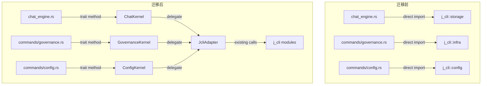

# kernel-trait-abstraction — jcli 内核 trait 抽象层

## 0. 术语

| 术语 | 含义 |
|------|------|
| **Kernel trait** | j-gui 定义的 Rust trait，抽象 jcli 的某一领域能力 |
| **Adapter** | 实现 trait 的结构体，内部包装现有 jcli 调用 |
| **迁移** | 将 j-gui 模块中的直接 `j_cli::` 导入替换为 trait 方法调用 |
| **退出标准** | `grep -r "j_cli::" src-tauri/src/` 仅命中 `adapters/` 目录 |

## 1. 决策与约束

### 1.1 为什么现在做

当前 22 个 `j_cli::` 导入点跨越 10 个内部模块。每新增一个 feature，解耦成本翻倍——#27 channel-model-unify、#28 governance-bidirectional-sync、#29 agent-engine-jagent 如果全基于直接导入实现，后续抽离需要同时改 5+ 个功能模块。

### 1.2 不做什么

- **不修改 jcli 代码**——trait 和 adapter 全在 j-gui 侧
- **不改变现有行为**——adapter 是纯包装，语义完全等价
- **不引入新的 IPC 协议**——仍通过 crate dependency 调用。但流式回调改为 `Channel<ChatEvent>`（与现有 IPC 模式一致）
- **不一步到位全部迁移**——分步：定义 trait → 写 adapter → 渐进迁移。每步由 feature flag 保护
- **trait 签名使用 j-gui 自有类型**——kernel/types.rs 定义轻量 DTO，adapter 内部做 ↔ jcli 类型转换。避免 jcli 类型变更穿透 trait 层

### 1.3 已知权衡

- trait 方法使用 j-gui `kernel/types.rs` 定义的 DTO（非 jcli 类型），增加 ~5 行/类型的 From/Into 代码，换取真正的解耦
- `JcliAdapter` 实现全部 3 个 trait 注入为单一 State（简化注入，接受 ISP 偏离——当前只有一个实现者）
- adapter 优先放 `kernel/adapter.rs`，未来有第二个实现者再拆目录

## 2. 方案

### 2.1 名词层

**现状**（j-gui 直接导入 jcli 内部路径）：

```rust
// chat_engine.rs
use j_cli::command::chat::storage::{
    load_agent_config, ChatMessage, MessageRole, SessionEvent,
    append_session_event, load_session,
};
use j_cli::command::chat::agent::api::call_llm_stream_async;

// commands/governance.rs
use j_cli::command::chat::infra::skill::{load_all_skills, Skill, SkillSource};
use j_cli::command::chat::infra::hook::manager::HookManager;
use j_cli::command::chat::infra::hook::types::{HookEvent, OnError};

// commands/config.rs
use j_cli::config::YamlConfig;
use j_cli::command::chat::storage::{load_agent_config, save_agent_config, ModelProvider};
// ... 共 22 个导入点
```

---

**变化**（trait 抽象层）：

```rust
// src-tauri/src/kernel/mod.rs
pub mod chat;
pub mod config;
pub mod governance;
pub mod error;

pub use chat::ChatKernel;
pub use config::ConfigKernel;
pub use governance::GovernanceKernel;
pub use error::KernelError;
```

**3 个 trait**（SessionKernel 合并入 ChatKernel，SystemKernel 合并入 ConfigKernel）：

```rust
// kernel/types.rs — j-gui 自有类型（不依赖 jcli）
pub struct KernelProvider {
    pub name: String,
    pub api_base: String,
    pub api_key: String,
    pub model: String,
    pub supports_vision: bool,
}
// From<j_cli::ModelProvider> for KernelProvider 在 adapter 内实现
// From<KernelProvider> for j_cli::ModelProvider 同上

pub struct KernelChatMessage { pub role: String, pub content: String }
pub struct KernelSessionSummary { pub id: String, pub title: Option<String>, pub message_count: usize, pub updated_at: u64 }
pub struct KernelSessionEvent { /* session event fields */ }

// kernel/error.rs — 统一错误类型，带 source 溯源
#[derive(Debug, thiserror::Error)]
pub enum KernelError {
    #[error("配置错误: {0}")]
    Config(String),
    #[error("对话错误: {0}")]
    Chat(#[source] Box<dyn std::error::Error + Send + Sync>),
    #[error("治理错误: {0}")]
    Governance(String),
    #[error("不支持: {0}")]
    Unsupported(String),
    #[error("IO 错误: {0}")]
    Io(#[from] std::io::Error),
}

// kernel/chat.rs — 流式对话 + 会话 CRUD
#[cfg_attr(test, mockall::automock)]
#[async_trait]
pub trait ChatKernel: Send + Sync {
    /// LLM 流式调用。通过 Channel 推送（与现有 IPC 模式一致，可 mock）
    async fn stream_chat(
        &self, provider: &KernelProvider, messages: &[KernelChatMessage],
        system_prompt: Option<&str>, on_event: Channel<ChatEvent>,
    ) -> Result<(), KernelError>;

    /// 会话管理
    fn list_sessions(&self) -> Result<Vec<SessionSummary>, KernelError>;
    fn get_session(&self, session_id: &str) -> Result<Vec<SessionEvent>, KernelError>;
    fn create_session(&self) -> Result<String, KernelError>;
    fn delete_session(&self, session_id: &str) -> Result<(), KernelError>;
    fn delete_message(&self, session_id: &str, pair_index: usize) -> Result<(), KernelError>;
    fn clear_session(&self, session_id: &str) -> Result<(), KernelError>;
}

// kernel/config.rs — Provider + Alias + System Prompt + YamlConfig + System
pub trait ConfigKernel: Send + Sync {
    // Provider/Channel
    fn load_providers(&self) -> Result<Vec<ModelProvider>, KernelError>;
    fn save_providers(&self, providers: &[ModelProvider]) -> Result<(), KernelError>;

    // Alias
    fn list_aliases(&self) -> Result<Vec<AliasEntry>, KernelError>;
    fn set_alias(&self, section: &str, name: &str, value: &str) -> Result<(), KernelError>;
    fn remove_alias(&self, section: &str, name: &str) -> Result<(), KernelError>;

    // System Prompt
    fn load_system_prompt(&self) -> Result<Option<String>, KernelError>;
    fn save_system_prompt(&self, prompt: &str) -> Result<(), KernelError>;

    // YamlConfig
    fn get_yaml_section(&self, section: &str) -> Result<HashMap<String, String>, KernelError>;
    fn set_yaml_property(&self, section: &str, key: &str, value: &str) -> Result<(), KernelError>;

    // System
    fn version(&self) -> String;
    fn data_dir(&self) -> PathBuf;
    fn set_theme(&self, theme: &str) -> Result<(), KernelError>;
}

// kernel/governance.rs — Skills + Hooks + MCP + Chat Tools
pub trait GovernanceKernel: Send + Sync {
    // Skills
    fn list_skills(&self) -> Result<Vec<SkillInfo>, KernelError>;
    fn scan_global_skills(&self) -> Result<Vec<SkillInfo>, KernelError>;
    fn copy_skill_to_workspace(&self, source_dir: &str, workspace_slug: &str, skill_slug: &str) -> Result<(), KernelError>;

    // Hooks
    fn list_hooks(&self) -> Result<Vec<HookInfo>, KernelError>;
    fn toggle_hook(&self, unique_id: &str, enabled: bool) -> Result<(), KernelError>;

    // MCP
    fn list_mcp_servers(&self) -> Result<Vec<McpServerConfig>, KernelError>;
    fn save_mcp_servers(&self, servers: &[McpServerConfig]) -> Result<(), KernelError>;

    // Chat Tools
    fn list_chat_tools(&self) -> Result<Vec<ToolInfo>, KernelError>;
    fn set_tool_enabled(&self, name: &str, enabled: bool) -> Result<(), KernelError>;
}
```

**合并理由**：
- SessionKernel → ChatKernel：会话是 Chat 的自然组成，分离增加注入复杂度
- SystemKernel → ConfigKernel：版本号/主题/数据目录本质是配置类信息

**Tauri State 注入**（替代手动 Arc）：

```rust
// lib.rs
app.manage(JcliAdapter::new());

// 命令中自动注入，无需手动构造 Arc
#[tauri::command]
fn list_channels(state: tauri::State<JcliAdapter>) -> Result<Vec<ChannelInfo>, String> {
    state.config().load_providers().map_err(|e| e.to_string())
    //        ↑ JcliAdapter 暴露各 kernel 的访问器
}
```

**JcliAdapter 结构**：

```rust
pub struct JcliAdapter;

impl JcliAdapter {
    pub fn new() -> Self { Self }
    /// 返回 ConfigKernel 访问器
    pub fn config(&self) -> &dyn ConfigKernel { self }
    /// 返回 ChatKernel 访问器
    pub fn chat(&self) -> &dyn ChatKernel { self }
    /// 返回 GovernanceKernel 访问器
    pub fn governance(&self) -> &dyn GovernanceKernel { self }
}

// 三个 trait 都在同一个 struct 上实现
impl ConfigKernel for JcliAdapter { /* 委托给现有 jcli 调用 */ }
impl ChatKernel for JcliAdapter { /* 委托给现有 jcli 调用 */ }
impl GovernanceKernel for JcliAdapter { /* 委托给现有 jcli 调用 */ }
```

**_impl 层测试模式**（每个命令拆两层，_impl 可独立测试）：

```rust
// 第 1 层：Tauri 包装（薄，不测试）
#[tauri::command]
pub fn list_aliases(state: tauri::State<'_, JcliAdapter>) -> Result<Vec<AliasEntry>, String> {
    list_aliases_impl(state.config())
}

// 第 2 层：纯逻辑（测试这层，传 MockConfigKernel 即可）
fn list_aliases_impl(config: &dyn ConfigKernel) -> Result<Vec<AliasEntry>, String> {
    config.list_aliases().map_err(|e| e.to_string())
}
```

**ChatEngine 重构模式**：

```rust
pub struct ChatEngine {
    chat: Arc<dyn ChatKernel>,
    config: Arc<dyn ConfigKernel>,
}
impl ChatEngine {
    pub fn new(chat: Arc<dyn ChatKernel>, config: Arc<dyn ConfigKernel>) -> Self { Self { chat, config } }
    // 现有方法签名不变，内部调用 self.chat.* / self.config.*
}
```

保留 ChatEngine 结构体——它承载编排逻辑（消息构建、取消检测、事件映射），这些不属于 kernel trait。

**Feature flag 安全迁移**（每步可独立开关）：

```rust
// Cargo.toml
[features]
kernel-trait = []  // 逐步启用各模块的 trait 路径

// commands/alias.rs
#[cfg(feature = "kernel-trait")]
fn list_aliases(state: tauri::State<'_, JcliAdapter>) -> ... { list_aliases_impl(state.config()) }

#[cfg(not(feature = "kernel-trait"))]
fn list_aliases() -> ... { /* 原有实现，不变 */ }
```

迁移完成且验证通过后，删除 `#[cfg(not)]` 分支和 feature flag。

**write_error_log 处理**：

`j_cli::util::log::write_error_log`（agent_engine.rs 使用）不属于 ChatKernel/ConfigKernel/GovernanceKernel 任一领域。方案：在 `agent_engine.rs` 中用 `eprintln!` 替代，移除该 jcli 导入。agent_engine 的日志需求足够简单，不值得为此扩展 ConfigKernel。

**回滚策略**：

所有改动在 j-gui 侧，零 jcli 改动。回滚 = `git checkout -- src-tauri/src/`。若 Cargo.toml 新增了 feature flag 或依赖，一并 revert。

**渐进式构建**（先写 adapter，再提取 trait 签名）：

```
Step 1: 只改 chat_engine.rs 中的 call_llm_stream_async 调用
        → 直接替换为 JcliAdapter.stream_chat()
        → 编译器告诉你 trait 方法签名应该长什么样
Step 2: 把验证通过的方法签名提取到 ChatKernel trait
Step 3: 重复直到所有 22 个导入点迁移完毕
```

避免"一次设计全部签名 → 实现时发现不合适 → 回头改 trait"的循环。

**Adapter 实现**：

```rust
// src-tauri/src/adapters/jcli_adapter.rs
pub struct JcliAdapter;

impl ChatKernel for JcliAdapter {
    async fn stream_chat(&self, provider: &ModelProvider, messages: &[ChatMessage],
        system_prompt: Option<&str>, on_chunk: &mut dyn FnMut(&str)
    ) -> Result<(), String> {
        call_llm_stream_async(provider, messages, system_prompt, on_chunk).await
    }
    // ... 其他方法委托给现有 jcli 调用
}

impl ConfigKernel for JcliAdapter {
    fn load_providers(&self) -> Vec<ModelProvider> {
        load_agent_config().providers
    }
    fn save_providers(&self, providers: &[ModelProvider]) -> Result<(), String> {
        let mut config = load_agent_config();
        config.providers = providers.to_vec();
        if save_agent_config(&config) { Ok(()) } else { Err("保存失败".into()) }
    }
    // ...
}
```

**实现模式**：

### 2.2 编排层



**主流程**：

1. **定义 trait** → 创建 `src-tauri/src/kernel/` 目录，每个 trait 一个文件
2. **写 JcliAdapter** → `src-tauri/src/adapters/jcli_adapter.rs`，每个 trait 方法委托给现有 jcli 调用
3. **注入 adapter** → Tauri `manage(JcliAdapter)` 或全局 `Arc<dyn Kernel>`，命令层通过 state 获取
4. **渐进迁移** → 每次迁移一个模块的导入点，编译 + 测试通过后再迁下一个
5. **验证** → `grep -r "j_cli::" src-tauri/src/` 仅剩 adapters/

### 2.3 挂载点

> jcli 升级应对（4 种场景）已移入项目参考：`.codestable/compound/2026-05-10-decision-jgui-jcli-decouple.md#jcli-升级应对`

| # | 挂载点 | 说明 |
|---|--------|------|
| 1 | `src-tauri/src/kernel/` | 5 个 trait 定义 + mod.rs |
| 2 | `src-tauri/src/adapters/jcli_adapter.rs` | 所有 trait 的 jcli 适配器实现 |
| 3 | `src-tauri/src/lib.rs` | 注册 adapter 到 Tauri state |
| 4 | 各 commands/ 文件 | 从直接 import jcli 改为通过 trait 调用 |
| 5 | `chat_engine.rs` / `agent_engine.rs` | 同上 |

### 2.4 推进策略

| Step | Paradigm | 内容 | 退出信号 |
|------|----------|------|---------|
| 1 | Trait 定义 | 创建 kernel/ 目录，定义 3 个 trait + types.rs + error.rs。`#[cfg_attr(test, mockall::automock)]` | `cargo check` 通过 |
| 2 | Adapter | 写 JcliAdapter（kernel/adapter.rs），每个方法委托给现有 jcli 调用，内部做 Kernel* ↔ jcli 类型转换 | `cargo test` 全量通过 |
| 3 | 注册注入 | lib.rs 中 `app.manage(JcliAdapter::new())`，ChatEngine 改为接收 kernel | `cargo check` 通过 |
| 4 | 迁移 alias+system | alias.rs (3 命令) → ConfigKernel，system.rs (2 命令) → ConfigKernel。最简单，1-2 导入 | `cargo test` 通过 |
| 5 | 迁移 config+channels | config.rs (7 命令) + channels.rs (6 命令) → ConfigKernel | `cargo test` 全量通过 |
| 6 | 迁移 chat | chat_engine.rs + chat.rs → ChatKernel。最高风险——流式 + ChatEngine 编排 | `cargo test` + 手动流式测试 |
| 7 | 迁移 governance | governance.rs → GovernanceKernel。独立模块，无跨模块锁依赖 | `cargo test` 通过 |
| 8 | 迁移 agent | agent_engine.rs → 替换 write_error_log 为 eprintln!，agent_session.rs → ConfigKernel::data_dir() | `cargo test` 通过 |
| 9 | 验证 | `grep -r "j_cli::" src-tauri/src/` 仅命中 kernel/adapter.rs | 退出标准达成 |

### 2.5 结构健康度

**新增目录**：
- `src-tauri/src/kernel/`（6 个文件：mod + 5 trait）— 新目录，健康 ✅
- `src-tauri/src/adapters/`（1 个文件）— 新目录，健康 ✅

**现有文件改动**：
- `commands/governance.rs`：替换 6 个 jcli 导入 → 1 个 trait 引用，改动 ~10 行 ✅
- `commands/config.rs`：替换 4 个 jcli 导入 → 1 个 trait 引用 ✅
- `chat_engine.rs`：替换 6 个 jcli 导入 → 1 个 trait 引用，改动 ~15 行 ✅

**本次不做微重构**。改动集中在新增 trait 文件和替换导入，不涉及文件拆分。

## 3. 验收契约

### 正常场景

| # | 触发 | 期望结果 |
|---|------|---------|
| A1 | 定义全部 5 个 trait | `cargo check` 通过，无编译错误 |
| A2 | JcliAdapter 实现全部 trait | `cargo test` 全量通过（行为不变） |
| A3 | 迁移 governance.rs | Skills/Hooks/MCP 命令正常响应 |
| A4 | 迁移 config.rs + channels.rs | Channel CRUD + Alias CRUD 正常 |
| A5 | 迁移 chat_engine.rs | Chat 流式对话正常 |
| A6 | 退出标准验证 | `grep -r "j_cli::" src-tauri/src/` 仅命中 adapters/ |

### 边界场景

| # | 触发 | 期望结果 |
|---|------|---------|
| B1 | adapter 方法返回错误 | 与迁移前相同的错误信息和行为 |
| B2 | 多个模块并发调用 adapter | 行为与迁移前一致（Mutex 保护不变）|

### 错误场景

| # | 触发 | 期望结果 |
|---|------|---------|
| C1 | trait 方法与 jcli 签名不一致 | `cargo check` 编译错误（可立即发现并修正）|

### 明确不做反向核对

- [ ] 不修改 jcli 代码
- [ ] 不改变现有函数签名（仅替换调用方式）
- [ ] 不引入 async_trait 以外的依赖
- [ ] 不在本 feature 中修改前端代码

## 4. 对其他模块的影响

| 模块 | 影响 | 动作 |
|------|------|------|
| 文件 | 导入点 | 移入 trait | 备注 |
|------|--------|-----------|------|
| `commands/alias.rs` | 1 | ConfigKernel | 最简单，先迁 |
| `commands/system.rs` | 2 | ConfigKernel | theme 的 `app.emit()` 保留在命令层 |
| `commands/config.rs` | 4 | ConfigKernel | |
| `commands/channels.rs` | 3 | ConfigKernel | |
| `commands/settings.rs` | 1 | ConfigKernel | agent_data_dir 引用 |
| `chat_engine.rs` | 6 | ChatKernel + ConfigKernel | 最高风险，最后迁 |
| `commands/chat.rs` | 0 | — | 通过 ChatEngine，无直接导入 |
| `commands/governance.rs` | 6 | GovernanceKernel | |
| `agent_engine.rs` | 1 | → eprintln! 替代 | write_error_log 不用 trait |
| `agent_session.rs` | 1 | ConfigKernel::data_dir | |

> 25 个导入点（含内联路径引用和类型导入），迁移后仅 kernel/adapter.rs 内保留 `j_cli::` 导入。
