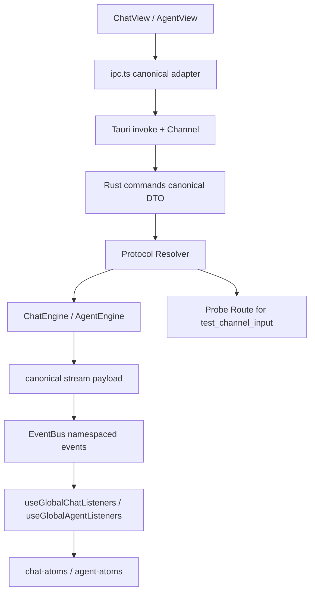

# stream-protocol-unify

## 0. 术语

| 术语 | 含义 |
|---|---|
| Canonical Request | 前后端共同认可的唯一发送请求结构；Chat/Agent 各自独立，但字段语义不再在每层重命名 |
| Canonical Stream Payload | Tauri Channel、前端 EventBus、全局监听器共同使用的一套流式事件 payload |
| Compatibility Shim | 为旧命令或旧字段保留的薄兼容层，只做转发，不再承载新语义 |
| Interrupt Contract | `permission / ask_user / plan` 三类中断请求与响应的统一口径 |
| Explicit Unsupported | 某字段当前后端不能消费时，必须显式报“不支持”或在 UI 禁用，不能静默丢弃 |
| Protocol Family | Chat runtime 实际命中的 HTTP 协议族。首批明确支持 `openai-chat-completions`、`openai-responses`、`anthropic-messages` |
| Runtime Route | 根据 `provider + api_base + model + request intent` 解析出的真实发送路径，决定使用哪个请求构造器、哪个 endpoint、哪个流式解析器 |
| Probe Route | `test_channel_input` 使用的连通性探测路径；要求与 Runtime Route 共享同一套协议解析规则，不能再独立猜测 |

## 1. 决策与约束

### 1.1 核心决策

- 统一的是契约，不是合并 Chat 与 Agent 模式。Chat/Agent 的状态、视图、runtime 继续分离；本 feature 只收口字段语义、流式 payload、中断响应口径和 Chat runtime 协议路由。
- 共享类型先行。`packages/shared/src/types/chat.ts` 与 `packages/shared/src/types/agent.ts` 是前后端共同的协议真相；`src/lib/ipc.ts` 和 Rust command 只做实现，不再各自发明一套事件形状。
- Chat runtime 以 UI-first 协议选路为准。Chat 不再被 `jcli` 当前固定的 `/chat/completions` 路径反向约束；`provider/base URL/model` 决定协议族，再决定走 `jcli` 兼容路径还是 Rust 侧直连请求。
- 测试连接与真实发送必须同口径。`test_channel_input` 不能继续“先 `/models` 再猜 fallback”；它必须与真实 Chat runtime 共享同一个 Protocol Resolver。
- 首批协议族只收口 3 条：`openai-chat-completions`、`openai-responses`、`anthropic-messages`。这已经覆盖当前 UI 主路径和用户已确认要补的 OpenAI Responses。
- 旧协议只能留在兼容桥。`respond_permission`、`respond_ask_user`、Chat 的 `content`/`delta` 双轨、Agent 的本地方言事件，都只能降级为兼容层。

### 1.2 硬约束

- MCP 仍然是 Agent runtime 边界，这次不回流到当前 Chat 主链路。
- Agent interrupt 仍保持分型：`permission`、`ask_user`、`plan` 继续是三类一等事件，不能压扁成一个通用布尔审批模型。
- 流式内容与中断队列继续分离：`agentStreamingStatesAtom` 只承载运行态/内容/工具活动；待审批请求继续走独立 per-session queue atoms。
- 运行时事件名空间必须统一：Chat 不再继续裸用 `stream:*`，改为与 shared 类型一致的 namespaced 口径。
- `provider/base URL` 不能再被简单映射成“是否 OpenAI 兼容”。像 DeepSeek Anthropic、Kimi Coding、OpenAI Responses 这类分支都要靠显式协议解析，而不是默认拼 `/chat/completions`。
- `provider key` 必须跨层统一。像 `tongyi` / `qwen` 这种命名分叉不能继续作为稳定路由键，协议解析优先级必须是“显式 UI 选择 > channel/provider 配置 > baseUrl 推断兜底”。
- `jcli::llm::LlmClient` 仍可作为其中一条实现路径，但不再是 Chat runtime 的唯一 transport。

### 1.3 明确不做

- 不在这个 feature 里补 `agent-history-replay-closure`
- 不在这个 feature 里补 `search-content-closure` 或 `toolsettings-runtime-closure`
- 不把 Chat 改造成 Agent Loop，也不把 Agent CLI 路径改写成 `j-agent` 主线
- 不顺手重写整个 `AgentView` / `ChatView` 交互，只做协议收口所必需的最小修改
- 不在这次首批里补 Google / Gemini / 其他 provider 全量 parity
- 不要求本次把“标题生成”“模型列表拉取”也全部升级成完整多协议平台层，但测试连接与真实聊天主链路必须先统一

### 1.4 复杂度档位

- 走默认档位：单机桌面、单仓库内协议收口，不引入远程同步、多用户、分布式并发语义

## 2. 方案

### 2.1 名词层

#### 现状

Chat 发送参数存在三层不一致：

```ts
type ChatSendInput = {
  conversationId: string
  userMessage: string
  channelId: string
  modelId: string
  contextLength?: number | "infinite"
  contextDividers?: string[]
  attachments?: FileAttachment[]
  thinkingEnabled?: boolean
  systemMessage?: string
  enabledToolIds?: string[]
}
```

```ts
invoke("send_message", {
  sessionId,
  content,
  onEvent,
})
```

```rust
fn send_message(session_id: String, content: String, on_event: Channel<ChatEvent>)
```

Chat 流式事件此前也长期处于双轨：

```ts
// Rust
ChatEvent::Chunk { index, content }

// shared / listener 期望
type StreamChunkEvent = { conversationId: string; delta: string; index?: number }
```

Agent 流式事件也至少有三套方言：

```ts
// Rust CLI path
AgentEvent = AssistantContent | ToolUse | Interrupt | ToolResult | Done | Error

// shared canonical type
AgentStreamPayload =
  | { kind: "sdk_message"; message: SDKMessage }
  | { kind: "jgui_event"; event: JguiEvent }

// ipc.ts 本地方言
{ kind: "text" | "tool_use" | "interrupt" | "tool_result", ... }
```

Agent interrupt 响应虽然前端已经主要走 `respond_agent_interrupt`，但 Rust 仍公开：

- `respond_agent_interrupt`
- `respond_permission`
- `respond_ask_user`

更关键的是，Chat runtime 与测试连接现在还不是同一口径：

```rust
// src-tauri/src/commands/channels.rs
test_channel_input(...)
  -> GET {api_base}/models
  -> 404/403 or error 时 fallback 到 try_chat_completion(...)

try_chat_completion(...)
  -> anthropic/deepseek => POST /messages
  -> 其他 => POST /chat/completions
```

```rust
// src-tauri/src/kernel/adapter.rs
ChatKernel::stream_chat(...)
  -> LlmClient::new(...)
  -> chat_completion_stream(&request)
  -> 固定由 jcli 客户端命中 /chat/completions
```

这导致一个真实缺口：测试连接可能成功，但真实 Chat 仍然 404，因为二者没有共享同一套协议解析规则。

与此同时，UI 侧其实已经有更成熟的协议适配思路，但还没有进入当前 Rust Chat runtime：

- `packages/core/src/providers/openai-adapter.ts`：支持 OpenAI Chat Completions SSE 解析，但仍固定 `/chat/completions`
- `packages/core/src/providers/anthropic-adapter.ts`：支持 Anthropic Messages，并已处理 thinking / tools / SSE 方言
- `packages/core/src/providers/types.ts`：已经把“请求构造 + SSE 解析”抽成了 provider adapter 模型

另外，当前 `infer_provider(...)` 和前端 provider registry 之间还存在命名分叉，例如 Rust 侧可能推断成 `tongyi`，而共享/前端侧实际使用 `qwen`。这意味着 `baseUrl -> provider` 不能直接当成稳定真相，必须先经过一层 canonical provider key 归一化。

#### 变化

本 feature 引入两套唯一对外契约，以及一套后端内部的协议路由结果：

```ts
type ChatRequestInput = {
  sessionId: string
  content: string
  channelId?: string
  modelId?: string
  systemMessage?: string | null
  contextLength?: number | "infinite"
  contextDividers?: string[]
  attachments?: FileAttachment[]
  thinkingEnabled?: boolean
  enabledToolIds?: string[]
  protocolHint?: "auto" | "openai-chat-completions" | "openai-responses" | "anthropic-messages"
}
```

```ts
type ChatProtocolFamily =
  | "openai-chat-completions"
  | "openai-responses"
  | "anthropic-messages"

type ChatTransportRoute = {
  family: ChatProtocolFamily
  baseUrl: string
  modelId: string
  providerType: string
  providerKey: string
}
```

```ts
type ChatStreamPayload =
  | { type: "chunk"; sessionId: string; delta: string; index: number }
  | { type: "reasoning"; sessionId: string; delta: string }
  | { type: "complete"; sessionId: string; totalTokens: number }
  | { type: "error"; sessionId: string; message: string; code?: string }
  | { type: "unsupported_fields"; sessionId: string; fields: string[]; message: string }
  | { type: "route_resolved"; sessionId: string; family: ChatProtocolFamily }
```

```ts
type AgentStreamPayload =
  | { kind: "sdk_message"; message: SDKMessage }
  | { kind: "jgui_event"; event: JguiEvent }
```

```ts
respondAgentInterrupt({
  sessionId: string
  interruptId: string
  kind: "permission" | "ask_user" | "plan"
  response: PermissionResponse | AskUserResponse | PlanResponse
})
```

Chat 字段处理矩阵在这一版必须明确：

| 字段 | 本 feature 处理要求 |
|---|---|
| `sessionId/content` | 必须真实消费 |
| `channelId/modelId` | 必须真实进入后端选路，不再只靠 active provider |
| `systemMessage` | 必须真实进入 ChatKernel 调用 |
| `attachments` | 图片附件必须继续闭环；非图片附件若未支持，显式报错 |
| `thinkingEnabled` | 必须真实透传到当前 route 支持的协议；不支持时显式报错 |
| `enabledToolIds` | 若本版不能真实消费，必须显式报 `unsupported_fields` 或在 UI 禁用 |
| `contextLength/contextDividers` | 当前已进入真实消费链，后续 route 切换不能再回退成静默丢弃 |

协议路由矩阵在这一版也必须明确：

| 条件 | 目标协议族 |
|---|---|
| `provider`/`base_url` 明确声明 Anthropic Messages 方言 | `anthropic-messages` |
| `provider`/`base_url` 明确声明 OpenAI Responses，或模型/渠道规则指向 Responses | `openai-responses` |
| 其余当前 OpenAI 兼容主链路 | `openai-chat-completions` |

跨层统一表也必须明确到实现里：

| provider key | protocol family | endpoint | auth |
|---|---|---|---|
| `openai` | `openai-chat-completions` / `openai-responses` | `/chat/completions` or `/responses` | `Authorization: Bearer` |
| `anthropic` | `anthropic-messages` | `/messages` | `x-api-key` + `Authorization: Bearer` |
| `deepseek` | `anthropic-messages` or OpenAI 兼容分支，按显式 route 决定 | 不再靠 provider 名猜默认 endpoint | route-specific |
| `qwen` | 待按实际兼容协议归一后决定 | 不能继续和 `tongyi` 分叉 | route-specific |

这次必须同时终结两件事：

1. 前端组装了，IPC 直接丢字段
2. 测试连接和真实发送各自猜协议

### 2.2 编排层



#### Chat 主流程

1. `ChatView` 继续组装完整 `ChatRequestInput`
2. `ipc.sendMessage()` 不再丢字段，而是：
   - 把可消费字段原样下传
   - 对当前后端还不能消费的字段，显式走 `unsupported_fields`
3. Rust `send_message` 改为接收 canonical request DTO，而不是最小三元组
4. `Protocol Resolver` 先把 provider key 归一化，再根据 `provider + api_base + model + protocolHint` 解析出 `ChatTransportRoute`
5. `ChatEngine` 按 route 选择 transport：
   - `openai-chat-completions`：可继续走 `jcli::llm::LlmClient` 兼容路径
   - `anthropic-messages`：走 Rust 侧直连请求与流式解析
   - `openai-responses`：走 Rust 侧直连请求，并把响应流映射回 canonical `delta/reasoning/tool` 事件
6. `ipc.ts` 与 `useGlobalChatListeners` 共同改成只认 `chat:stream:*` namespaced canonical payload

#### Agent 主流程

1. CLI path 与 JAgent path 都必须在进入前端前先收口成 `AgentStreamPayload`
2. `ipc.ts` 不再发明 `{ kind: "text" }` 这类本地方言，而是直接透传 canonical payload
3. `useGlobalAgentListeners` 继续作为唯一消费入口，但兼容转换逻辑只保留到 canonical payload 这一层
4. `PermissionBanner` / `AskUserBanner` / `ExitPlanModeBanner` 的提交路径全部统一到 `respond_agent_interrupt`
5. `respond_permission` / `respond_ask_user` 仅保留为 Rust compat shim，内部立即转发到统一入口

#### 测试连接主流程

1. `test_channel_input` 与 `send_message` 共用同一个 `Protocol Resolver`
2. Probe 模式优先做“最小真实请求”而不是“猜一个通用 endpoint”：
   - `openai-chat-completions`：最小 chat completion probe
   - `openai-responses`：最小 responses probe
   - `anthropic-messages`：最小 messages probe
3. `/models` 拉取保留为“模型发现能力”，不再承担“连接是否可用于聊天”的真判断
4. 返回值要能区分：
   - “凭据和 endpoint 可用”
   - “模型列表可读”
   - “当前聊天协议可发送”
5. `/models` 成功只代表“模型发现可读”，不能直接代表“Chat 协议可发送”

#### 错误与兼容语义

- Chat 对“当前后端不支持的字段”必须返回结构化错误，而不是静默忽略
- Chat 对“当前 route 不支持的 endpoint / provider 组合”必须返回结构化错误，而不是回退到错误的默认 endpoint
- Agent 若收到旧命令，也必须映射到统一响应结构，不再新增旁路逻辑
- 任何新增前端调用点，只允许使用 canonical request / payload / interrupt API

### 2.3 挂载点

| # | 挂载点 | 说明 |
|---|---|---|
| 1 | `packages/shared/src/types/chat.ts` + `packages/shared/src/types/agent.ts` | 共享 canonical request / payload / error 类型 |
| 2 | `src/lib/ipc.ts` | 统一 Chat/Agent Channel decode 与 EventBus emit，不再保留本地方言 |
| 3 | `src/hooks/useGlobalChatListeners.ts` + `src/hooks/useGlobalAgentListeners.ts` | 只消费 canonical payload |
| 4 | `src-tauri/src/commands/chat.rs` + `src-tauri/src/chat_engine.rs` | Chat request DTO + provider/model/systemMessage 消费 + canonical chat stream event |
| 5 | `src-tauri/src/commands/channels.rs` | `test_channel_input` / probe 路由与真实运行时共享 resolver |
| 6 | `src-tauri/src/kernel/adapter.rs` 或拆出的 protocol transport 模块 | Chat runtime protocol resolver + transport 选路；不再只固定 `chat_completion_stream` |
| 7 | `src-tauri/src/commands/agent.rs` + `src-tauri/src/agent_engine.rs` | `respond_agent_interrupt` 主口径固化，旧命令降级为 compat shim |

### 2.4 推进策略

| Step | 内容 | 退出信号 |
|---|---|---|
| 1 | 微重构：把 `src/lib/ipc.ts` 里的 Chat/Agent 协议 decode/normalize 提取成独立 helper，不改行为 | `bunx tsc --noEmit` 通过 |
| 2 | 共享协议定型：补齐 `packages/shared` 里的 canonical chat/agent request + payload + unsupported error 类型 | `bunx tsc --noEmit` 通过 |
| 3 | Chat 收口：`send_message` 改为接收 request DTO，真实消费 `sessionId/content/channelId/modelId/systemMessage` | `cargo test` + `bun run test` 通过 |
| 4 | Chat 流式收口：Rust / IPC / listener 全部改成唯一 `delta` 口径和 `chat:stream:*` namespaced 事件 | `bun run test` 通过 |
| 5 | Agent 收口：CLI path / JAgent path / 前端监听统一到 `AgentStreamPayload`；`respond_agent_interrupt` 成为唯一主口径 | `cargo test` + `bun run test` 通过 |
| 6 | 后端微重构：提取 Chat protocol resolver / request builder 边界，让 `test_channel_input` 与 `send_message` 能共享选路逻辑 | `cargo test` 通过 |
| 7 | Chat runtime protocol routing：首批接通 `openai-chat-completions`、`anthropic-messages`、`openai-responses` 三条 route | `cargo test` 通过 |
| 8 | Probe 路由统一：`test_channel_input` 改为复用 resolver，不再“/models + 猜 fallback” | `cargo test` 通过 |
| 9 | 兼容门禁与验收：旧命令只做 shim，新增调用点无旧协议；完成 Chat/Agent 端到端手测，并验证“测试连接通过 => 真实 Chat 可发” | 手动验收 |

### 2.5 结构健康度与微重构

#### 文件级

- `src/lib/ipc.ts` 已承担“所有 invoke 封装 + Chat 流协议 + Agent 流协议 + 本地 EventBus”，职责过厚；本 feature 若继续把协议转换逻辑堆进去，后续 replay/search/toolsettings 会更难收口。
- `src/hooks/useGlobalAgentListeners.ts` 已很长，但当前问题主要是协议入口不统一，而不是监听器职责本身错误。
- `src-tauri/src/kernel/adapter.rs` 现在既承担 `jcli` 适配，又承担 Chat runtime 细节；如果把 `responses/messages` 直连逻辑继续塞进去，会把“jcli bridge”和“Chat protocol runtime”混成一层。
- `src-tauri/src/commands/channels.rs` 当前自带一套探测逻辑，已经和真实发送分叉；这正是本次必须先拆边界的地方。
- provider 命名归一化逻辑现在散在多层，如果继续边做边猜，会把 protocol resolver 建在不稳定键之上。

#### 目录级

- `src/lib/` 当前仍适合承接协议 helper；没有必要为本 feature 再做目录重组。
- `packages/shared/src/types/` 已经是共享协议的自然归属，无需新建平行类型目录。
- `src-tauri/src/` 下如果增加 Chat protocol runtime helper，应优先落在 `chat_engine` 邻近或新的 protocol 子模块，而不是继续摊平堆进 `commands/`。

#### 结论

- 做微重构（拆文件）：先把 `ipc.ts` 内的 Chat/Agent 流协议 normalize helper 提到独立文件，并把 Rust 侧 protocol resolver / request builder 从 `commands/channels.rs`、`kernel/adapter.rs` 的内联逻辑中拆出来，作为 checklist 第 1 步与第 6 步。
- 不做目录重组：本次不改 `src/lib/` / `packages/shared/src/types/` 目录结构。

#### 超出范围的观察

- `useGlobalAgentListeners.ts` 的 Phase 1 兼容转换仍偏重，未来在 `agent-history-replay-closure` 之后可考虑再走一次 `cs-refactor`，但不作为本 feature 前置。
- `packages/core/src/providers/*` 已经有较成熟的请求构造 / 流式解析经验，但当前是 TS 侧资产；这次实现可以参考其协议语义，不要求先把整套 adapter 直接搬到 Rust/共享层。
- `ProviderAdapter` 当前只有“怎么发请求/怎么解析流”的接口，没有 capability 元数据；实现时如果需要 UI gating 或路由前置判断，允许补一层 capability 描述，但不要求在本 design 阶段先把整套抽象重写完。

## 3. 验收契约

| # | 触发 | 期望结果 |
|---|---|---|
| A1 | Chat 发送一条普通文本，且当前会话选择了特定 channel/model | Rust 后端收到 canonical `ChatRequestInput`，实际按该 channel/model 选路，而不是回退到 active provider |
| A2 | Chat 发送带 `systemMessage` 的请求 | `systemMessage` 真实进入 `stream_chat` 调用链，而不是只停留在前端 |
| A3 | 渠道配置指向 Anthropic Messages 或 OpenAI Responses | Runtime Route 被正确解析；不会误打到 `/chat/completions` |
| A3b | 渠道配置来自 `baseUrl` 推断，且 provider 命名存在别名 | 进入 resolver 前先做 canonical provider key 归一化；不会因为 `tongyi/qwen` 分叉走错 route |
| A4 | `test_channel_input` 对同一渠道执行连通性探测 | Probe Route 与真实发送使用同一套协议解析；不会出现“测试通过但聊天 404”的口径分叉 |
| A5 | Chat 发送带当前 route 尚未支持的字段或不合法 provider/base URL 组合 | 不再静默丢字段或猜错 endpoint；前端得到结构化 `unsupported_fields` / route error |
| A6 | Chat 流式返回文本/推理内容 | Rust/IPC/listener/UI 全链路只使用 canonical `delta` / `reasoning` 口径 |
| A7 | Agent 收到 `permission` / `ask_user` / `plan` 中断并在 banner 中提交响应 | 三类 banner 全部走 `respond_agent_interrupt`；旧命令即使保留，也只做 compat shim |
| A8 | CLI path 与 JAgent path 各产出一轮 Agent 流式事件 | 前端只接收到 canonical `AgentStreamPayload`，不再出现本地 `{ kind: "text" }` 方言 |
| A9 | 新增或修改的前端/后端调用点 grep 检查 | 不再出现新增 `respond_permission` / `respond_ask_user` 主路径调用，也不再新增“固定 `/chat/completions`”的 Chat 主路径 |

### 明确不做反向核对

- [ ] 不把 Agent history replay 混进这次 feature
- [ ] 不把搜索内容闭环混进这次 feature
- [ ] 不把 ToolSettings runtime closure 混进这次 feature
- [ ] 不把 Chat 与 Agent 状态合并成一套 atoms
- [ ] 不在本次首批里追求所有 provider 全量协议适配

## 4. 对其他模块的影响

| 模块 | 影响 | 动作 |
|---|---|---|
| `packages/shared/src/types/chat.ts` | 增加 canonical chat request / stream payload / unsupported error 类型 | 扩展 |
| `packages/shared/src/types/agent.ts` | 固化 `AgentStreamPayload` 为唯一前端消费口径 | 收口 |
| `src/lib/ipc.ts` | 不再丢 Chat 字段；不再发明 Agent 本地方言 | 收口 |
| `useGlobalChatListeners` / `useGlobalAgentListeners` | 只认 canonical payload | 适配 |
| `commands/chat.rs` / `chat_engine.rs` | 请求 DTO 与 provider/model/systemMessage 真实消费，并引入 protocol routing | 扩展 |
| `commands/channels.rs` | 测试连接改为共享 route resolver，不再独立猜 endpoint | 收口 |
| `kernel/adapter.rs` / 新 protocol transport 模块 | 不再把 Chat runtime 限死在 `jcli` 的 `chat_completion_stream` | 收口 |
| `commands/agent.rs` | 旧中断命令降级为 compat shim | 收口 |
