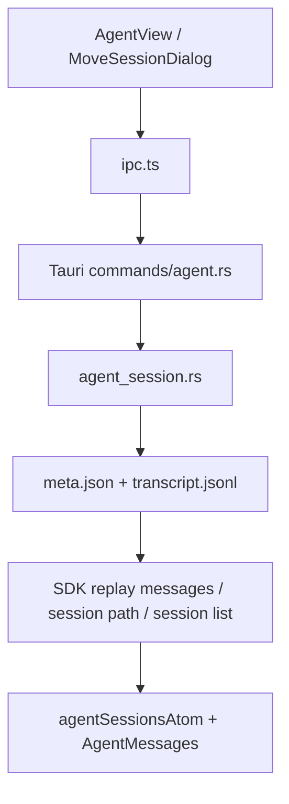

# agent-history-replay-closure

## 0. 术语

| 术语 | 含义 |
|---|---|
| Session Meta | Agent 会话的轻量元数据真相，至少包含 `workspaceId`、`sdkSessionId`、`stoppedByUser`、`permissionMode` 等前端长期依赖字段 |
| Timeline Truth | `transcript.jsonl` 中持久化的时间线真相，作为 SDK replay 消息、搜索与 rewind 截断的唯一来源 |
| Replay Surface | 前端打开历史会话时真正消费的消息形状，即 `get_agent_session_sdk_messages` 返回的 SDKMessage 列表 |
| Fork Snapshot | 从指定历史消息点复制出的新会话快照，包含被截断后的 timeline 与必要的 meta 继承 |
| Rewind Anchor | 同一会话内回退的锚点，即某条 assistant message 的 `uuid`，回退后该点之后的 timeline 必须被截断 |
| Workspace Move | 把一个会话从当前工作区迁到另一个工作区，并同步更新工作目录、会话 meta 与前端列表归属 |
| Continue Boundary | fork / rewind / move 完成后，用户下一次发送消息时仍能继续工作，但首版允许只恢复“可见 timeline + 会话归属”，不要求补齐底层隐藏上下文 |

## 1. 决策与约束

### 1.1 核心决策

- 先收口“工作台操作是真后端能力”，不在本 feature 里解决运行中 Agent 的多会话 runtime 冲突；那部分归 `agent-runtime-stability-recovery`。
- 前端不再自己合成 Agent 历史回放主链路。`get_agent_session_sdk_messages`、`fork_agent_session`、`rewind_session`、`move_agent_session_to_workspace` 都必须由 Rust 后端真实实现并注册。
- `Session Meta` 必须升级成前后端共同真相。当前前端已经长期按 `workspaceId / sdkSessionId / stoppedByUser / permissionMode` 消费，这些字段不能继续只存在于 TS 类型里。
- Replay 以 `Timeline Truth` 为单一来源。搜索、历史打开、fork、rewind 都从 transcript 推导，不再允许前端 fallback 直接猜 timeline。
- 首版 `Continue Boundary` 明确收窄：fork / rewind 后必须能重新打开、看到正确消息、继续发送新消息；如果底层 SDK 隐藏上下文尚未完整恢复，必须通过明确 meta 字段保留恢复边界，而不是假装完全续接。

### 1.2 硬约束

- 不修改 Chat 主链路与搜索域逻辑；仅允许触及 Agent session/workspace 相关文件。
- 不发明新的会话存储文件格式；继续沿用每会话目录下的 `meta.json` + `transcript.jsonl`。
- `move_agent_session_to_workspace` 不能只改前端列表归属，必须同步影响后续 `get_agent_session_path` 与会话工作目录定位。
- `fork_agent_session` 与 `rewind_session` 必须以 SDK message `uuid` 为入口参数真相，不允许前端传数组下标。
- 所有新命令必须注册到 `src-tauri/src/lib.rs`，否则不算闭环。
- 保持注释最小化；只有协议/边界处才加中文注释。

### 1.3 明确不做

- 不在这个 feature 里修复后端全局单例 `AgentState` 的运行时冲突
- 不在这个 feature 里补文件级 checkpoint / 真正文件系统 rewind
- 不在这个 feature 里补内容搜索或归档视图
- 不在这个 feature 里把 Agent runtime 改成 SDK 原生 session 恢复引擎
- 不顺手重做 `AgentMessages` / `SDKMessageRenderer` 的 UI 表现

### 1.4 复杂度档位

- 走默认桌面单机档位：本地磁盘持久化 + 单用户工作区，不考虑云同步与远程协作

## 2. 方案

### 2.1 名词层

#### 现状

前端已经长期按 richer meta 建模：

```ts
interface AgentSessionMeta {
  id: string
  title: string
  channelId?: string
  sdkSessionId?: string
  workspaceId?: string
  pinned?: boolean
  archived?: boolean
  forkSourceDir?: string
  forkSourceSdkSessionId?: string
  resumeAtMessageUuid?: string
  stoppedByUser?: boolean
  permissionMode?: JguiPermissionMode
  updatedAt: number
}
```

但 Rust 当前实际 meta 只写入：

```json
{
  "created_at": 1715490000000,
  "title": null,
  "pinned": false,
  "archived": false,
  "manual_working": false,
  "permission_mode": "bypassPermissions"
}
```

前端已经真实调用：

```ts
ipc.getAgentSessionSDKMessages(sessionId)
ipc.forkAgentSession({ sessionId, upToMessageUuid })
ipc.rewindSession({ sessionId, assistantMessageUuid })
ipc.moveAgentSessionToWorkspace({ sessionId, targetWorkspaceId })
```

但 Rust 后端当前只真实存在：

- `create_agent_session`
- `list_agent_sessions`
- `get_agent_session`
- `get_agent_session_sdk_messages`

而 `fork / rewind / move` 尚未在 `commands/agent.rs` 与 `src-tauri/src/lib.rs` 落地注册。

#### 变化

本 feature 把 Agent 会话真相补齐为：

```ts
type AgentSessionMetaRecord = {
  id: string
  title: string | null
  workspaceId: string | null
  channelId: string | null
  sdkSessionId: string | null
  pinned: boolean
  archived: boolean
  manualWorking: boolean
  stoppedByUser: boolean
  permissionMode: string | null
  forkSourceDir: string | null
  forkSourceSdkSessionId: string | null
  resumeAtMessageUuid: string | null
  createdAt: number
  updatedAt: number
}
```

新增四个后端主口径：

```ts
get_agent_session_sdk_messages(id: string) -> SDKMessage[]
move_agent_session_to_workspace(input: MoveSessionToWorkspaceInput) -> AgentSessionMeta
fork_agent_session(input: ForkSessionInput) -> AgentSessionMeta
rewind_session(input: RewindSessionInput) -> RewindSessionResult
```

其中：

- `get_agent_session_sdk_messages` 成为历史会话回放唯一入口
- `move_agent_session_to_workspace` 返回迁移后的最新 `AgentSessionMeta`
- `fork_agent_session` 返回新会话 meta，并保留来源信息字段
- `rewind_session` 至少返回剩余消息数；首版 `fileRewind` 可明确为不可用

### 2.2 编排层



#### 历史打开主流程

1. 前端调用 `getAgentSessionSDKMessages(sessionId)`
2. Rust 读取 `transcript.jsonl`
3. `timeline_to_sdk_messages(...)` 生成统一 SDKMessage 列表
4. 前端直接渲染，不再走 fallback synthesis 主链路

#### move 主流程

1. `MoveSessionDialog` 提交 `sessionId + targetWorkspaceId`
2. Rust 校验会话存在、目标工作区存在
3. 更新会话 `meta.json.workspace_id`
4. 返回最新 `AgentSessionMeta`
5. 前端列表与当前 workspace 归属同步刷新

#### fork 主流程

1. 前端传 `sessionId + upToMessageUuid?`
2. Rust 创建新会话目录与新 meta
3. 复制源 transcript 中锚点及之前的 timeline 到新会话
4. 新会话继承必要 meta：`workspaceId`、`channelId`、`permissionMode`
5. 写入 fork 来源字段，返回新会话 meta

#### rewind 主流程

1. 前端传 `sessionId + assistantMessageUuid`
2. Rust 读取 transcript，定位目标 assistant message
3. 截断该消息之后的所有 timeline
4. 把被保留的最后一条 assistant message 作为新 continue 边界
5. 返回 `remainingMessages`
6. 前端 bump refresh，重新加载回放消息

#### 错误语义

- 会话不存在、锚点不存在、目标工作区不存在时，都返回结构化错误字符串，不静默 fallback
- `rewind` 若无法做文件恢复，返回 `fileRewind.canRewind = false`，而不是伪造成功恢复文件

### 2.3 挂载点

| # | 挂载点 | 说明 |
|---|---|---|
| 1 | `packages/shared/src/types/agent.ts` | 固化 move/fork/rewind 输入输出类型与 Session Meta 字段真相 |
| 2 | `src/lib/ipc.ts` | 去掉 Agent 历史回放主链路对 fallback synthesis 的依赖，接通新命令 |
| 3 | `src-tauri/src/agent_session.rs` | 补 meta 读写、move/fork/rewind 真实现 |
| 4 | `src-tauri/src/commands/agent.rs` | 暴露并路由新命令 |
| 5 | `src-tauri/src/lib.rs` | 注册命令，形成真实 Tauri 后端能力 |
| 6 | `src/components/agent/MoveSessionDialog.tsx` + `AgentView.tsx` | 消费真实返回值并刷新列表/消息 |

### 2.4 推进策略

| Step | 内容 | 退出信号 |
|---|---|---|
| 1 | 微重构：在 `agent_session.rs` 抽出统一的 meta 读写 helper，不改行为 | `cargo test` 通过 |
| 2 | 数据模型收口：补齐 Rust 侧 Session Meta 字段与 shared 类型对应关系 | `cargo test` 通过 |
| 3 | 历史回放主链路收口：`get_agent_session_sdk_messages` 继续走真实后端，并补测试覆盖 | `cargo test` 通过 |
| 4 | 实现 `move_agent_session_to_workspace`，同步影响列表与路径归属 | `cargo test` 通过 |
| 5 | 实现 `fork_agent_session`，复制锚点前 timeline 与关键 meta | `cargo test` 通过 |
| 6 | 实现 `rewind_session`，真实截断 timeline 并返回 continue 边界结果 | `cargo test` 通过 |
| 7 | 前端接通与验证：Move/Fork/Rewind UI 动作消费真实后端结果，不再落回空实现 | `bun run test` 通过 |

### 2.5 结构健康度与微重构

#### 文件级

- `agent_session.rs` 已经承载了会话目录、timeline、搜索与 meta，继续直接往里塞 move/fork/rewind 会更难维护。
- 但当前改动仍属于同一领域，先做 helper 级微重构即可，不额外拆模块目录。

#### 目录级

- `src-tauri/src/` 当前目录结构仍能承接这次改动；不需要为 replay 新建目录。

#### 结论

- 做微重构（拆函数）：把 meta 读写和 timeline 读写统一成 helper，作为第 1 步独立完成。
- 不做目录重组。

#### 超出范围的观察

- `rewind` 若未来要恢复真实文件快照，应该另起子 feature，不在这次用占位逻辑伪装完成。
- `sdkSessionId / resumeAtMessageUuid` 的真正 runtime 恢复，要交给下一条 `agent-runtime-stability-recovery` 统一处理。

## 3. 验收契约

| # | 触发 | 期望结果 |
|---|---|---|
| A1 | 打开任意已有 Agent 会话 | `get_agent_session_sdk_messages` 通过真实后端返回 SDKMessage，前端无需 fallback 才能显示历史 |
| A2 | 列出 Agent 会话 | 每条会话都能稳定返回 `workspaceId / stoppedByUser / permissionMode` 等前端长期消费字段 |
| A3 | 在 MoveSessionDialog 里迁移会话 | 返回更新后的 `workspaceId`，侧边栏与当前会话归属同步变化 |
| A4 | 对某条 assistant 消息执行 fork | 生成新会话，新会话只包含锚点及之前的历史，并继承源会话工作区/权限模式 |
| A5 | 对某条 assistant 消息执行 rewind | 当前会话 timeline 被真实截断，刷新后看不到锚点之后的消息 |
| A6 | rewind 后再次发送新消息 | 会话仍可继续使用，不会因为缺命令或坏 meta 直接断链 |
| A7 | grep 命令注册 | `move_agent_session_to_workspace`、`fork_agent_session`、`rewind_session` 已注册到 `src-tauri/src/lib.rs` |

### 明确不做反向核对

- [ ] 不声称本次已经恢复真实文件系统快照
- [ ] 不声称本次已经解决多会话并发 runtime 路由
- [ ] 不把搜索内容闭环或归档视图混进本次 feature

## 4. 对其他模块的影响

| 模块 | 影响 | 动作 |
|---|---|---|
| `packages/shared/src/types/agent.ts` | Session Meta 与 replay/move/fork/rewind 类型真相收口 | 扩展 |
| `src/lib/ipc.ts` | 历史回放主链路与 move/fork/rewind 命令接通 | 收口 |
| `src-tauri/src/agent_session.rs` | meta/timeline 持久化与 replay/workspace move/fork/rewind 真实现 | 扩展 |
| `src-tauri/src/commands/agent.rs` | 暴露新命令 | 扩展 |
| `src-tauri/src/lib.rs` | 注册新命令 | 扩展 |
