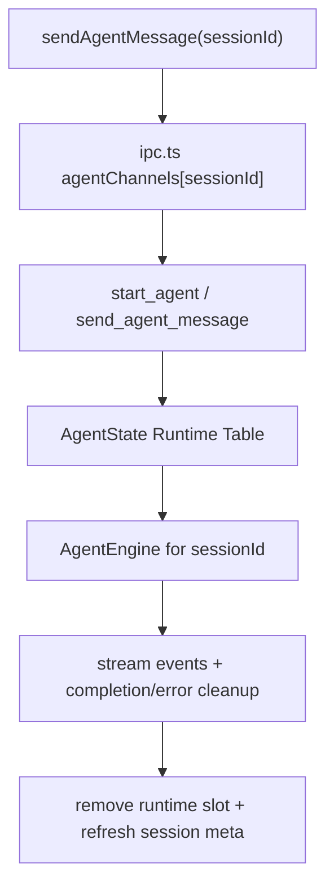

# agent-runtime-stability-recovery

## 0. 术语

| 术语 | 含义 |
|---|---|
| Runtime Slot | 某个 `sessionId` 对应的一条活跃 Agent 运行时实例 |
| Runtime Table | 后端 `AgentState` 中按 `sessionId` 维护的运行时实例表，而不是单个 `Option<AgentEngine>` |
| Active Run | 某个会话当前正在执行的一轮流式运行，包含 startedAt、stoppedByUser、retrying 等状态 |
| Interrupt Routing | `respond_agent_interrupt` 必须按 `sessionId` 路由到正确 runtime slot |
| Stop Routing | `stop_agent(sessionId)` 只停止对应会话，不影响其他会话 |
| Recovery Surface | 流式结束、错误、重试、用户中断后，前后端都能恢复到一致的可继续状态 |
| Busy Guard | 同一 `sessionId` 在已有活跃 runtime 时的保护规则，避免重复启动和错路由 |

## 1. 决策与约束

### 1.1 核心决策

- 后端必须和前端一样按会话建模 runtime。`AgentState(pub Arc<Mutex<Option<AgentEngine>>>)` 必须升级为 `sessionId -> AgentRuntimeHandle` 的实例表。
- 这次先修正“错会话路由”的正确性，再谈更复杂的并发优化。允许仍然限制“同一会话只跑一条活跃 runtime”，但不能继续让不同会话共享一个全局槽位。
- `start_agent`、`send_agent_message`、`respond_agent_interrupt`、`stop_agent` 都必须以 `sessionId` 为显式路由键；不再允许只有前端知道会话、后端只拿当前实例。
- 错误、完成、用户中断后的恢复以“前后端状态一致”为准：前端 `agentChannels` 清理时机、后端 runtime slot 清理时机、持久化 `stoppedByUser` 必须统一。
- 不在这次引入真正的 runtime resume 引擎；本 feature 的“恢复”仅指状态机恢复和会话可继续使用，不指底层 SDK 隐藏上下文复原。

### 1.2 硬约束

- 不修改 Chat runtime。
- 继续兼容 CLI backend 与 JAgent backend；两条路径都要被 `Runtime Table` 承载。
- 同一会话重复 `start_agent` 时必须有 Busy Guard；不能静默覆盖已有实例。
- `respond_agent_interrupt` 必须要求 `sessionId`，否则无法保证正确路由。
- `stop_agent` 必须支持按会话停止，前端也不能再为切换会话自动强停其他会话。
- 所有清理逻辑都必须最终把 runtime slot 从表中移除，避免幽灵实例。

### 1.3 明确不做

- 不在这次实现真正的 SDK session resume / hidden context restore
- 不在这次 feature 里重做 retry UI
- 不在这次引入多线程任务调度器或复杂队列系统
- 不顺手把 AgentView 的交互流改成新的产品形态

### 1.4 复杂度档位

- 走默认桌面会话级 runtime 档位：单机、本地线程、以 correctness 优先于并发吞吐

## 2. 方案

### 2.1 名词层

#### 现状

前端已经按会话维护活跃通道：

```ts
const agentChannels = new Map<string, AgentRuntimeChannel>()
```

但 Rust 后端仍是：

```rust
pub struct AgentState(pub Arc<Mutex<Option<AgentEngine>>>);
```

于是当前：

- `start_agent` 会覆盖上一个全局实例
- `send_agent_message` 不按 `session_id` 选实例
- `respond_agent_interrupt` 不按 `session_id` 路由
- `stop_agent` 直接关闭当前全局实例

#### 变化

把后端 runtime 真相升级为：

```rust
type AgentRuntimeTable = HashMap<String, AgentEngine>;

pub struct AgentState(pub Arc<Mutex<AgentRuntimeTable>>);
```

并统一命令签名：

```ts
start_agent(input: { sessionId: string, ... }, onEvent)
send_agent_message(input: { sessionId: string, userMessage: string })
respond_agent_interrupt({ sessionId, interruptId, kind, response })
stop_agent({ sessionId })
```

前端 `sendAgentMessage` 不再在切换会话时自动 `stopAgent(activeAgentSessionId)`，而是：

- 若当前会话已有 active channel，复用它
- 若没有，则仅启动本会话 runtime

### 2.2 编排层



#### 启动主流程

1. 前端为当前 `sessionId` 创建/复用 channel
2. Rust `start_agent` 检查 runtime table：
   - 已存在该会话实例且仍活跃 -> 返回 busy 错误
   - 不存在 -> 新建并插入
3. 完成后由该 slot 独占该会话的后续消息/中断/停止路由

#### 发送主流程

1. 前端传 `sessionId`
2. Rust 从 runtime table 取出该会话实例
3. 若不存在，返回“Agent 未启动（for sessionId）”
4. 向对应 runtime 写入消息

#### 中断主流程

1. 前端 `respondAgentInterrupt` 必传 `sessionId`
2. Rust 从 runtime table 取对应实例
3. 更新对应会话的 interrupt transcript
4. 将响应只写给该会话 runtime

#### 停止与恢复主流程

1. 前端 `stopAgent(sessionId)` 只清理对应 channel 的 stoppedByUser 标记
2. Rust 只关闭对应 runtime slot
3. runtime 正常 complete / error / stop 后，统一从 runtime table 移除
4. 前端收到 complete/error 后清理对应 channel，不影响其他会话

### 2.3 挂载点

| # | 挂载点 | 说明 |
|---|---|---|
| 1 | `packages/shared/src/types/agent.ts` | `respond_agent_interrupt` / stop 等会话级输入真相 |
| 2 | `src/lib/ipc.ts` | 前端 active channel 管理改成真正 per-session，不再切换时强停别的会话 |
| 3 | `src-tauri/src/commands/agent.rs` | `AgentState` 升级为 runtime table，并按 sessionId 路由 |
| 4 | `src-tauri/src/agent_engine.rs` | 为 slot 生命周期与 close 清理提供更稳定边界 |
| 5 | `src/hooks/useGlobalAgentListeners.ts` | 完成/错误后仍只清理对应会话状态 |

### 2.4 推进策略

| Step | 内容 | 退出信号 |
|---|---|---|
| 1 | 微重构：为 Rust 侧 runtime slot 查找/插入/移除抽 helper，不改行为 | cargo test 通过 |
| 2 | 数据模型收口：`respond_agent_interrupt` 与 `stop_agent` 的输入显式带 `sessionId` | cargo test 通过 |
| 3 | 后端升级：`AgentState` 改为 runtime table，`start/send/respond/stop` 全部按会话路由 | cargo test 通过 |
| 4 | 前端升级：`sendAgentMessage` 与 `stopAgent` 改成真正 per-session，不再切会话自动强停 | bun run test 通过 |
| 5 | 恢复语义验证：complete/error/stoppedByUser 后，前后端都能清理正确 slot 且继续使用该会话 | `bash scripts/check_lint.sh` 通过 |

### 2.5 结构健康度与微重构

#### 文件级

- `commands/agent.rs` 已经很长，但这次问题集中在 runtime state 与路由 helper，先做函数级微重构即可。
- `ipc.ts` 里的 Agent runtime 管理也偏厚，但当前只改 per-session 路由语义，不做目录重组。

#### 目录级

- 不需要新增目录；继续在 `commands/agent.rs` 与 `ipc.ts` 就地收口。

#### 结论

- 做微重构（拆函数）：runtime table 的 `get_mut/remove/insert` helper 独立出来。
- 不做目录重组。

#### 超出范围的观察

- JAgent backend 目前不支持主动中断响应与 direct send，这类能力若要真正补齐，应另开 feature；本次只保证它不再错路由。

## 3. 验收契约

| # | 触发 | 期望结果 |
|---|---|---|
| A1 | 连续打开两个不同 Agent 会话并分别发送消息 | 后端不会因为第二个会话启动而覆盖第一个会话 runtime |
| A2 | 对某个会话提交 interrupt 响应 | 只会路由到该 `sessionId` 的 runtime，不会误投别的会话 |
| A3 | 停止某个会话 | 只停止该会话，其他会话运行态不受影响 |
| A4 | 某会话 complete / error / 用户 stop 后再次发送消息 | 旧 runtime slot 被正确清理，新一轮可正常启动 |
| A5 | grep 检查 | Rust 后端不再保留 `Option<AgentEngine>` 单槽位模型 |

### 明确不做反向核对

- [ ] 不声称本次已经实现真正的 hidden context resume
- [ ] 不声称本次已经做了复杂并发调度或全局消息队列
- [ ] 不把搜索、归档或 ToolSettings 混进本次 feature

## 4. 对其他模块的影响

| 模块 | 影响 | 动作 |
|---|---|---|
| `packages/shared/src/types/agent.ts` | interrupt/stop 的会话级输入真相更明确 | 扩展 |
| `src/lib/ipc.ts` | agent channel 管理改成真正 per-session | 收口 |
| `src-tauri/src/commands/agent.rs` | runtime state 与路由模型从单例升级为实例表 | 扩展 |
| `src-tauri/src/agent_engine.rs` | close 生命周期与清理边界被更明确地消费 | 适配 |
