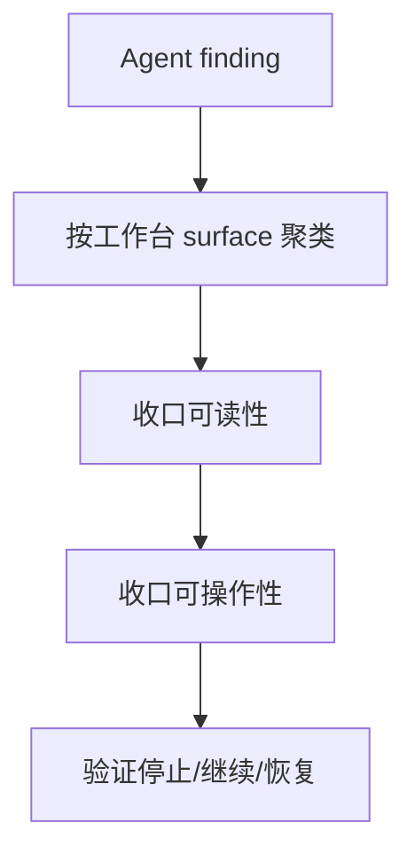

# agent-workbench-polish

## 0. 术语

| 术语 | 含义 |
|---|---|
| Agent 工作台 | Agent 会话、timeline、权限、工具调用、文件上下文、历史恢复组成的长期使用界面 |
| 可操作性 | 用户能理解当前 Agent 在做什么，并能在正确时机停止、批准、继续或恢复 |

## 1. 决策与约束

- 本 design 当前是 draft，必须等 `product-friction-audit` 输出 Agent finding 后才能 approved。
- 不改 Agent runtime 协议，不引入新后端。
- 不把缺失能力伪装成 UI polish；后端断点转 issue 或回闭环 feature。
- 保持 typing while streaming、Chat/Agent 状态隔离、Channel 流式路径不变。

## 2. 方案

### 2.1 名词层

#### 现状

Agent replay、runtime recovery、interrupt 等闭环已完成，但工作台体验可能仍存在 timeline 难读、工具状态不清、权限请求不好理解、文件上下文和历史恢复边界不清等问题。

#### 变化

从摩擦台账筛选 Agent finding，按工作台区域聚类：

```ts
interface AgentWorkbenchPolishBatch {
  surface: "timeline" | "permission" | "tool-call" | "file-context" | "stop-continue" | "history-restore"
  findings: string[]
  expectedOperatorAction: string
}
```

### 2.2 编排层



错误语义：

- 用户必须能区分运行中、等待权限、已停止、可继续、恢复边界。
- 工具调用失败必须能被看见。
- 历史恢复不能暗示隐藏上下文已完整恢复，除非后端真的支持。

### 2.3 挂载点

| # | 挂载点 | 说明 |
|---|---|---|
| 1 | `src/components/agent/AgentView.tsx` | Agent 工作台主界面 |
| 2 | `src/components/agent/AgentMessages.tsx` / `SDKMessageRenderer.tsx` | timeline 与 SDK message 渲染 |
| 3 | `src/hooks/useGlobalAgentListeners.ts` | Agent 状态事件进入前端 |
| 4 | `src/components/app-shell/RightSidePanel.tsx` | 文件上下文 |
| 5 | 产品摩擦台账 | 本项唯一事实输入 |

### 2.4 推进策略

| Step | 内容 | 退出信号 |
|---|---|---|
| 1 | 从台账筛选 Agent P0/P1 finding | surface 聚类完成 |
| 2 | 收口 timeline/工具/权限可读性 | 用户能理解 Agent 当前状态 |
| 3 | 收口停止/继续/恢复可操作性 | 用户能执行正确动作 |
| 4 | 补验证记录 | 每条 finding 有验证 |

### 2.5 结构健康度与微重构

`AgentView.tsx` 和 renderer 相关文件可能偏胖；若实现时需要结构调整，先把纯搬移列为独立步骤，不能在 polish 中混入行为重构。

## 3. 验收契约

| # | 触发 | 期望结果 |
|---|---|---|
| A1 | Agent 运行中 | 用户能看懂当前状态和可用动作 |
| A2 | Agent 等待权限 | 请求原因和操作按钮明确 |
| A3 | 工具调用失败 | 失败可见，不被普通消息吞掉 |
| A4 | 打开历史会话 | 恢复边界明确，不误导隐藏上下文完整恢复 |

## 4. 对其他模块的影响

待台账输出后细化；当前不预写实现清单。
