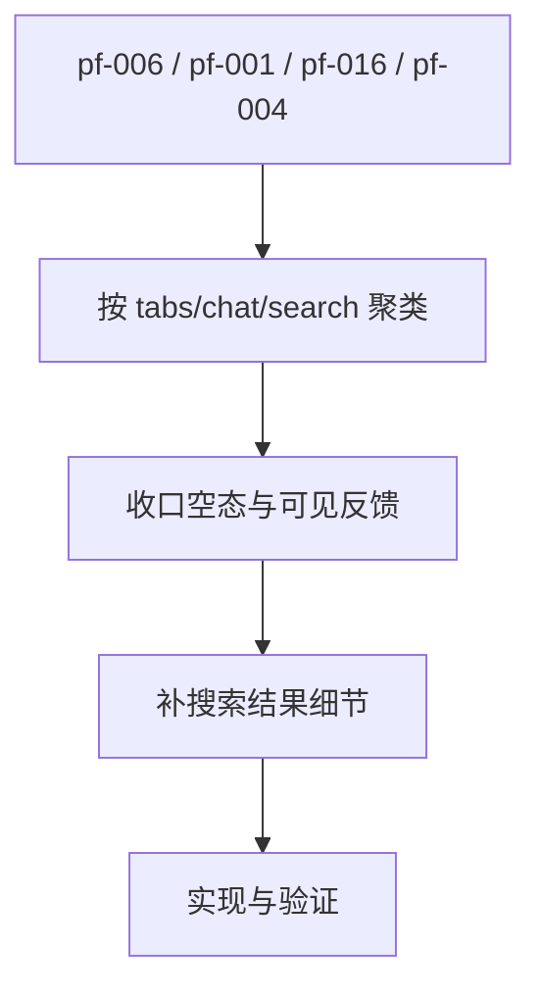

# core-workflow-ux-hardening

## 0. 术语

| 术语 | 含义 |
|---|---|
| 核心工作流 | 用户每天都会走的 Chat/Agent 输入、流式、停止、重试、恢复、切换路径 |
| 主路径摩擦 | 不一定是后端 bug，但会让用户频繁停顿、误解状态或退回外部工具的问题 |
| 修复批次 | 从产品摩擦台账中挑出的同一类 P0/P1 finding 集合 |

## 1. 决策与约束

- 本 design 现在只收口第一批已确认的主路径 finding：
  - `pf-006`：最后一个 tab 关闭后空态不可达
  - `pf-001`：Chat 工具活动提示不足
  - `pf-016`：Chat 到 Agent 的迁移入口缺失
  - `pf-004`：搜索结果细节和归档标识不足
- 当前批次只消费 `product-friction-audit` 中明确映射到本项的 P0/P1 finding，不扩大到 Agent 工作台或 Settings。
- 不新增新功能，不重写 Chat/Agent 架构，不改变流式协议。
- 如果 finding 根因是后端契约断点，转为 issue 或回对应闭环 feature，不在本项里用前端补丁遮住。

## 2. 方案

### 2.1 名词层

#### 现状

Chat/Agent 主链路已经具备能力闭环。`product-friction-audit` 已把当前最该优先处理的主路径摩擦收口成 4 条明确输入：`pf-006`、`pf-001`、`pf-016`、`pf-004`。

#### 变化

本项的第一批修复批次固定为：

```ts
const batchOne = {
  findings: ["pf-006", "pf-001", "pf-016", "pf-004"],
  workflows: ["tab-switch", "chat-send", "search-open"],
}
```

抽象上仍使用下面的批次结构：

```ts
interface WorkflowHardeningBatch {
  findings: string[]
  workflow: "chat-send" | "agent-run" | "stream-control" | "tab-switch" | "history-restore"
  expectedUserOutcome: string
  acceptance: string[]
}
```

### 2.2 编排层



错误语义：

- 修复后用户必须能看到状态变化或失败原因。
- 不允许让按钮/快捷键看似可用但实际无效。
- 流式中切换、停止、重试必须保留 Chat/Agent 状态隔离。
- `pf-006` 的最低完成标准是允许真实无 tab 状态，并显示 WelcomeView，而不是关闭后自动补位。
- `pf-001` 的最低完成标准是 Chat 工具活动在主路径中可见，而不是只存在底层 event。
- `pf-016` 的最低完成标准是 Chat 中出现明确的 Agent 迁移入口，不要求新增复杂编排。
- `pf-004` 的最低完成标准是搜索结果列表明确展示归档状态和更稳定的结果细节。

### 2.3 挂载点

| # | 挂载点 | 说明 |
|---|---|---|
| 1 | `src/components/chat/ChatInput.tsx` / `ChatView.tsx` / `ChatMessages.tsx` | Chat 输入、工具活动和迁移推荐主路径 |
| 2 | `src/components/agent/AgentView.tsx` / `useAgentSendMessage.ts` | Agent 输入、停止、继续工作 |
| 3 | `src/components/tabs/MainArea.tsx` / `src/atoms/tab-atoms.ts` | 多标签切换和恢复 |
| 4 | `src/components/shortcuts/GlobalShortcuts.tsx` | 快捷键体验 |
| 5 | `src/components/app-shell/SearchDialog.tsx` | 搜索结果细节和归档标识 |
| 6 | 产品摩擦台账 | 本项唯一事实输入 |

### 2.4 推进策略

| Step | 内容 | 退出信号 |
|---|---|---|
| 1 | 把 `pf-006` / `pf-001` / `pf-016` / `pf-004` 固定为第一批实现输入 | design/checklist 和 roadmap 状态对齐 |
| 2 | 收口 tabs/chat 的静态 UI 状态与可见反馈 | WelcomeView、工具活动、迁移入口都能直接看到 |
| 3 | 收口 tabs/chat/search 的交互逻辑 | 关闭最后 tab、搜索结果细节等行为符合台账预期 |
| 4 | 补针对性测试或手动验收 | 4 条 finding 都有验证记录 |
| 5 | 写 acceptance 并回写 roadmap | feature 从 `in-progress` 翻 `done` |

### 2.5 结构健康度与微重构

当前不预设微重构。若实现时发现 `ChatInput`、`ChatView`、`SearchDialog` 或 `MainArea` 需要大拆，先停下来改 design 或转 `cs-refactor`，不能在硬化实现里顺手重构。

## 3. 验收契约

| # | 触发 | 期望结果 |
|---|---|---|
| A1 | 查看本 feature 的实现范围 | 只覆盖 `pf-006`、`pf-001`、`pf-016`、`pf-004` 四条 finding |
| A2 | 关闭最后一个 tab | 允许真实无 tab 状态，并显示 WelcomeView |
| A3 | Chat 工具活动或 Agent 推荐出现时 | 用户能在 Chat 主路径中直接看到工具活动和迁移入口 |
| A4 | 搜索结果包含归档项时 | 结果列表明确展示归档状态和稳定细节 |
| A5 | 反向核对 | 没有未来源于这 4 条 finding 的新表面功能 |

## 4. 对其他模块的影响

本批次预计只触达：

- `src/atoms/tab-atoms.ts`
- `src/components/tabs/MainArea.tsx`
- `src/components/chat/ChatView.tsx`
- `src/components/chat/ChatMessages.tsx`
- `src/components/app-shell/SearchDialog.tsx`
