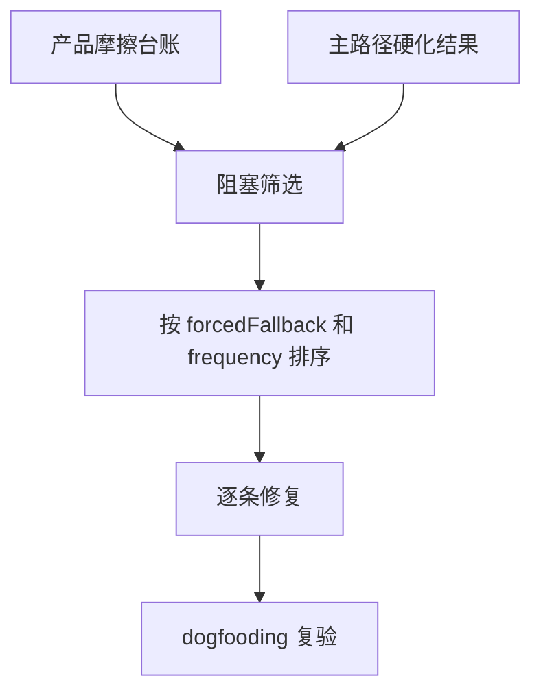

# dogfooding-blocker-burn-down

## 0. 术语

| 术语 | 含义 |
|---|---|
| Dogfooding 阻塞 | 真实使用 j-gui 做开发时，迫使用户退回外部终端、手工补救或放弃 GUI 的问题 |
| Burn-down | 按频率和严重度逐条清零阻塞，不扩写新功能愿望 |

## 1. 决策与约束

- 本 design 当前是 draft，必须等 `product-friction-audit` 和主路径硬化至少产出 P0/P1 结论后才能 approved。
- 只处理真实 dogfooding 阻塞，不处理“以后可能会方便”的增强项。
- 不替代 `dogfooding-self-development-loop` 的完整 workflow matrix；本项提前处理已知阻塞。
- 不把远程访问、双后端、移动端放进阻塞清零。

## 2. 方案

### 2.1 名词层

#### 现状

Roadmap 之前把 dogfooding 放在后端演进之后，但用户体验反馈说明当前主链路仍有足够多摩擦，必须先清掉会阻塞真实使用的点。

#### 变化

从产品摩擦台账和主路径硬化结果筛选阻塞项：

```ts
interface DogfoodingBlocker {
  sourceFinding: string
  forcedFallback: "terminal" | "manual-file-edit" | "restart-app" | "external-search" | "abandon-flow"
  frequency: "daily" | "weekly" | "occasional"
  burnDownTarget: string
}
```

### 2.2 编排层



错误语义：

- 不能把普通 P2 视觉问题升级成 dogfooding 阻塞。
- 若阻塞需要新功能，应回 roadmap 另立 feature，不在 burn-down 中偷做大需求。

### 2.3 挂载点

| # | 挂载点 | 说明 |
|---|---|---|
| 1 | 产品摩擦台账 | 阻塞来源 |
| 2 | core-workflow / agent-workbench 验收记录 | 已修和未修主路径问题 |
| 3 | `src/components/*` / `src-tauri/src/*` | 具体触点待阻塞项确定后再细化 |

### 2.4 推进策略

| Step | 内容 | 退出信号 |
|---|---|---|
| 1 | 筛选 dogfooding 阻塞 | 每条都有 forcedFallback |
| 2 | 排序并确认 burn-down 批次 | 批次范围不超过 3-5 条 |
| 3 | 逐条修复并验证 | 每条阻塞不再迫使 fallback |
| 4 | 写 acceptance | burn-down 结果和残余风险明确 |

### 2.5 结构健康度与微重构

当前无法预判具体触点。实现前必须按阻塞项重新评估是否需要微重构；未评估前不 approved。

## 3. 验收契约

| # | 触发 | 期望结果 |
|---|---|---|
| A1 | 查看 burn-down 批次 | 每条都有 sourceFinding 和 forcedFallback |
| A2 | 复验阻塞路径 | 不再需要退回终端、手工改文件、重启或放弃 GUI |
| A3 | 反向核对 | 没有把远程/双后端/移动端混进阻塞清零 |

## 4. 对其他模块的影响

待阻塞批次确定后细化。
