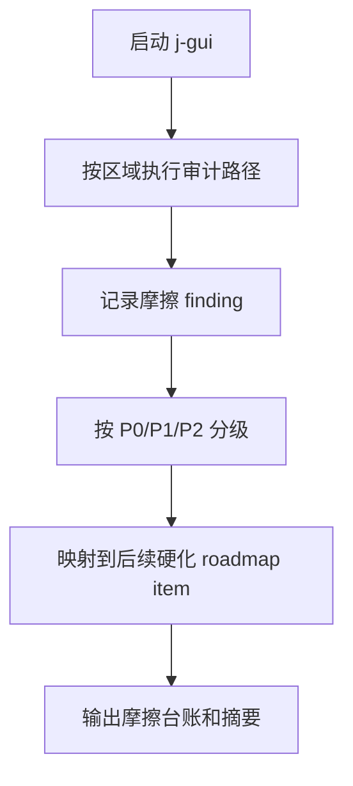

# product-friction-audit

## 0. 术语

| 术语 | 含义 |
|---|---|
| 产品摩擦 | 用户完成日常任务时遇到的 UI 细节、交互、状态反馈、功能断点或视觉布局问题 |
| 摩擦台账 | 本 feature 输出的结构化问题清单，后续体验硬化项必须从这里取输入 |
| 行为证据 | 截图、录屏、运行步骤、控制台/日志、代码锚点之一，用来证明问题真实存在 |
| 区域 | Chat、Agent、Search、Settings、Tabs、File Context、Layout 七个审计面 |

## 1. 决策与约束

### 1.1 核心决策

- 本项只做产品体验审计，不修产品代码。
- 审计结论必须能复现，不能只写“感觉不顺”。
- 后续 `core-workflow-ux-hardening`、`settings-experience-hardening`、`agent-workbench-polish`、`visual-layout-polish`、`dogfooding-blocker-burn-down` 都必须消费本台账。
- `proma-parity-evidence-pass` 的 `Partial` 结论是输入之一，但本项以当前 j-gui 真实运行体验为准。

### 1.2 明确不做

- 不修 bug、不改 UI、不调整样式。
- 不新增 Proma 对标功能。
- 不把未运行验证的问题写成 P0/P1。
- 不把后端契约问题伪装成视觉问题。

### 1.3 复杂度档位

走默认桌面单机人工验收档位：本地启动 App，按固定路径操作，记录步骤、预期、实际和证据。不引入新的自动化截图框架。

## 2. 方案

### 2.1 名词层

#### 现状

Roadmap 已经证明多条能力闭环存在，但当前体验反馈说明“闭环存在”不足以证明产品好用。已有证据包也承认多数 Proma parity 区域仍是 `Partial`，并且缺少真实截图/录屏资产。

#### 变化

新增一份产品摩擦台账，格式以 roadmap 第 5.7 节的 `ProductFrictionFinding` 为准：

```ts
type ProductFrictionFinding = {
  area: "chat" | "agent" | "search" | "settings" | "tabs" | "file-context" | "layout"
  severity: "P0" | "P1" | "P2"
  kind: "ui-detail" | "interaction" | "state-feedback" | "functional-break" | "visual-layout"
  reproduction: string[]
  expected: string
  actual: string
  evidence?: string
  targetRoadmapItem?: string
}
```

### 2.2 编排层



审计区域：

| 区域 | 最小审计路径 |
|---|---|
| Chat | 新建会话、发送、停止、重试、错误态、滚动、附件/工具入口 |
| Agent | 新建任务、权限请求、工具调用、停止、继续、历史恢复、文件上下文 |
| Search | 打开搜索、标题/内容搜索、打开结果、空结果、失败态 |
| Settings | 修改设置、保存/自动保存、失败提示、unsupported 状态、来源说明 |
| Tabs | 新建/切换/关闭/恢复、流式中切换、无 tab/多 tab 状态 |
| File Context | 侧栏文件树、附件、目录切换、空目录、错误路径 |
| Layout | 溢出、截断、焦点态、按钮状态、滚动区域、窄窗口 |

错误语义：

- 无复现步骤的条目最多只能记为观察项，不能进入 P0/P1。
- 如果问题会阻断主路径或造成数据/操作不可理解，标 P0/P1。
- 如果问题只是视觉粗糙但不阻断任务，标 P2。

### 2.3 挂载点

| # | 挂载点 | 说明 |
|---|---|---|
| 1 | `.codestable/acceptance/product-friction/2026-05-12/` | 审计台账和分区记录输出目录 |
| 2 | `src/components/chat/*` | Chat 区域代码锚点 |
| 3 | `src/components/agent/*` | Agent 区域代码锚点 |
| 4 | `src/components/settings/*` | Settings 区域代码锚点 |
| 5 | `src/components/app-shell/*` / `src/components/tabs/*` | Shell、Search、Tabs、Layout 区域代码锚点 |

### 2.4 推进策略

| Step | 内容 | 退出信号 |
|---|---|---|
| 1 | 建立审计目录与台账模板 | 台账文件存在，字段与 roadmap 5.7 对齐 |
| 2 | 运行 Chat/Search/Tabs 审计路径 | 三个区域都有 finding 或明确无 P0/P1 的记录 |
| 3 | 运行 Agent/File Context 审计路径 | 两个区域都有 finding 或明确无 P0/P1 的记录 |
| 4 | 运行 Settings/Layout 审计路径 | 两个区域都有 finding 或明确无 P0/P1 的记录 |
| 5 | 分级并映射后续 roadmap item | P0/P1/P2 清单和目标硬化项明确 |
| 6 | 写 acceptance 并校验 CodeStable 产物 | acceptance 完成，yaml 校验通过 |

### 2.5 结构健康度与微重构

#### 文件级

本项不改产品代码，不触发文件级微重构。

#### 目录级

新增 `.codestable/acceptance/product-friction/2026-05-12/` 与现有 parity acceptance 目录模式一致。

#### 结论

本次不做微重构。原因：目标是建立事实输入，不是实现修复。

## 3. 验收契约

| # | 触发 | 期望结果 |
|---|---|---|
| A1 | 查看产品摩擦台账 | 每条 finding 都有区域、严重度、类型、复现、期望、实际和后续映射 |
| A2 | 查看 P0/P1 清单 | 能直接看出下一步优先修哪些体验问题 |
| A3 | 查看区域记录 | 七个区域都有审计结论，未发现问题的区域也要写明 |
| A4 | 下游 design 消费台账 | 能从 finding 回指到具体硬化 roadmap item |
| A5 | 反向核对 | 没有无证据的“优化 UI”任务进入 P0/P1 |

## 4. 对其他模块的影响

| 模块 | 影响 | 动作 |
|---|---|---|
| `.codestable/acceptance/product-friction/` | 新增审计证据包 | 新增 |
| `j-gui-v1-roadmap` | 当前 Phase E 的事实输入 | 已更新 |
| 产品代码 | 无直接影响 | 不修改 |
