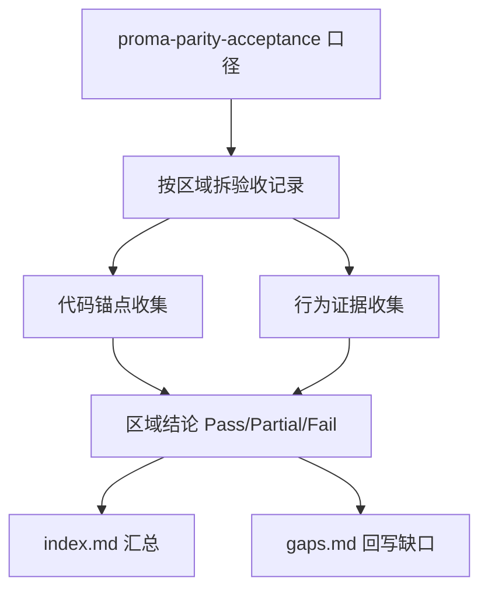

# proma-parity-evidence-pass

## 0. 术语

| 术语 | 含义 |
|---|---|
| Parity Evidence Pack | `.codestable/acceptance/proma-parity/{date}/` 下的一组验收材料，证明当前 j-gui 与 Proma 在哪些条目上是 Pass / Partial / Fail / Excluded / Blocked |
| Baseline Source | Proma 的对照基线；当前以 `.codestable/reference/proma-parity-acceptance.md` 中记录的 `E:\Coding\AI\Proma@d1d07e7` 为准 |
| Evidence Record | 单条验收记录文件，至少包含：Proma 对照点、j-gui 实现锚点、步骤、预期、实际、判定 |
| Behavior Evidence | 截图、录屏、手动验收记录、DOM/状态记录、自动化测试之一，用来证明用户可见行为而不是只证明代码存在 |
| Gap Ledger | 本轮 parity 验收中仍为 `Partial / Fail / Blocked` 的条目清单，用来反推后续 roadmap/feature，而不是在 evidence pass 里偷偷修功能 |

## 1. 决策与约束

### 1.1 核心决策

- 本 feature 不实现新的 parity 功能；它只做**证据收口**，把“现在到底追平到什么程度”从主观判断变成可审计结果。
- 判定口径以 [proma-parity-acceptance.md](/E:/Coding/AI/j-gui/.codestable/reference/proma-parity-acceptance.md) 为准；`runtime-observability-gates` 提供的 Closure Gate / Failure Surface 证据作为输入，不重复定义。
- 对每条 parity 项，证据必须同时覆盖：
  - 实现证据：代码/feature/architecture 锚点
  - 行为证据：截图/录屏/手动验收/自动化之一
- 这次 evidence pass 可以接受大量 `Partial / Fail`，前提是结论真实、证据完整、后续缺口能回指到明确条目；不能为了“看起来像通过”而抬高判定。
- 当前仓库里 `proma-parity-acceptance.md` 引用的部分上游输入已缺失：
  - `j-gui-proma-parity.md`
  - `roadmap/j-gui-desktop-app/proma-parity-implementation-spec.md`
  - `roadmap/j-gui-desktop-app/proma-parity-matrix.yaml`
  本 feature 不补这些缺失文档，但必须在 evidence index 里显式记录引用漂移。

### 1.2 硬约束

- 不在本 feature 中顺手修产品代码；发现缺口只记录到 Gap Ledger。
- 不修改 `proma-parity-acceptance.md` 的判定口径，除非发现明显与当前仓库冲突且必须同步修正。
- 证据目录必须落到 `.codestable/acceptance/proma-parity/{YYYY-MM-DD}/`，不能只写 feature acceptance 代替。
- 没有截图/录屏时，必须用手动验收记录补足步骤、预期、实际和判定，不能只写“代码已有”。
- 自动化测试只能证明其中一部分行为；不能拿 `bun run test` 结果直接宣称 parity 通过。

### 1.3 明确不做

- 不补 Proma parity 缺失功能
- 不新开大规模前端/后端实现改动
- 不替代 `tdd-coverage`
- 不把旧 roadmap 的缺失输入文件在这轮顺手重建
- 不把 `Partial / Fail` 硬翻成 `Pass`

### 1.4 复杂度档位

- 走默认桌面单机人工验收档位：以现有本地 Proma 基线源码、j-gui 当前代码和本地运行/测试证据为主，不引入额外截图自动化框架

## 2. 方案

### 2.1 名词层

#### 现状

- 仓库里已有 parity 参考口径：
  - [proma-parity-acceptance.md](/E:/Coding/AI/j-gui/.codestable/reference/proma-parity-acceptance.md)
  - [proma-mapping.md](/E:/Coding/AI/j-gui/.codestable/reference/proma-mapping.md)
- 已有一个证据目录骨架：
  - [.codestable/acceptance/proma-parity/2026-05-09/index.md](/E:/Coding/AI/j-gui/.codestable/acceptance/proma-parity/2026-05-09/index.md)
- 但当前还没有一份**以当前代码真相为准**的最终证据包，说明：
  - 哪些项已经 Pass
  - 哪些项仍是 Partial / Fail / Blocked
  - 哪些结论依赖运行时 gate、哪些依赖手动 UI 验收

当前证据层最大问题不是完全没有材料，而是材料还没有被整理成“本次可复查结论”。

#### 变化

本 feature 新增一套证据包结构：

```text
.codestable/acceptance/proma-parity/2026-05-12/
  index.md
  shell-sidebar-partial.md
  tabs-workspace-partial.md
  chat-partial.md
  agent-partial.md
  search-partial.md
  settings-partial.md
  shortcuts-partial.md
  gaps.md
  assets/   (可选：截图/录屏)
```

其中：

- `index.md`
  - 本轮范围
  - 基线信息
  - 缺失输入观察项
  - 各大区域总表
- 区域记录文件
  - 对照 Proma 验收清单的一个或一组条目
  - 标注当前 `Pass / Partial / Fail / Excluded / Blocked`
- `gaps.md`
  - 汇总仍需后续 feature 承接的缺口

### 2.2 编排层



#### 现状

- parity 参考清单已经按区域拆出：
  - 全局 Shell
  - Tabs
  - Chat
  - Agent
  - Search
  - Settings
  - File Browser / 工作上下文
  - Shortcuts
- 但当前还没有把这些条目和**2026-05-12 代码快照**的真实状态重新核对。

#### 变化

本 feature 的主流程：

1. 先建立 `2026-05-12` 证据目录和 index
2. 按区域读验收清单，对每块收：
   - Proma 来源
   - j-gui 实现锚点
   - 自动化证据
   - 需要的手动验收步骤
   - 当前判定
3. 把 `runtime-observability-gates` 已经整理好的质量证据接入 Search / ToolSettings / replay 相关结论
4. 把仍然缺失或证据不足的项汇总到 `gaps.md`
5. 最后决定 `proma-parity-evidence-pass` 自身是 `done` 还是仍留 `in-progress`

#### 分区策略

- `shell-sidebar`
- `tabs-workspace`
- `chat-experience`
- `agent-experience`
- `search-navigation`
- `settings-console`
- `file-context`
- `core-shortcuts`

每区可以是一份文件，也可以把证据明显相连的条目合并成一份文件；原则是让读者能在 5 分钟内看清这一块为什么是 `Pass / Partial / Fail`。

#### 错误语义

- 若缺行为证据，只能判 `? verify` 对应的 `Partial` 或 `Blocked`，不能直接判 `Pass`
- 若引用的 requirement/spec/matrix 缺失，必须在 index 记录为“输入漂移观察项”，而不是静默忽略
- 若某条 parity 清单与当前 roadmap 已完成项冲突，以代码真相为准，并在记录里解释差异

### 2.3 挂载点

| # | 挂载点 | 说明 |
|---|---|---|
| 1 | `.codestable/reference/proma-parity-acceptance.md` | 最终判定口径 |
| 2 | `.codestable/reference/proma-mapping.md` | Proma → j-gui 模块映射 |
| 3 | `.codestable/acceptance/proma-parity/2026-05-09/index.md` | 现有证据目录骨架，作为格式参考 |
| 4 | `.codestable/features/2026-05-12-runtime-observability-gates/` | Search / ToolSettings / replay 的质量证据输入 |
| 5 | `src/components/`、`src/__tests__/`、`src-tauri/src/tests/` | 当前实现锚点与自动化证据来源 |
| 6 | `.codestable/acceptance/proma-parity/2026-05-12/` | 本 feature 的最终证据包输出目录 |

### 2.4 推进策略

| Step | 内容 | 退出信号 |
|---|---|---|
| 1 | 建立 2026-05-12 parity 证据目录与 index 骨架，记录基线与缺失输入观察项 | 证据目录和 index 初稿存在 |
| 2 | 按区域梳理代码锚点与自动化证据，优先消费已有 quality gates | 至少 6 个区域有实现证据草稿 |
| 3 | 补手动验收记录模板，覆盖自动化无法证明的 UI 行为 | 各区域都有可执行的手动步骤 |
| 4 | 输出区域级结论文件与 gaps 汇总 | 区域记录和 gaps.md 初稿完成 |
| 5 | 跑默认门禁，确认本轮 evidence 收口未破坏仓库状态 | `bash scripts/check_lint.sh` 通过 |

### 2.5 结构健康度与微重构

#### 文件级

- 这是文档/证据型 feature，不涉及产品代码的结构性微重构。

#### 目录级

- 现有 `.codestable/acceptance/proma-parity/` 目录已存在，继续按日期扩展最自然。
- 不需要为每个 parity 区域另建子目录，先按单层 md 文件组织更利于快速 review。

#### 结论

- 本次不做微重构。

#### 超出范围的观察

- `proma-parity-acceptance.md` 的若干引用已漂移，后续若这个 reference 要继续长期使用，应该独立补一轮文档健康修复。

## 3. 验收契约

| # | 触发 | 期望结果 |
|---|---|---|
| A1 | 查看 `.codestable/acceptance/proma-parity/2026-05-12/` | 存在 index 和区域证据记录，而不是只有一句总结 |
| A2 | 打开任一区域记录 | 能同时看到 Proma 对照点、j-gui 实现锚点、行为证据和当前判定 |
| A3 | 查看 Search / ToolSettings / replay 相关区域 | 能直接引用 `runtime-observability-gates` 的质量证据，不再重复空谈 |
| A4 | 查看 gaps 汇总 | 仍未追平的项被清楚列出，并能回指后续 roadmap/feature，而不是被隐藏 |
| A5 | 查看 index | 能看到缺失输入文件的观察项，而不是把旧引用当成已存在事实 |
| A6 | 跑默认门禁 | `bash scripts/check_lint.sh` 通过，说明本轮 evidence 收口未破坏仓库约束 |

### 明确不做反向核对

- [ ] 不声称本 feature 已经补齐 parity 缺失功能
- [ ] 不声称所有条目都会变成 Pass
- [ ] 不把缺失的 requirement/spec/matrix 在本轮伪装成已存在输入
- [ ] 不用自动化测试结果直接替代 UI parity 判定

## 4. 对其他模块的影响

| 模块 | 影响 | 动作 |
|---|---|---|
| `.codestable/acceptance/proma-parity/` | 新增 2026-05-12 证据包 | 扩展 |
| `.codestable/reference/proma-parity-acceptance.md` | 作为判定口径输入 | 读取 |
| `.codestable/reference/proma-mapping.md` | 作为模块映射输入 | 读取 |
| `.codestable/features/2026-05-12-runtime-observability-gates/` | 作为质量证据输入 | 读取 |
| `src/components/*` / `src/__tests__/*` | 作为实现锚点和行为证据来源 | 读取 |
