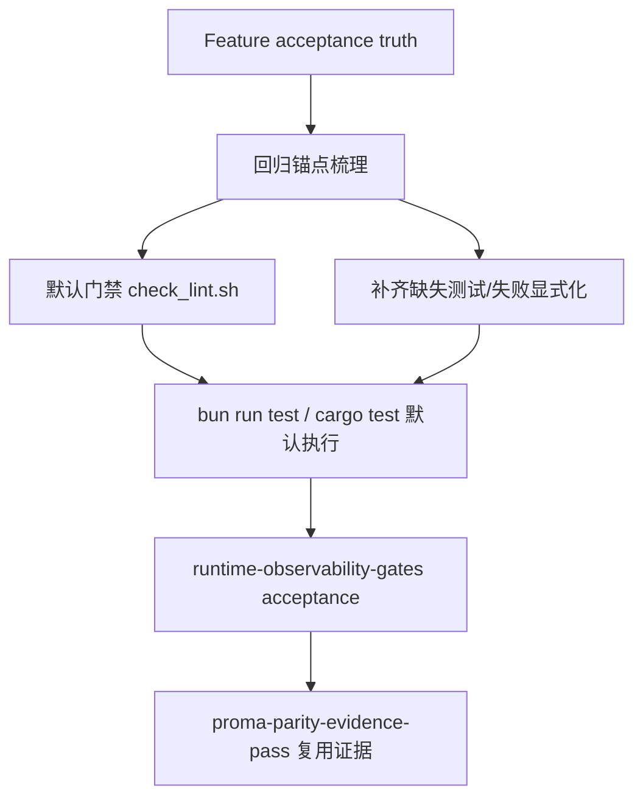

# runtime-observability-gates

## 0. 术语

| 术语 | 含义 |
|---|---|
| Closure Gate | 某条能力闭环在默认仓库门禁里必须被验证到的最小检查组合，不允许只靠人工记忆判断 |
| Failure Surface | 用户或开发者能直接看到的失败表现，例如 IPC 抛错、搜索错误态、ToolSettings toggle 失败提示，而不是静默 fallback |
| Regression Anchor | 直接锚定某条历史闭环缺口的测试或验收记录；它存在的目的不是“增加覆盖率”，而是防止旧洞重开 |
| Default Gate | 默认执行的 `bash scripts/check_lint.sh`，不要求额外手工命令才能判定主链路是否通过 |
| Supplemental Gate | 因环境或副作用限制，暂时不能并入默认门禁、但仍需在验收里明确执行的附加验证 |
| Evidence Pack | 可复用到后续 `proma-parity-evidence-pass` 的验收材料，包括代码证据、自动化测试和必要的手动记录 |

## 1. 决策与约束

### 1.1 核心决策

- Phase D 的首个条目不是“再多写一些测试”，而是把已经翻成 `done` 的高风险闭环变成**默认门禁可挡回归**的能力。
- 本 feature 只覆盖三个 roadmap 已点名的高风险域：
  - Agent history replay
  - message-content search
  - ToolSettings runtime closure
- “可观测”在这里的最低标准不是加日志，而是：
  - 失败路径对前端/测试可见
  - 默认门禁能覆盖关键主链路
  - acceptance 有统一证据口径，可被后续 parity 证据复用
- 不追求一次性把所有历史零测试文件补平；那属于 `tdd-coverage` 的更大范围。本项优先做**与当前闭环状态直接相关的门禁收口**。
- 治理持久化那组 `ignored` round-trip 测试保留 supplemental gate 身份，不强行并入本 feature 的默认门禁目标；本 feature 聚焦 roadmap 已明确点名的三个高风险域。

### 1.2 硬约束

- 默认完成门禁仍以 `bash scripts/check_lint.sh` 为准；若新增关键校验，优先并入这个脚本，而不是要求维护者记住额外命令。
- 不重新设计 SearchDialog、ToolSettings 或 AgentView 的 UI；只允许为错误暴露和可测性做最小接线。
- 不回退到前端 fallback 掩盖后端失败；如果某命令缺失或返回错误，测试和 UI 都必须能看见。
- 不把 `proma-parity-evidence-pass` 的截图/录屏工作混进本 feature；这里只定义可复用证据接口和基础目录/口径。
- 不顺手把 `config.rs` / `alias.rs` / `system.rs` 等全仓测试缺口都纳入当前 feature。

### 1.3 明确不做

- 不做 Proma 逐屏对标结论
- 不补新的表面功能或 UI 改版
- 不把治理持久化 `ignored` 测试强制迁入默认 `cargo test`
- 不以“测试数量增长”作为成功标准
- 不顺手重构 `ipc.ts`、`chat_engine.rs`、`agent_session_replay.rs` 的文件结构

### 1.4 复杂度档位

- 走默认桌面单机档位：以本地命令、Vitest 和 Rust 单测为主，必要时辅以轻量人工验收记录，不引入新的 E2E 框架

## 2. 方案

### 2.1 名词层

#### 现状

当前三个高风险域已经各自有 feature 文档和部分回归测试，但门禁层仍不够统一：

- `agent-history-replay-closure`
  - 有 `getAgentSessionSDKMessages surfaces backend replay failures instead of synthesizing fallback`
  - 有 `fork / rewind / move` 的 Rust 侧实现与 acceptance
  - 但这些证据仍分散在 feature 文档和局部测试里，未被总结成“Phase D 默认门禁要求”
- `search-content-closure`
  - 已补正式 `search_conversation_messages`
  - `SearchDialog` 已有“后端失败时显示显式错误、单侧失败不吞健康结果”的前端测试
  - requirement/roadmap 已翻正，但 acceptance 还没有统一的 Phase D 质量标签
- `toolsettings-runtime-closure`
  - 已补 `enabledToolIds` 伪闭环移除和 `set_tool_enabled` 路径测试
  - 未接通能力已收紧成 unsupported surface
  - 但默认门禁没有把“Chat 发送不再透传 unsupported 工具字段”显式命名为质量锚点

当前 `bash scripts/check_lint.sh` 已经跑：

- `cargo fmt --check`
- `cargo clippy -- -D warnings`
- workspace TypeScript 检查
- `bun run test`
- `cargo test`
- 结构性约束扫描

所以本 feature 的重点不是再造一个新门禁入口，而是让这三个风险域的回归测试和验收证据**稳定落在已有默认门禁里，并且被文档显式定义为 Closure Gate**。

#### 变化

本 feature 新增一套与 roadmap Phase D 对齐的质量真相：

```ts
type ClosureGateStatus = {
  area: "agent-history-replay" | "message-content-search" | "toolsettings-runtime"
  defaultGate: "covered" | "missing"
  failureSurface: "explicit" | "implicit"
  evidencePack: "ready" | "partial"
}
```

这不是新的运行时代码结构，而是 design / acceptance / check_lint 之间共享的判定模型：

- `defaultGate=covered`
  - 代表默认 `check_lint.sh` 会执行到该域的关键回归测试
- `failureSurface=explicit`
  - 代表后端失败不会被 fallback 吞掉，前端或测试能直接看到错误
- `evidencePack=ready`
  - 代表该域已有 acceptance 可引用的代码证据 + 自动化验证记录

同时本 feature 约定：

- `runtime-observability-gates-acceptance.md` 将按这三个 area 分节验收
- `proma-parity-evidence-pass` 后续只能消费这里已整理好的 gate/evidence 真相，不再自己重新解释“哪些闭环算完成”

### 2.2 编排层



#### 现状

- 每条 Phase B/C feature 已经各自完成 acceptance，但“高风险回归是否真的被默认门禁覆盖”还没有被单独建模。
- 有些测试已经存在，例如：
  - `src/__tests__/ipc.test.ts`
  - `src/__tests__/search-dialog.test.tsx`
  - `src/__tests__/tool-settings.test.tsx`
  - `src-tauri/src/tests/commands_agent.rs`
- 但这些测试还停留在“某个 feature 当时补过”，而不是“Phase D 必须守住的闭环门槛”。

#### 变化

本 feature 的主流程分四层：

1. 先盘点三个 area 当前已有的自动化锚点、失败显式化能力和 acceptance 证据
2. 对缺的部分做最小补齐：
   - 缺默认门禁覆盖：补 Vitest/Rust 测试，让它落进 `bun run test` 或 `cargo test`
   - 缺失败显式化：补前端错误态或 IPC 抛错路径，不允许 fallback 吞掉
   - 缺 acceptance 真相：在本 feature acceptance 中统一记录
3. 把 `runtime-observability-gates` 自身变成一个可验收的“质量条目”，而不是仅靠口头描述
4. 把结果作为下游 `proma-parity-evidence-pass` 和 `tdd-coverage` 的输入

#### 三个 area 的最小 Gate

1. `agent-history-replay`
   - 历史回放后端失败会显式抛错
   - `fork / rewind / move` 的命令路径由 Rust 测试覆盖
   - 默认门禁运行到对应前端 IPC 测试和 Rust 测试
2. `message-content-search`
   - Chat 内容搜索只走正式后端命令
   - 单侧后端失败时 UI 显式报错，不吞健康侧结果
   - 默认门禁运行到 SearchDialog / IPC 相关测试
3. `toolsettings-runtime`
   - `list_chat_tools / set_tool_enabled` 路径有回归测试
   - Chat 发送不再透传 `enabledToolIds`
   - unsupported surface 继续 fail fast 或显式提示

#### 错误语义

- 如果某个 area 仍需要“命令不存在时 fallback 成功”才能通过，则该 gate 判失败
- 如果某个 area 只有 acceptance 文档、没有默认门禁里的自动化锚点，则该 gate 至少是 `partial`
- 如果某个 area 默认门禁通过但用户可见失败态仍被静默吞掉，也不能判完成

### 2.3 挂载点

| # | 挂载点 | 说明 |
|---|---|---|
| 1 | `scripts/check_lint.sh` | 默认门禁入口；必要时补充对高风险域的最小验证约束 |
| 2 | `src/__tests__/ipc.test.ts` | replay/search/toolsettings 的 IPC 主链路回归锚点 |
| 3 | `src/__tests__/search-dialog.test.tsx` | 内容搜索错误态、单侧失败保留健康结果 |
| 4 | `src/__tests__/tool-settings.test.tsx` | ToolSettings 启停与错误表面 |
| 5 | `src-tauri/src/tests/commands_agent.rs` / `agent_session_replay.rs` | Agent replay/fork/rewind/move 的 Rust 侧锚点 |
| 6 | `.codestable/features/2026-05-12-runtime-observability-gates/` | 本 feature 的 design/checklist/acceptance 作为质量层统一入口 |
| 7 | `.codestable/reference/proma-parity-acceptance.md` | 只消费本 feature 输出的证据口径，不在本 feature 内重写 parity 条目 |

### 2.4 推进策略

| Step | 内容 | 退出信号 |
|---|---|---|
| 1 | 盘点三个高风险域已有的默认门禁锚点、失败显式化和 acceptance 证据 | 三域差距清单明确 |
| 2 | 补齐 replay 域缺失的默认门禁或失败显式化收口 | `bun run test` / `cargo test` 对应锚点通过 |
| 3 | 补齐 search 域缺失的默认门禁或错误表面收口 | `bun run test` 对应搜索测试通过 |
| 4 | 补齐 toolsettings 域缺失的默认门禁或 unsupported surface 收口 | `bun run test` 对应工具测试通过 |
| 5 | 如有必要，最小更新 `scripts/check_lint.sh`，确保默认门禁能稳定覆盖上述锚点 | `bash scripts/check_lint.sh` 通过 |
| 6 | 编写本 feature acceptance，统一记录 Closure Gate / Supplemental Gate / Evidence Pack | acceptance 初稿完成 |

### 2.5 结构健康度与微重构

#### 文件级

- `src/__tests__/ipc.test.ts` 已经很长，但本 feature 如果继续扩测试，仍属于同一类“IPC 主链路回归锚点”，不应在这轮顺手大拆。
- `scripts/check_lint.sh` 是默认门禁单入口，本 feature 可能需要最小改动；不适合把它拆成多脚本并引入新的维护复杂度。

#### 目录级

- 测试文件当前按前端 `src/__tests__/`、Rust `src-tauri/src/tests/` 分层，已经与现有结构对齐。
- 本 feature 只新增一份 feature 目录，不需要新建质量专项目录。

#### 结论

- 本次不做微重构。
- 原因：当前目标是把已有闭环变成默认门禁可验证的质量层，而不是重组测试架构。

#### 超出范围的观察

- `src/__tests__/ipc.test.ts` 和部分 Rust 测试文件已经偏长，后续若继续扩大量测试，可能需要独立 `cs-refactor` 处理测试拆分。
- 全仓命令层零测试补平仍是 `tdd-coverage` 的更大主题，不在本 feature 中一次性解决。

## 3. 验收契约

| # | 触发 | 期望结果 |
|---|---|---|
| A1 | 执行默认门禁 `bash scripts/check_lint.sh` | 三个高风险域的关键回归锚点都在默认门禁内被执行到 |
| A2 | Agent history replay 主链路出现后端失败 | 前端 IPC 或对应测试显式暴露错误，不回退到伪造 replay |
| A3 | Chat 内容搜索后端失败或单侧失败 | SearchDialog 显式显示错误，并保留健康侧结果 |
| A4 | ToolSettings/ToolSelector 与 Chat 发送链路 | 不再透传 unsupported 工具字段；启停错误可见 |
| A5 | 查看本 feature acceptance | 三个 area 都有 Closure Gate 结论、证据路径和 supplemental gate 说明 |
| A6 | 后续进入 `proma-parity-evidence-pass` | 无需重新定义这三个闭环的质量真相，只复用本 feature 证据 |

### 明确不做反向核对

- [ ] 不声称已经完成 Proma parity 最终判定
- [ ] 不声称已经补平所有命令层测试缺口
- [ ] 不把 governance ignored 持久化测试并入默认门禁当作本 feature 的必须结果
- [ ] 不把测试数量增长当作完成证据

## 4. 对其他模块的影响

| 模块 | 影响 | 动作 |
|---|---|---|
| `scripts/check_lint.sh` | 默认门禁可能补最小高风险域约束 | 可能更新 |
| `src/__tests__/ipc.test.ts` | 三域 IPC 主链路回归锚点 | 可能扩展 |
| `src/__tests__/search-dialog.test.tsx` | 搜索错误表面与单侧失败策略 | 可能扩展 |
| `src/__tests__/tool-settings.test.tsx` | ToolSettings 错误表面与启停真相 | 可能扩展 |
| `src-tauri/src/tests/*` | replay/fork/rewind/move 的 Rust 锚点补齐 | 可能扩展 |
| `.codestable/reference/proma-parity-acceptance.md` | 后续作为证据消费者，而不是本次直接修改对象 | 保持 |
