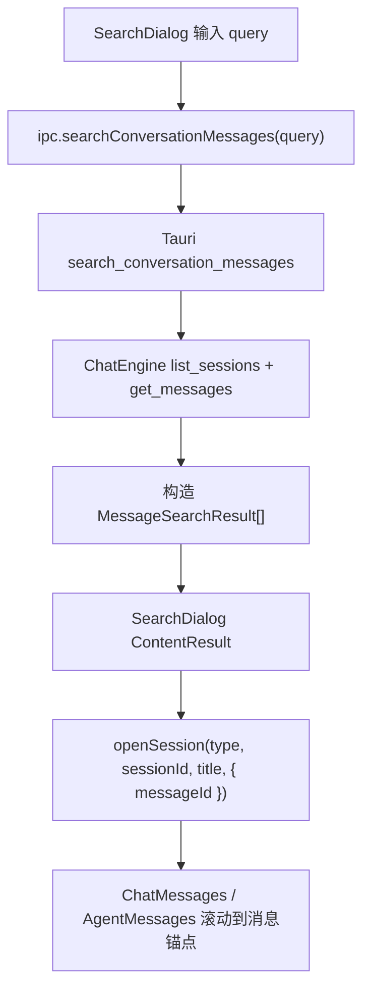

# search-content-closure

## 0. 术语

| 术语 | 含义 |
|---|---|
| Title Search | 只按会话标题匹配，返回会话级结果，不带消息锚点 |
| Content Search | 按消息内容匹配，返回会话 + 消息锚点 + snippet 的搜索结果 |
| Message Anchor | 搜索结果里的 `messageId`，用于打开会话后滚动到目标消息 |
| Search Result Truth | 前端搜索 UI 直接消费的结果真相，至少包含 `conversationId/sessionId`、`messageId`、`snippet`、`matchStart`、`matchLength`、`archived` |
| Fallback Search | 前端在 `ipc.ts` 里先列会话再逐个读消息进行内容搜索的兜底实现 |

## 1. 决策与约束

### 1.1 核心决策

- `search-content-closure` 先收口 **Chat 内容搜索后端真命令**，让 Chat / Agent 两侧都具备正式后端搜索入口，而不是一边真后端、一边前端 fallback。
- 前端现有 `SearchDialog -> openSession(messageId)` 的消息锚点链路已经成立，这次不重做 UI，重点补后端闭环与文档真相。
- requirement 必须同步从“只搜标题”升级到“标题搜索 + 内容搜索都成立”。否则代码和 requirement 会继续互相否定。
- 旧文档里“内容搜索首版排除”的说法只保留历史语境；当前 `j-gui-v1` 活动 roadmap 和 requirement 必须反映现状。

### 1.2 硬约束

- 不重写 `SearchDialog` 的交互层，不改 title/content 两段式 UI 结构。
- 不修改 Agent 内容搜索命令的对外契约；它已经是正式后端能力，只做对齐参考。
- Chat 内容搜索结果结构必须继续兼容现有 `MessageSearchResult`，不让前端额外改字段名。
- 搜索命令必须注册到 `src-tauri/src/lib.rs`；只有 `ipc.ts` 包装不算闭环。
- 继续保持 `messageId` 可用于打开会话后的消息定位；不允许后端返回“只有 snippet 没有锚点”的弱结果。

### 1.3 明确不做

- 不在本 feature 里做跨 workspace / 文件内容搜索
- 不在本 feature 里重做搜索排序、IME、标题搜索体验
- 不在本 feature 里补会话归档视图
- 不在本 feature 里调整 ToolSettings / Governance 子链路
- 不顺手改 Agent 搜索结果 UI

### 1.4 复杂度档位

- 走默认桌面单机档位：本地会话数据、同步读取搜索、按当前数据量优先保证闭环真相而不是先做索引优化

## 2. 方案

### 2.1 名词层

#### 现状

- 前端已经定义了稳定的 `MessageSearchResult`：

```ts
interface MessageSearchResult {
  conversationId: string
  conversationTitle: string
  messageId: string
  role: MessageRole
  snippet: string
  matchStart: number
  matchLength: number
  archived?: boolean
}
```

- `SearchDialog` 已经会把内容搜索结果映射为 `ContentResult`，并在打开时把 `messageId` 传给 `openSession(...)`。
- Agent 侧已有正式后端命令 `search_agent_session_messages(query)`，返回 `AgentMessageSearchResult`。
- Chat 侧 `ipc.searchConversationMessages()` 目前是：
  1. 先尝试 `invoke('search_conversation_messages')`
  2. 若命令不存在，则 fallback 到前端：`listConversations() -> getConversationMessages()` 逐条匹配

这意味着 Chat 内容搜索在用户侧可见，但 Search Result Truth 不是后端单一真相。

#### 变化

本 feature 把 Chat 内容搜索升级为正式后端真相：

```rust
#[tauri::command]
fn search_conversation_messages(query: String) -> Result<Vec<MessageSearchResult>, String>;
```

其中 Rust 侧结果字段与前端既有 `MessageSearchResult` 一致：

```ts
type ChatMessageSearchResult = {
  conversationId: string
  conversationTitle: string
  messageId: string
  role: "user" | "assistant"
  snippet: string
  matchStart: number
  matchLength: number
  archived: boolean
}
```

同时 requirement 真相调整为：

- 标题搜索：会话入口级能力
- 内容搜索：消息级能力，返回消息锚点

### 2.2 编排层



#### 现状

- 打开结果后的锚点滚动已经成立，问题集中在搜索命令链路：
  - Agent：`SearchDialog -> ipc -> Tauri command -> 后端 transcript 搜索`
  - Chat：`SearchDialog -> ipc -> try invoke -> invoke 失败后前端 fallback`
- 旧 requirement / 旧 parity 文档仍把内容搜索视作“首版排除”，与当前 UI 和 `j-gui-v1` 规划发生冲突。

#### 变化

这次收口后的主流程：

1. `SearchDialog` 保持现有 debounce + 并行查 Chat/Agent 两路
2. Chat 侧 `ipc.searchConversationMessages()` 命中正式 Tauri 命令
3. 后端通过 `list_sessions()` + `get_messages(session_id)` 逐会话构造搜索结果
4. 前端拿到正式结果后继续沿用现有 `messageId` 定位链路
5. requirement / roadmap / architecture 文字同步为“内容搜索已进入当前能力”

#### 错误语义

- 命令不存在：本 feature 完成后不应再出现；若出现视为闭环失败
- 单个会话读取失败：后端直接返回错误，不静默吞掉后继续给部分结果
- 空命中：返回空数组，由现有 UI 空态承接

### 2.3 挂载点

| # | 挂载点 | 说明 |
|---|---|---|
| 1 | `src-tauri/src/commands/chat.rs` | 新增正式 `search_conversation_messages` 命令 |
| 2 | `src-tauri/src/lib.rs` | 注册命令，形成真实 Tauri 能力 |
| 3 | `src/lib/ipc.ts` | 收紧 Chat 内容搜索为正式命令主链路，去掉长期 fallback 依赖 |
| 4 | `.codestable/requirements/j-gui-session-management.md` | 把“只搜标题”边界改成与当前代码一致 |
| 5 | `.codestable/roadmap/j-gui-v1/*` | 回写 feature 进度与能力真相，避免 roadmap 继续滞后 |

### 2.4 推进策略

| Step | 内容 | 退出信号 |
|---|---|---|
| 1 | 后端新增 Chat 内容搜索命令与结果映射 | Rust 搜索命令可编译、可注册 |
| 2 | 前端 IPC 收口到正式命令主链路，并补测试/兼容校验 | 前端测试通过，内容搜索不再依赖命令缺失 fallback |
| 3 | requirement / roadmap / architecture 同步到代码真相 | 文档与代码不再互相否定 |
| 4 | 全量校验与回归验证 | `bash scripts/check_lint.sh` 通过 |

### 2.5 结构健康度与微重构

#### 文件级

- `src-tauri/src/commands/chat.rs` 当前体量不大，新增一个搜索命令不会把职责推到失控。
- `src/lib/ipc.ts` 已经承载大量 IPC 包装，但本次只是收紧一个已有函数的主链路，不适合在这个 feature 里顺手拆文件。

#### 目录级

- 现有搜索相关逻辑分散在 `commands/chat.rs`、`commands/agent.rs` 与 `SearchDialog.tsx`，这符合当前“按领域命令归类”的目录结构，不需要为搜索单独起子目录。

#### 结论

- 本次不做微重构。
- 原因：当前问题是闭环真相缺失，不是结构负担；此时先补正式命令和文档同步，风险最低。

#### 超出范围的观察

- 如果后续内容搜索继续扩展到排序、索引、跨 workspace 检索，届时应独立评估是否把搜索能力下沉到更专门的 search 模块；不在本 feature 里提前抽象。

## 3. 验收契约

| # | 触发 | 期望结果 |
|---|---|---|
| A1 | 在搜索框输入能命中 Chat 消息正文的关键词 | Chat 内容结果通过正式 Tauri 命令返回，而不是靠命令缺失 fallback 才成立 |
| A2 | 点击 Chat 内容搜索结果 | 能打开目标会话并滚动到对应消息锚点 |
| A3 | 在搜索框输入能命中 Agent transcript 的关键词 | Agent 内容结果继续正常返回，不因本次修改回退 |
| A4 | 查看活动 requirement / roadmap | 不再出现“当前只搜标题”与“当前支持内容搜索”同时存在的冲突表述 |
| A5 | grep 命令注册 | `search_conversation_messages` 已注册到 `src-tauri/src/lib.rs` |

### 明确不做反向核对

- [ ] 不声称本次已经做了搜索索引或性能优化
- [ ] 不声称本次已经补齐归档视图
- [ ] 不把 ToolSettings 或 Governance 闭环混进本次 feature

## 4. 对其他模块的影响

| 模块 | 影响 | 动作 |
|---|---|---|
| `src-tauri/src/commands/chat.rs` | 新增正式内容搜索命令 | 扩展 |
| `src-tauri/src/lib.rs` | 注册搜索命令 | 扩展 |
| `src/lib/ipc.ts` | Chat 内容搜索不再以 fallback 作为长期主路径 | 收口 |
| `src/components/app-shell/SearchDialog.tsx` | 继续消费既有结果，不应需要协议变更 | 保持 |
| `.codestable/requirements/j-gui-session-management.md` | 边界真相修正 | 更新 |
| `.codestable/roadmap/j-gui-v1/*` | 进度与能力真相回写 | 更新 |
