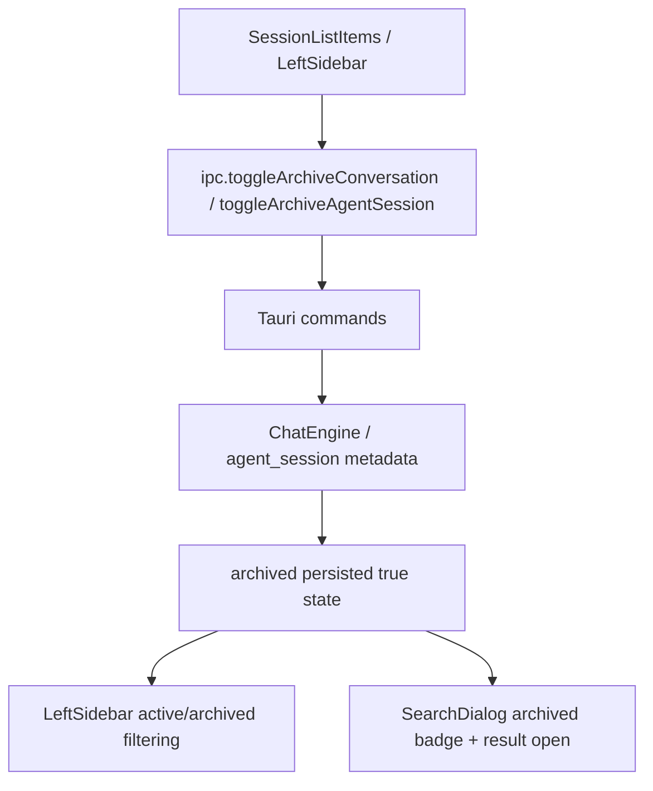

# session-archive

## 0. 术语

| 术语 | 含义 |
|---|---|
| Active View | 侧边栏默认视图，只展示未归档会话 |
| Archived View | 侧边栏归档视图，只展示 `archived=true` 的 Chat / Agent 会话 |
| Archive Toggle | 归档/取消归档动作，落到后端真实持久化并回写侧边栏与搜索展示 |
| Archive Search Truth | SearchDialog 的标题/内容搜索结果保留 `archived` 标记，并能打开归档会话 |

## 1. 决策与约束

### 1.1 核心决策

- `session-archive` 只收口“归档状态真实持久化 + 归档视图一致性 + 搜索结果一致性”。
- 本项依赖 `search-content-closure` 与 `agent-history-replay-closure` 已可信；前者保证搜索结果能正确打开，后者保证 Agent 回放不会因为归档状态而失真。
- 归档是软隐藏，不是删除：会话仍可被搜索到、打开、取消归档。
- Chat 与 Agent 归档都必须走正式后端命令，不能保留前端静默失败存根。

### 1.2 明确不做

- 不实现按天自动批量归档任务
- 不补独立“归档中心”新页面
- 不实现归档导出、恢复历史版本或跨设备同步

## 2. 方案

### 2.1 当前真相

当前已落地：

- Chat：`toggle_archive_conversation`
- Agent：`toggle_archive_agent_session`
- 侧边栏：`sidebarViewModeAtom` + 已归档入口 / 返回活跃按钮
- 搜索：`SearchDialog` 标题与内容结果均保留 `archived`
- 打开逻辑：归档项仍可通过搜索或列表打开

本项不再新增实现主链，而是把这组能力作为已闭环能力补全 feature 文档、验收证据与 roadmap 状态。

### 2.2 编排层

核心收口点：

1. Chat / Agent 的归档动作都是真后端命令
2. 归档状态会同步影响侧边栏 active/archived 过滤和计数
3. SearchDialog 会保留归档标记，搜索结果与归档视图不冲突

### 2.3 挂载点

| # | 挂载点 | 说明 |
|---|---|---|
| 1 | `src/components/app-shell/LeftSidebar.tsx` | 归档动作、视图切换、归档计数 |
| 2 | `src/components/app-shell/SessionListItems.tsx` | 归档入口、归档列表展示 |
| 3 | `src/components/app-shell/SearchDialog.tsx` | 搜索结果保留 `archived` 标记 |
| 4 | `src/lib/ipc.ts` | Chat / Agent 归档 IPC 命令 |
| 5 | `src-tauri/src/commands/chat.rs` | Chat 归档命令 |
| 6 | `src-tauri/src/commands/agent.rs` | Agent 归档命令 |
| 7 | `src-tauri/src/chat_engine.rs` / `src-tauri/src/agent_session.rs` | 归档状态真实持久化 |

## 3. 验收契约

| # | 触发 | 期望结果 |
|---|---|---|
| A1 | 归档 Chat 会话 | 会话从 active 视图移出，并可在 archived 视图与搜索结果中看到 |
| A2 | 归档 Agent 会话 | 当前工作区 archived 计数和列表同步更新 |
| A3 | 从搜索结果打开已归档项 | 能继续打开目标会话，且结果保留归档标记 |
| A4 | 取消归档 | 会话回到 active 视图，搜索与列表状态同步恢复 |
| A5 | 代码与 roadmap 对齐 | 不再把已实现归档能力继续标成 planned |

### 明确不做反向核对

- [ ] 不声称存在自动批量归档任务
- [ ] 不声称有独立归档中心页面
- [ ] 不声称删除后的会话可恢复

## 4. 对其他模块的影响

| 模块 | 影响 | 动作 |
|---|---|---|
| `LeftSidebar.tsx` | 归档切换与列表一致性 | 核对 |
| `SearchDialog.tsx` | 归档搜索结果真相 | 核对 |
| `ipc.ts` | 归档命令桥接 | 核对 |
| `chat_engine.rs` / `agent_session.rs` | 归档状态持久化 | 核对 |
| `j-gui-session-management` | 当前能力边界 | 回写 |
