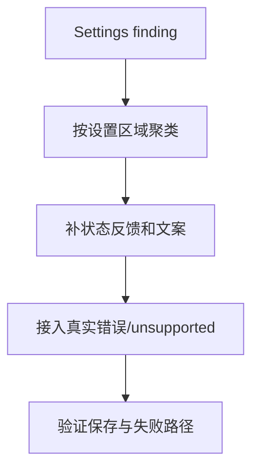

# settings-experience-hardening

## 0. 术语

| 术语 | 含义 |
|---|---|
| 设置可理解性 | 用户知道改了什么、是否保存、失败原因、当前来源和不支持边界 |
| Unsupported Surface | 当前能力不支持时显式告诉用户，而不是显示可操作但失败或无效 |
| 来源提示 | j-cli 源、CC SDK 源、工作区源、全局源等配置来源说明 |

## 1. 决策与约束

- 本 design 当前是 draft，必须等 `product-friction-audit` 输出 Settings finding 后才能 approved。
- 不新增设置项，不扩大治理模型。
- 不绕过 `GovernanceKernel` / `ConfigKernel`。
- 不把“已落盘”当作“用户体验完成”；必须覆盖保存中、已保存、保存失败、unsupported、来源说明。

## 2. 方案

### 2.1 名词层

#### 现状

Settings 已有多标签和真实后端命令，但体验问题可能集中在保存反馈、错误暴露、unsupported 能力、凭据/工具状态、来源解释等位置。

#### 变化

从摩擦台账筛选 Settings finding，形成设置体验修复批次：

```ts
interface SettingsExperienceFinding {
  settingsArea: "general" | "channels" | "tools" | "skills" | "hooks" | "mcp" | "yaml" | "aliases"
  feedbackGap: "saving" | "saved" | "failed" | "unsupported" | "source" | "validation"
  expectedUserMessage: string
}
```

### 2.2 编排层



错误语义：

- 后端失败必须以用户可见方式呈现。
- 未支持能力必须禁用或标明 unsupported，不能伪装成可编辑。
- 来源不同的配置不能混成一种。

### 2.3 挂载点

| # | 挂载点 | 说明 |
|---|---|---|
| 1 | `src/components/settings/SettingsDialog.tsx` / `SettingsPanel.tsx` | Settings 总入口 |
| 2 | `src/components/settings/ToolSettings.tsx` | 工具状态与 unsupported |
| 3 | `src/components/settings/AgentSettings.tsx` / `HooksSettings.tsx` | Governance 来源与启停 |
| 4 | `src/components/settings/primitives/*` | 统一反馈原语 |
| 5 | 产品摩擦台账 | 本项唯一事实输入 |

### 2.4 推进策略

| Step | 内容 | 退出信号 |
|---|---|---|
| 1 | 从台账筛选 Settings P0/P1/P2 finding | 区域和反馈缺口明确 |
| 2 | 收口保存/失败/unsupported 状态 | 用户可见反馈完成 |
| 3 | 收口来源与凭据/工具状态提示 | 来源和能力边界可理解 |
| 4 | 补验证记录 | 每条 finding 有验证 |

### 2.5 结构健康度与微重构

Settings 已有 primitives。若修复需要重复 UI 模式，应优先复用 primitives；只有在多个设置页出现同一反馈模式时才考虑新增原语。当前 draft 不预设微重构。

## 3. 验收契约

| # | 触发 | 期望结果 |
|---|---|---|
| A1 | 修改设置成功 | 用户能看到保存结果或状态稳定变化 |
| A2 | 修改设置失败 | 用户能看到失败原因，不静默回退 |
| A3 | 查看 unsupported 能力 | UI 禁用或明确说明不支持 |
| A4 | 查看来源混合配置 | 用户能区分 j-cli、SDK、工作区、全局来源 |

## 4. 对其他模块的影响

待台账输出后细化；当前不预写实现清单。
