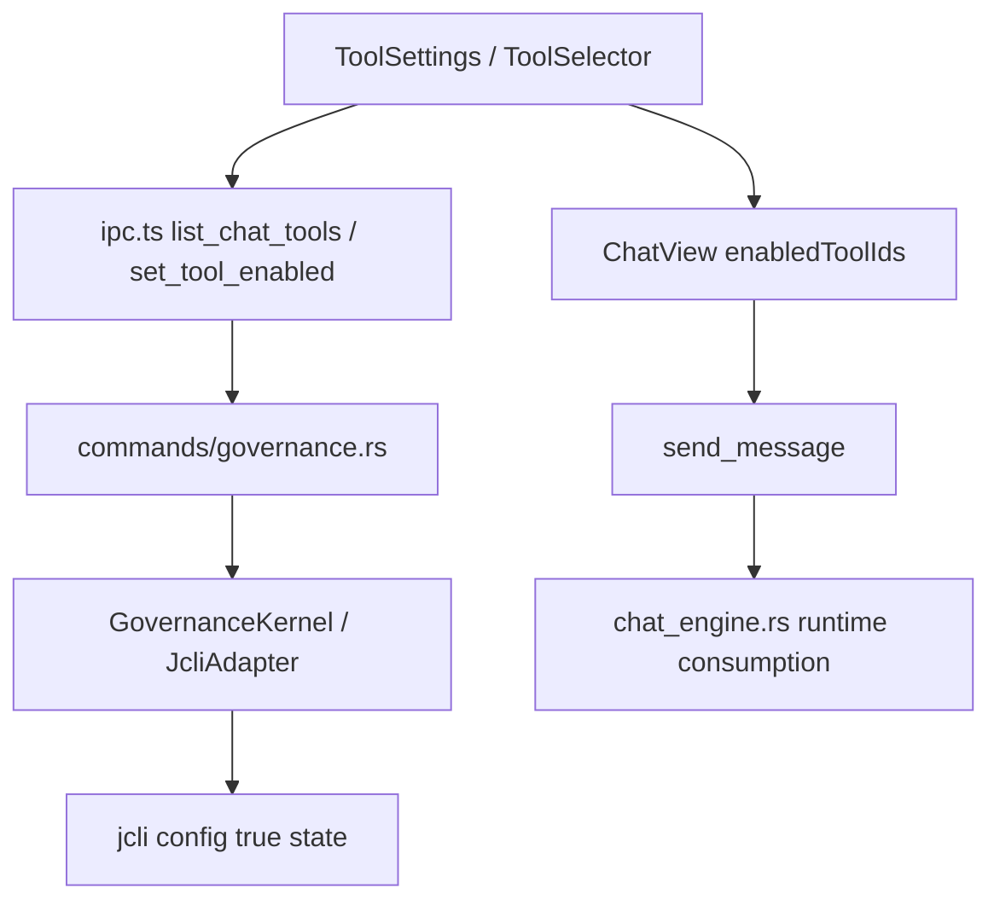

# toolsettings-runtime-closure

## 0. 术语

| 术语 | 含义 |
|---|---|
| Builtin Tool Truth | 后端 `list_chat_tools / set_tool_enabled` 返回的内置工具名称、描述、启停状态 |
| Tool Availability | 某个工具在 UI 中是否可切换使用；例如缺凭据时只能展示“需配置” |
| Tool Runtime Effect | 用户在 Settings 或 ToolSelector 中切换工具后，Chat 发送链路与后端 runtime 对该状态的真实消费结果 |
| Unsupported Surface | 当前仍未接通的凭据编辑、自定义工具、连通性测试等入口，必须显式隐藏或标 unsupported，而不是伪装可用 |

## 1. 决策与约束

### 1.1 核心决策

- 本 feature 只负责 ToolSettings / Chat Tools 的 runtime 闭环，不再混入 Skills / Hooks / MCP 治理项。
- “已闭环”的最低标准不是 Settings 页面有工具列表，而是：
  - ToolSettings 与 ToolSelector 使用同一套后端真相
  - 工具启停状态能稳定持久化
  - Chat 发送链路对工具选择的消费与后端能力一致
  - 未接通能力必须明确隐藏或标 unsupported
- 当前代码里已经落地的 `list_chat_tools / set_tool_enabled` 和 ToolSettings / ToolSelector UI 基线应保留，不重做外观。
- 如果某项工具运行时当前不能生效，就不能继续让前端把它包装成“已支持的高级设置”。

### 1.2 明确不做

- 不实现自定义聊天工具 CRUD
- 不实现工具凭据 UI 或连通性测试
- 不补 MCP / Skills / Hooks 治理逻辑
- 不把 `enabledToolIds` 扩展成完整工具编排平台

## 2. 方案

### 2.1 当前真相

当前已经落地：

- 后端命令：`list_chat_tools`、`set_tool_enabled`
- 前端设置页：`ToolSettings` 的 `BuiltinToolsSection`
- 前端快捷入口：`ToolSelectorPopover`
- IPC 桥接：`getChatTools / listChatTools / setToolEnabled / updateChatToolState`

但当前仍有关键断点：

- `ChatView` 会把 `enabledToolIds` 送入 `send_message`
- Rust `chat_engine.rs` 当前把非空 `enabledToolIds` 视为 unsupported request field
- 因此“工具开关存在”和“runtime 真的消费工具选择”还不是一条真链路

### 2.2 编排层

核心收口点：

1. ToolSettings 与 ToolSelector 的显示/切换必须都来自同一套后端工具真相
2. Chat 发送链路要么真实消费工具选择，要么不再发送会被后端判 unsupported 的字段
3. unsupported surface 必须继续显式隐藏或报错

### 2.3 挂载点

| # | 挂载点 | 说明 |
|---|---|---|
| 1 | `src/components/settings/ToolSettings.tsx` | ToolSettings 当前支持面的真相与错误表面 |
| 2 | `src/components/chat/ToolSelectorPopover.tsx` | 工具选择器与 Settings 共用后端工具状态 |
| 3 | `src/components/chat/ChatView.tsx` | Chat 发送链路是否继续传 `enabledToolIds` |
| 4 | `src/lib/ipc.ts` | `list_chat_tools / set_tool_enabled / updateChatToolState / getChatTools` 桥接真相 |
| 5 | `src-tauri/src/commands/governance.rs` | 内置工具命令表面 |
| 6 | `src-tauri/src/chat_engine.rs` | `enabledToolIds` 的 runtime 消费或拒绝边界 |

### 2.4 推进策略

| Step | 内容 | 退出信号 |
|---|---|---|
| 1 | 审计 ToolSettings / ToolSelector / ChatView / chat_engine 之间的工具状态断点 | 断点清单明确 |
| 2 | 收紧 IPC 与 UI 真相，只保留已接通能力，明确 unsupported surface | `bun run test` 通过 |
| 3 | 收口 Chat 发送链路与后端 runtime 对工具选择的口径 | `cargo test` + `bun run test` 通过 |
| 4 | 为 ToolSettings 与 ToolSelector 补回归测试，覆盖切换、刷新、发送链路 | 对应测试通过 |
| 5 | 跑 `bash scripts/check_lint.sh`，把 ToolSettings runtime closure 作为正式闭环项验收 | 全量通过 |

## 3. 验收契约

| # | 触发 | 期望结果 |
|---|---|---|
| A1 | 打开 ToolSettings | 只显示当前已接通的工具管理能力，不再暴露假入口 |
| A2 | 在 ToolSettings 切换内置工具 | 状态持久化成功，刷新后保持一致 |
| A3 | 在 ToolSelector 切换工具 | 与 ToolSettings 看到的状态一致 |
| A4 | 发送 Chat 消息时带工具选择 | 前后端对工具字段口径一致，不再出现“前端发送、后端直接判 unsupported” |
| A5 | 触发 unsupported surface | 明确隐藏或返回 unsupported，不伪装成功 |

### 明确不做反向核对

- [ ] 不声称已支持自定义工具 CRUD
- [ ] 不声称已支持工具凭据编辑
- [ ] 不声称已支持工具连通性测试

## 4. 对其他模块的影响

| 模块 | 影响 | 动作 |
|---|---|---|
| `ToolSettings.tsx` | 设置页支持面真相 | 收口 |
| `ToolSelectorPopover.tsx` | 与 Settings 共用工具真相 | 收口 |
| `ChatView.tsx` | 发送链路字段口径统一 | 收口 |
| `ipc.ts` | 工具状态桥接与 unsupported surface | 收口 |
| `commands/governance.rs` | 工具列表/启停命令 | 核对 |
| `chat_engine.rs` | 工具字段 runtime 真相 | 收口 |
