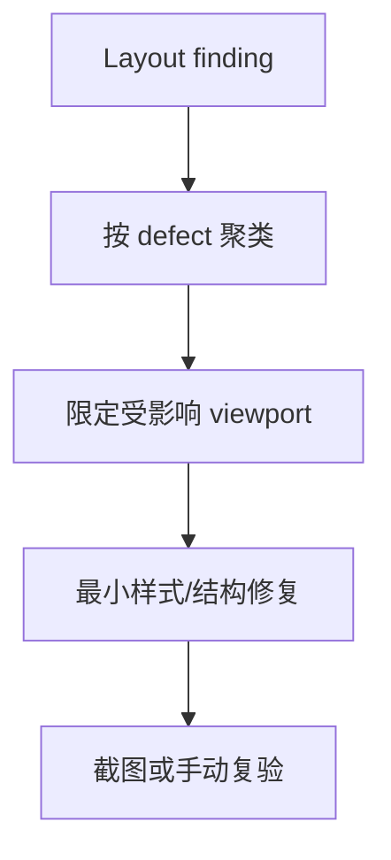

# visual-layout-polish

## 0. 术语

| 术语 | 含义 |
|---|---|
| 视觉布局问题 | 不改变业务能力，但影响阅读、点击、扫描、聚焦或窗口适配的问题 |
| 截图证据 | 能证明溢出、遮挡、错位、截断、焦点缺失的视觉材料 |

## 1. 决策与约束

- 本 design 当前是 draft，必须等 `product-friction-audit` 输出 Layout finding 后才能 approved。
- 只处理有截图/复现证据的布局问题。
- 不做全局换肤，不重写设计系统，不引入新 UI 框架。
- 不修改功能语义；若问题本质是交互或后端断点，转对应 feature/issue。

## 2. 方案

### 2.1 名词层

#### 现状

当前前端已有较完整组件结构，但大量细节问题可能来自溢出、密度、滚动容器、截断、按钮状态、焦点态和窄窗口适配。

#### 变化

从摩擦台账筛选 `kind=visual-layout | ui-detail` finding，形成布局修复批次：

```ts
interface VisualLayoutFinding {
  viewport: "desktop" | "narrow" | "unknown"
  defect: "overflow" | "overlap" | "truncation" | "density" | "focus" | "scroll" | "button-state"
  screenshot?: string
}
```

### 2.2 编排层



错误语义：

- 没有视觉证据的全局“美化”不进入本项。
- 修复不能造成相邻区域遮挡、重排或文本不可读。
- 按钮和控件尺寸要稳定，不能因 hover/loading 文字导致布局跳动。

### 2.3 挂载点

| # | 挂载点 | 说明 |
|---|---|---|
| 1 | `src/components/app-shell/*` | Shell、侧栏、右侧面板布局 |
| 2 | `src/components/chat/*` | Chat 消息和输入布局 |
| 3 | `src/components/agent/*` | Agent timeline 和工作台布局 |
| 4 | `src/components/settings/*` | Settings 表单和滚动区域 |
| 5 | 产品摩擦台账 | 本项唯一事实输入 |

### 2.4 推进策略

| Step | 内容 | 退出信号 |
|---|---|---|
| 1 | 从台账筛选布局 finding | 每条都有截图/复现 |
| 2 | 按 defect 和 viewport 聚类 | 批次边界明确 |
| 3 | 最小修复样式/结构问题 | 不扩大为换肤 |
| 4 | 补截图或手动复验 | 每条 finding 有 before/after 或验收记录 |

### 2.5 结构健康度与微重构

本项优先做局部样式和结构修复。若发现需要统一抽象或设计系统调整，记录为后续 `cs-refactor` 或单独 design，不在本项顺手扩大。

## 3. 验收契约

| # | 触发 | 期望结果 |
|---|---|---|
| A1 | 查看每条布局 finding | 有截图/复现和目标区域 |
| A2 | 修复后复验 | 不再溢出、遮挡、错位、截断或布局跳动 |
| A3 | 窄窗口复验 | 文本和控件仍可读可点 |
| A4 | 反向核对 | 没有无来源的全局换肤或设计系统重写 |

## 4. 对其他模块的影响

待台账输出后细化；当前不预写实现清单。
