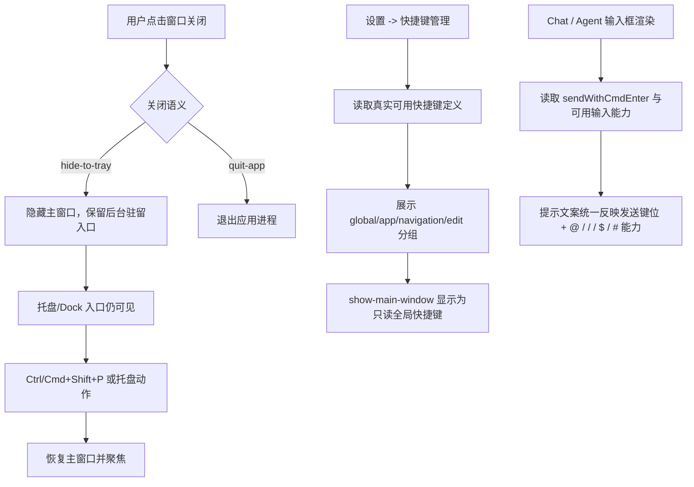

# desktop-presence-lifecycle

## 0. 术语

| 术语 | 含义 |
|---|---|
| 桌面存在态 | 应用在操作系统里的可见/可唤回状态，包括前台窗口、托盘图标、Dock 图标、全局快捷键 |
| 显示主界面 | 无论当前焦点在哪里，都把主窗口恢复到可见、可交互状态 |
| 关闭窗口保活 | 用户关闭前台主窗口后，不退出后台进程，而是保留托盘/Dock 入口与全局唤回能力 |
| 真实可用快捷键 | UI 中能看到、且当前版本确实已注册并能触发的快捷键 |

## 1. 决策与约束

- 本 design 以 `.codestable/audits/2026-05-13-desktop-shell-lifecycle/` 作为直接输入源；实现阶段不能只“做主流程”，还要顺手消化该 audit 中已经确认的同源问题，至少覆盖：
  - `show-main-window` 在设置页不可见
  - 关闭窗口缺少真实保活/唤回闭环
  - 左侧缺少明确拖拽表面
  - 右上角窗口按钮与顶部壳层割裂
- 本项不是单纯“补一条快捷键文案”，而是收口一组同源问题：
  - `show-main-window` 在默认快捷键表里存在，但快捷键管理页未展示
  - 当前 `Ctrl/Cmd+Shift+P` 只覆盖“显示当前主窗口”，还没和“关闭窗口后仍可唤回”的桌面生命周期闭环起来
  - 当前窗口关闭语义仍是桌面壳层空缺，尚未明确定义“关闭 = 退出进程”还是“关闭 = 收起到托盘”
  - 输入框提示文案与当前可切换的发送快捷键设置存在漂移；设置里已经支持切换“Enter 发送 / Cmd(Ctrl)+Enter 发送”，但输入框提示没有统一跟随，且旧文案缺少 `@ / / / $ / #` 这些已存在能力的完整提示
- 本项优先定义桌面主应用的生命周期真相，再落 UI 和交互；不能继续靠前端热补丁把多个状态拼起来。
- Windows 和 macOS 都要有统一的产品语义，但平台表面允许不同：
  - Windows：任务栏 + 系统托盘语义优先
  - macOS：Dock + 菜单栏/状态栏语义优先
- 本项当前只设计“主窗口隐藏/显示/保活”闭环，不扩到通知中心、后台任务总览、托盘菜单高级动作。
- 不在本项里引入“快捷键完全自定义到全局层”这类扩范围能力；首轮全局快捷键仍可保留只读。
- 如果最终发现需要 Tauri tray / menu / app lifecycle 的后端补充，应显式写成 Rust 能力，而不是继续只靠渲染进程做假闭环。

## 2. 方案

### 2.1 名词层

#### 现状

当前代码真相是分裂的：

- `show-main-window` 仍在默认快捷键表中，且被标记为 `category: "global"`、`global: true`、`readonly: true`，见 `src/lib/shortcut-defaults.ts`
- `ShortcutSettings` 的 `categoryOrder` 只渲染 `app / navigation / edit`，没有 `global`，所以“显示主窗口”不会出现在快捷键管理 UI 中，见 `src/components/settings/ShortcutSettings.tsx`
- `registerGlobalAppShortcuts()` 确实还在注册 `CommandOrControl+Shift+P`，触发后调用 `unminimize/show/setFocus`，见 `src/lib/global-shortcut-manager.ts`
- 当前还没有托盘/Dock 保活语义；“关闭窗口后应用仍驻留，可由全局快捷键或托盘再次显示”尚未进入真实生命周期
- Agent 输入框已经能根据 `sendWithCmdEnter` 在两种发送模式间切换提示，并且会展示 `@ 引用文件 / 调用 Skill / $ 引用 Chat / # 调用 MCP`，见 `src/components/agent/AgentView.tsx`
- Chat 输入框当前只覆盖“发送 / 换行”提示，没有同步提到 `@ / / / $ / #` 这些能力，且两端文案口径没有统一，见 `src/components/chat/ChatInput.tsx`

#### 变化

本项要把这些离散状态统一成一个显式桌面存在态模型：

```ts
type DesktopPresenceMode =
  | "foreground-window"
  | "background-resident"
  | "terminated"

interface DesktopPresenceCapability {
  showMainWindowShortcut: {
    id: "show-main-window"
    accelerator: string
    visibleInShortcutSettings: boolean
    readonly: boolean
    registeredByBackend: boolean
  }
  closeBehavior: "hide-to-tray" | "quit-app"
  trayOrDockPresence: boolean
  inputHintPolicy: {
    mirrorsSendShortcutSetting: boolean
    includesMentionAndToolHints: boolean
  }
}
```

其中当前期望默认值为：

```ts
const defaultDesktopPresence: DesktopPresenceCapability = {
  showMainWindowShortcut: {
    id: "show-main-window",
    accelerator: "Ctrl/Cmd+Shift+P",
    visibleInShortcutSettings: true,
    readonly: true,
    registeredByBackend: true,
  },
  closeBehavior: "hide-to-tray",
  trayOrDockPresence: true,
  inputHintPolicy: {
    mirrorsSendShortcutSetting: true,
    includesMentionAndToolHints: true,
  },
}
```

### 2.2 编排层



错误语义：

- 不允许 UI 声称某快捷键存在，但设置页看不到，或后台根本没注册
- 不允许“关闭窗口”与“退出应用”在不同平台上静默表现成两套未说明的语义
- 不允许 `show-main-window` 只在窗口尚未关闭时可用；若默认承诺保活，就必须覆盖隐藏后再唤回
- 若平台或环境不支持驻留托盘/Dock，必须显式退化并提示，而不是继续展示误导文案
- 不允许设置页已支持切换发送快捷键，但输入框提示仍停留在旧文案
- 不允许 Chat / Agent 两处输入框对同一组输入能力给出不同口径的提示文案

### 2.3 挂载点

| # | 挂载点 | 说明 |
|---|---|---|
| 1 | `src/lib/shortcut-defaults.ts` / `src/components/settings/ShortcutSettings.tsx` | 快捷键定义与快捷键管理 UI 的真实可见性 |
| 2 | `src/lib/global-shortcut-manager.ts` / `src/components/shortcuts/GlobalShortcuts.tsx` | 全局显示主界面快捷键注册、恢复主窗口动作 |
| 3 | `src-tauri/src/lib.rs` 及桌面壳层相关 Tauri 生命周期 | 主窗口关闭、隐藏、保活、恢复的宿主语义 |
| 4 | `src/components/app-shell/*` / Settings / About 文案面 | 对用户解释当前关闭行为与唤回入口 |
| 5 | 托盘/Dock 入口（待实现时在 Tauri capability / tray 配置中落地） | 保活状态下的可见入口 |
| 6 | `src/components/chat/ChatInput.tsx` / `src/components/agent/AgentView.tsx` | 输入框提示文案与发送快捷键切换、输入能力提示保持一致 |

### 2.4 推进策略

| Step | 内容 | 退出信号 |
|---|---|---|
| 1 | 先统一桌面生命周期语义：关闭窗口到底是隐藏保活还是退出 | design 明确平台默认行为和退化条件 |
| 2 | 把 `show-main-window` 从“底层存在、UI 漏展示”修正为真实可见快捷键 | 快捷键管理页能展示 `global` 分类与只读全局快捷键 |
| 3 | 把“显示主界面”接到关闭后保活态，而不只是当前窗口未销毁时的 `show` | 关闭主窗口后仍可由快捷键/托盘恢复 |
| 4 | 吸收 audit 中确认的桌面壳层 UI 缺口：左侧明确拖拽表面、右上角按钮并入统一顶部壳层，而不是悬浮补丁 | 左侧存在连续可拖拽区域，顶部按钮与 TabBar / 右侧文件区形成统一带状壳层 |
| 5 | 统一 Chat / Agent 输入框提示文案，使其跟随发送快捷键设置，并补齐 `@ / / / $ / #` 能力提示 | 两处输入框在两种发送模式下都给出一致、真实的提示文案 |
| 6 | 补托盘/Dock 驻留入口与关闭语义反馈，并完成桌面生命周期测试与验收 | 关闭、保活、恢复、快捷键展示、输入提示五条主路径都有验证记录 |

### 2.5 结构健康度与微重构

当前不建议先做大重构，但有两个低风险结构动作可以纳入实现前置判断：

- `ShortcutSettings` 需要把分类渲染从硬编码数组改成覆盖 `global` 的显式顺序；这是局部结构修正，不是重写整个快捷键系统
- 若托盘/Dock 生命周期落地后发现 `global-shortcut-manager` 同时承担“键位匹配 + Tauri 窗口恢复 + 生命周期语义”，可以拆出 `desktop-presence` / `window-lifecycle` 级薄层，避免继续把桌面壳逻辑塞进快捷键文件
- 若 Chat / Agent 输入框提示文案继续各写一份，建议顺手抽一个共享的 hint 生成函数，只统一“提示口径”，不重写输入组件本体

本 design 当前先不把它升级成独立 `cs-refactor` 前置，因为问题主轴是能力闭环，不是文件过胖；若实现时发现会进一步蔓延到 tray/menu/window 生命周期多模块耦合，再补独立微重构步骤。

## 3. 验收契约

| # | 触发 | 期望结果 |
|---|---|---|
| A1 | 打开快捷键管理 | 能看到“全局”分类，且 `显示主窗口` 出现在列表中，状态与当前能力一致 |
| A2 | 在主窗口可见时按 `Ctrl/Cmd+Shift+P` | 不触发浏览器默认行为，而是聚焦当前主窗口 |
| A3 | 关闭主窗口后 | 默认行为不是静默退出；若设计选定保活，则应用仍保留托盘/Dock 可见入口 |
| A4 | 在保活态按 `Ctrl/Cmd+Shift+P` 或托盘/Dock 动作 | 主窗口恢复到前台并可交互 |
| A5 | 拖动窗口 | 左侧边栏存在明确、连续、不会干扰主要交互的拖拽表面 |
| A6 | 观察顶部壳层 | 右上角窗口按钮不再像独立悬浮块，而是与顶部标签栏/右侧文件区视觉成带 |
| A7 | 切换发送快捷键设置后观察 Chat / Agent 输入框 | 两处提示文案都能真实反映当前发送键位，并统一展示 `@ 引用文件，/ 调用 Skill，$ 引用 Chat，# 调用 MCP` |
| A8 | 平台反向核对 | Windows/macOS 的差异有明确产品语义说明，不存在“代码这样写但 UI 没说”的误导 |
| A9 | 反向核对 | 没有把“全局快捷键可自定义”“托盘高级菜单”“后台任务面板”等额外能力偷偷带进本项 |

## 4. 对其他模块的影响

本项预计会触达：

- `src/components/settings/ShortcutSettings.tsx`
- `src/lib/shortcut-defaults.ts`
- `src/lib/global-shortcut-manager.ts`
- `src/components/shortcuts/GlobalShortcuts.tsx`
- `src-tauri/src/lib.rs`
- `src/components/chat/ChatInput.tsx`
- `src/components/agent/AgentView.tsx`
- 可能新增桌面生命周期 / tray 相关 Tauri 薄层

若设计评审通过，后续再决定是否把 roadmap 中已完成的 `shortcut-system-hardening` / `desktop-shell-platform-polish` 做补充说明，或新增一条更准确的 follow-up item。
