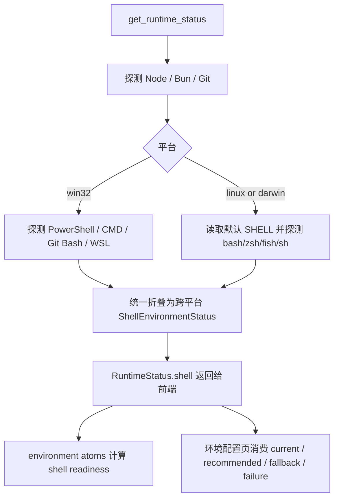

# environment-configuration-surface

## 0. 术语

| 术语 | 含义 |
|---|---|
| shell 能力模型 | 运行时对当前平台可用 shell、默认 shell、推荐 shell、失败原因的统一结构化描述 |
| 当前 shell | 当前用户环境下最可能承载 CLI/Hook/脚本执行的默认交互 shell |
| shell 家族 | `powershell` / `cmd` / `git-bash` / `wsl` / `bash` / `zsh` / `fish` / `sh` / `unknown` 这类可在 UI 和策略层消费的枚举 |
| platform capability | 平台特有增强能力，例如 Windows 的 `Git Bash` / `WSL`，POSIX 的默认 shell / profile 路径 |
| fallback 规则 | 推荐 shell 不可用时，系统按什么顺序退回到其他 shell，并把原因暴露给 UI |

## 1. 决策与约束

- 本项从 `j-gui-v1` 的 `environment-configuration-surface` roadmap 条目起头，目标不是“多加几个字段”，而是把环境配置页所需的 shell 真相补齐成跨平台后端契约。
- 现有 `RuntimeStatus.shell` 只建模 Windows 专属结构：`gitBash` / `wsl` / `recommended: 'git-bash' | 'wsl' | null`。这与 roadmap 中“环境配置页”要承载的跨平台 shell 真相不匹配。
- 本项优先收口“探测模型和 UI 可消费契约”，并补一个真实可用的设置区“环境配置”页面最小落地：
  - 展示 Node/Git/Bun 与 shell 真相
  - 展示 current / recommended / fallback / failure
  - 提供重检入口
  - 不伪造“已生效 shell 选择”或 runtime 执行策略切换
- Windows 现有语义不能回退：
  - 继续支持 `Git Bash` / `WSL` 专项状态
  - 继续给出 Windows 推荐 shell
  - 继续保留失败原因，而不是只给布尔值
- Linux/macOS 首轮必须至少补齐：
  - 默认 shell 路径与家族识别
  - `bash` / `zsh` / `fish` / `sh` 的可用性与版本探测
  - 推荐 shell
  - 基本 fallback 顺序与失败原因
- 本项不做什么：
  - 不在本轮实现 shell profile 修改、PATH 注入、自动写入 `.bashrc` / `.zshrc`
  - 不在本轮做 shell 显式切换持久化 UI；页面里若展示“推荐 shell”，仅作只读真相展示，不写回设置
  - 不在本轮把 Agent/Hook 的实际执行后端改成按新 shell 模型路由
  - 不把 Node/Git/Bun 的现有探测逻辑重写成另一套架构
- 若后续要让 Agent/Hook 真正依据 shell 配置运行，需要单独 feature；本项只提供可信输入，不偷偷扩到执行链路。
- 复杂度走默认档位，不引入额外抽象层级；优先在 `settings_environment.rs`、共享类型和前端环境 atoms 内做最小闭环。

## 2. 方案

### 2.1 名词层

#### 现状

当前代码真相：

- Rust 侧 `get_runtime_status()` 只在 Windows 下填充 `shell`，非 Windows 直接返回 `None`，见 [settings_environment.rs](E:/Coding/AI/j-gui/src-tauri/src/commands/settings_environment.rs:366)。
- 共享类型 [runtime.ts](E:/Coding/AI/j-gui/packages/shared/src/types/runtime.ts:102) 把 `ShellEnvironmentStatus` 定义成 Windows 专属结构，只包含 `gitBash`、`wsl` 和 `recommended: 'git-bash' | 'wsl' | null`。
- 前端 [environment.ts](E:/Coding/AI/j-gui/src/atoms/environment.ts:55) 目前把“非 Windows 没有 `runtime.shell`”直接解释为 shell 环境天然 OK，这意味着 Linux/macOS 根本没有被纳入真实检查面。
- roadmap 已明确要求环境配置页展示 Shell 显式选择、fallback 规则、推荐 shell，以及 Node/Git/Bun/Git Bash/WSL/PowerShell 的状态与失败原因；当前契约不足以承载这层 UI。

#### 变化

把 `RuntimeStatus.shell` 从“Windows 专属状态块”升级为“跨平台 shell 能力模型 + 平台特有分支”：

```ts
type ShellFamily =
  | 'powershell'
  | 'cmd'
  | 'git-bash'
  | 'wsl'
  | 'bash'
  | 'zsh'
  | 'fish'
  | 'sh'
  | 'unknown'

interface ShellCandidateStatus {
  family: ShellFamily
  available: boolean
  path: string | null
  version: string | null
  source: 'default' | 'path-scan' | 'registry' | 'env' | 'unknown'
  error: string | null
}

interface PosixShellStatus {
  current: ShellCandidateStatus | null
  candidates: ShellCandidateStatus[]
  recommended: ShellFamily | null
  fallbackOrder: ShellFamily[]
}

interface WindowsShellStatus {
  powershell: ShellCandidateStatus
  cmd: ShellCandidateStatus
  gitBash: ShellCandidateStatus
  wsl: {
    available: boolean
    version: 1 | 2 | null
    defaultDistro: string | null
    distros: string[]
    error: string | null
  }
  recommended: ShellFamily | null
  fallbackOrder: ShellFamily[]
}

interface ShellEnvironmentStatus {
  platform: 'win32' | 'linux' | 'darwin'
  current: ShellCandidateStatus | null
  recommended: ShellFamily | null
  fallbackOrder: ShellFamily[]
  windows: WindowsShellStatus | null
  posix: PosixShellStatus | null
}
```

关键约束：

- `shell` 在三平台都返回，不再让非 Windows 走 `undefined`
- Windows 特有能力放进 `windows` 分支，POSIX 特有能力放进 `posix` 分支
- UI 公共层优先消费 `current` / `recommended` / `fallbackOrder`
- 平台细节页再消费 `windows` 或 `posix` 的明细

推荐策略首版约定：

- Windows：`git-bash` > `wsl` > `powershell` > `cmd`
- macOS：`zsh` > `bash` > `sh`
- Linux：`bash` > `zsh` > `fish` > `sh`

### 2.2 编排层



错误语义：

- 不允许非 Windows 再以“`shell` 字段不存在”伪装成环境正常
- 不允许 UI 只能知道“有/没有 shell”，却不知道默认 shell、推荐 shell 和失败原因
- 不允许平台公共层直接依赖 `gitBash` / `wsl` 这种 Windows 特有字段
- 若默认 shell 路径无法解析，必须返回 `current = null` 和明确错误，而不是静默降级成 OK
- 探测不到某个候选 shell 时，应保留候选条目并给出 `available: false + error`

### 2.3 挂载点

| # | 挂载点 | 说明 |
|---|---|---|
| 1 | [settings_environment.rs](E:/Coding/AI/j-gui/src-tauri/src/commands/settings_environment.rs:1) | shell 探测主逻辑、推荐与 fallback 规则 |
| 2 | [settings.rs](E:/Coding/AI/j-gui/src-tauri/src/commands/settings.rs:391) | Rust 侧 `RuntimeStatus` / shell 相关序列化结构 |
| 3 | [runtime.ts](E:/Coding/AI/j-gui/packages/shared/src/types/runtime.ts:102) | 前后端共享 shell 能力类型定义 |
| 4 | [ipc.ts](E:/Coding/AI/j-gui/src/lib/ipc.ts:223) | `getRuntimeStatus()` 的稳定消费面 |
| 5 | [environment.ts](E:/Coding/AI/j-gui/src/atoms/environment.ts:55) | shell readiness 派生判断，不能再把非 Windows 自动判真 |
| 6 | 环境配置页 UI 消费面 | 本轮直接接入真实 `环境配置` 标签页，展示运行时与 shell 真相，但不提供写回式 shell 选择 |

### 2.4 推进策略

| Step | 内容 | 退出信号 |
|---|---|---|
| 1 | 重建共享 shell 类型，明确跨平台公共层和平台专属分支 | TypeScript/Rust 结构对齐，公共层不再绑死 Windows 字段 |
| 2 | 在 Rust 侧补 POSIX 默认 shell 与候选 shell 探测，同时保留 Windows 现有专项探测 | `get_runtime_status` 在三平台都能返回 `shell` |
| 3 | 收口推荐 shell 与 fallback 规则 | 三平台都有稳定 `recommended` / `fallbackOrder` 输出 |
| 4 | 更新前端环境 atoms 的 shell readiness 判断 | 非 Windows 不再无条件视为 shell 环境 OK |
| 5 | 在设置区接入真实环境配置页 | SettingsPanel 出现独立 `环境配置` 标签，能展示运行时与 shell 真相、失败原因和重检入口 |
| 6 | 补针对性测试并跑默认门禁 | 共享类型、Rust 单测、前端消费、设置页渲染与 `bash scripts/check_lint.sh` 全部通过 |

### 2.5 结构健康度与微重构

- 文件级：
  - `settings_environment.rs` 继续承担运行时探测主逻辑是可以接受的，但本轮会新增 POSIX 探测分支和公共折叠逻辑，存在继续变胖风险。
  - 若实现时新增逻辑超过“当前文件再加一小段”的规模，优先做“只搬不改行为”的薄拆分，例如抽出 `settings_environment_shell.rs` 或 `runtime_shell.rs`，专门承载 shell 探测辅助函数。
- 目录级：
  - `src-tauri/src/commands/` 目前已按 settings 子文件拆分，继续把 shell 探测放在 settings 领域下是合理的，不需要单独再建顶层目录。
  - `packages/shared/src/types/` 当前也能自然承载 runtime 类型，不需要重组目录。
- 结论：
  - 本 design 默认先不强制做微重构；若实现中 `settings_environment.rs` 新增内容明显扩张，再把“抽 shell 辅助文件”作为第 1 步独立前置。
- 超出范围的观察：
  - 真正让 Agent/Hook/外部命令执行链路依赖这个新 shell 模型，已经超出“环境配置面”范围，应后续单独走 feature，而不是在本项里顺手接 runtime 执行策略。

## 3. 验收契约

| # | 触发 | 期望结果 |
|---|---|---|
| A1 | 在 Windows 调 `get_runtime_status` | `shell` 始终存在，且能返回 `current` / `recommended` / `fallbackOrder` 与 `windows.gitBash` / `windows.wsl` 明细 |
| A2 | 在 Linux 调 `get_runtime_status` | `shell` 始终存在，`posix.current` 能反映默认 shell，`candidates` 至少覆盖 `bash/zsh/fish/sh` |
| A3 | 在 macOS 调 `get_runtime_status` | `shell` 始终存在，推荐策略按 `zsh > bash > sh` 输出，缺失项带失败原因 |
| A4 | 前端消费 `runtimeStatus.shell` | 不再依赖 `runtime.shell` 是否存在来判断是否 OK，而是基于结构化状态得出结果 |
| A5 | 默认 shell 路径无效或环境变量缺失 | 返回明确失败原因，不静默判绿 |
| A6 | 打开设置区 `环境配置` 标签 | 能看到 Node/Git/Bun、当前 shell、推荐 shell、fallback 顺序、平台明细与失败原因 |
| A7 | 点击重检运行时 | 页面会重新拉取运行时状态，不需要重开设置面板 |
| A8 | 反向核对 | 本轮没有实现 shell profile 写入、PATH 注入、执行链路切换或 shell 选择持久化 |

## 4. 对其他模块的影响

- `RuntimeStatus.shell` 的共享契约会变化，前端凡是直接消费 `gitBash` / `wsl` 的地方都要同步到新结构。
- `environment-configuration-surface` 后续实现可以直接消费这份契约，不必再从 UI 侧猜平台行为。
- Windows 现有 Git Bash/WSL 语义必须通过回归测试锁住，避免“为了加 Linux/macOS 支持把 Windows 老能力打碎”。
