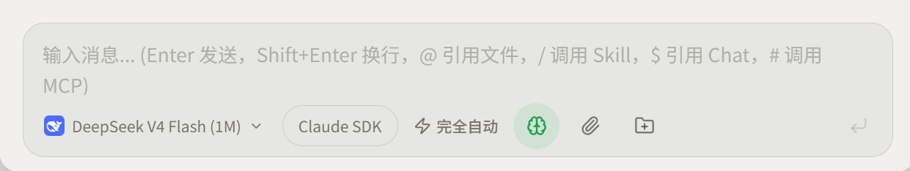
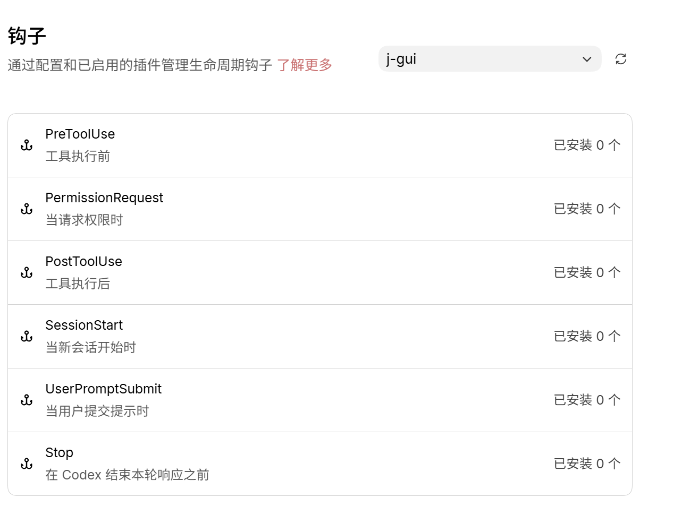
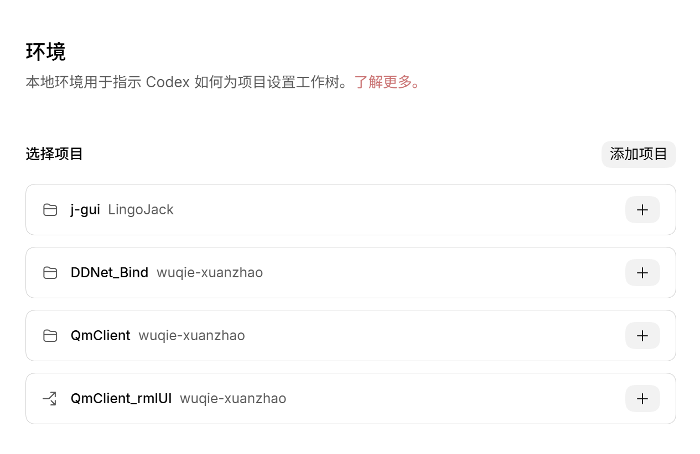
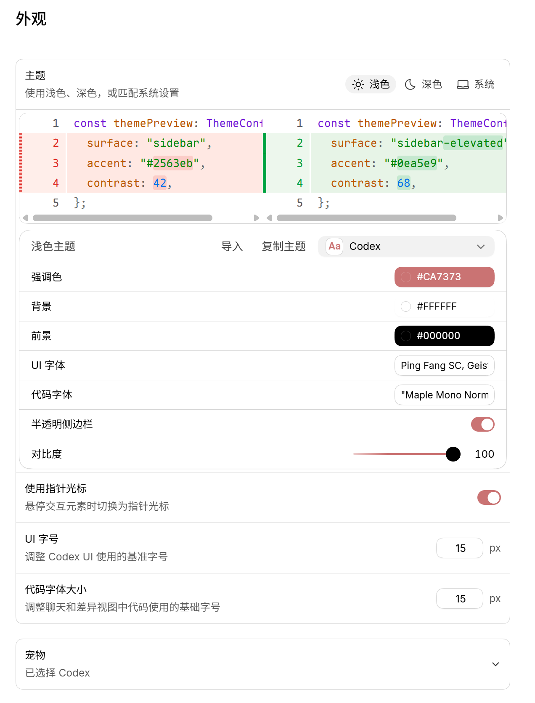
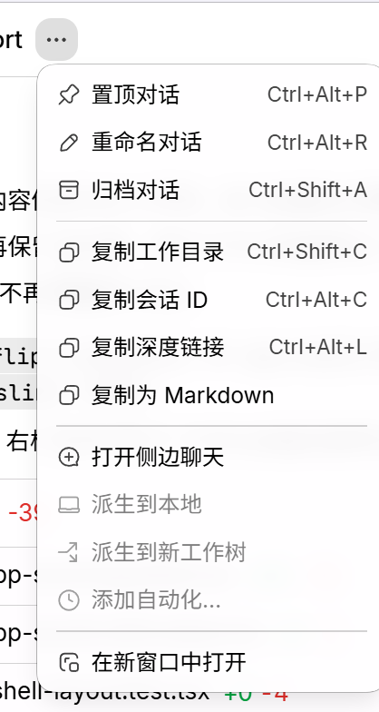
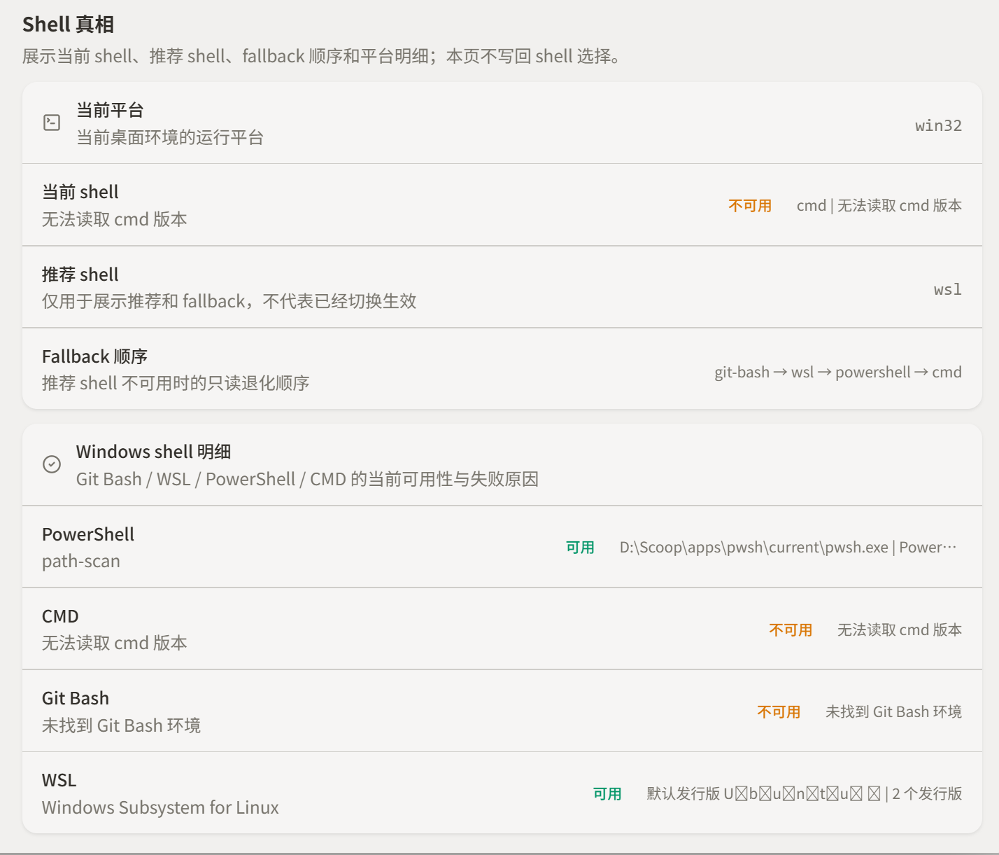
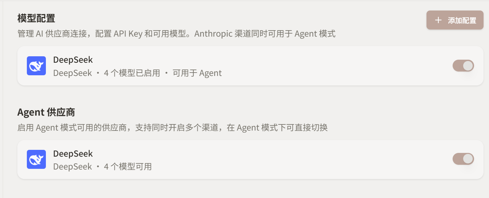

# J gui

### 待提示词（Issue）

1. 快捷键问题
    1. 全局快捷键，显示主窗口的ctrl+shift +P 我按了之后是出来打印页面的（Windows），说明快捷键的后端也需要找 bug 修复
    2. ctrl++、ctrl+- 这些放大字体等界面元素的快捷键，当前是没用的
    3. 快捷键文案对应修改：Enter 发送，Shift+enter 换行 — 这个在设置里面是可以切换的，但是对应的提示信息没有改过来，文案可以改为：Enter发送，Shift+Enter换行，@引用文件，/ 调用SkiII，$ 引用Chat，# 调用 MCP （删去前面的输入信息…）
        
        
        
2. Roadmap
    1. 后续移动端的支持计划
        1. 移动端的需求：
            1. 仅作为控制器，也就是核心功能是远程连接（局域网）桌面端（当前的 GUI app），进行 Vibe Coding ，所以相关的逻辑应该抽离出来当成 Core 核心 结构如：core/ （使用Rust）
            2. ios、android、harmony 三个系统，分别用对应的 UI 框架（原生）如：SwiftUI / Compose / ArkTS，然后后端用同一个 core （需要Bindings：uniffi 绑定 / NAPI）
            
            ```flow
            flowchart TB
                subgraph A[共享核心（Rust）]
                    Net[局域网通信<br/>WebSocket/WebRTC/SSH]
                    Proc[数据流处理<br/>编解码/缓存]
                end
            
                subgraph B[iOS]
                    SwiftUI[SwiftUI]
                    Bridge_iOS[Swift绑定]
                end
            
                subgraph C[Android]
                    Compose[Jetpack Compose]
                    Bridge_Android[Kotlin绑定]
                end
            
                subgraph D[鸿蒙 HarmonyOS]
                    ArkUI[ArkUI (ArkTS)]
                    Bridge_Ohos[ArkTS绑定]
                end
            
                Net & Proc <--> Bridge_iOS --> SwiftUI
                Net & Proc <--> Bridge_Android --> Compose
                Net & Proc <--> Bridge_Ohos --> ArkUI
            ```
            
        2. 使用 monorepo 项目结构 `app/mobiles/ios`、`app/mobiles/android`、`app/mobiles/harmony`
3. Explore
    1. E:/Coding/AI/j-gui/.codestable/compound/2026-05-13-explore-proma-backend-refactor-candidates.md：这个 Proma 的能力吸收 能说明完成了吗？以及是否还有值得吸收的功能？（最后，看看之前写的Proma 值得吸收参考的引入 的 explore 文档，现在能说完成了吗（以及，是否有还能吸收的功能和后端能力？））
    2. 侧边栏可用来拖动窗口
4. Codex 学习
    1. Hooks（图为Codex的，我想要的是类似的，告诉你钩子的类型，当然前提是Agent 支持（双后端可做区分），需要区分 工作区 ，应该把当前的单独的钩子配置集成到Agent 配置中去，而且可类似 MCP 的那种一样，添加对应类型的钩子）
        
        
        
    2. 工作区/项目文件夹（图为Codex的）
        
        
        
    3. 自定义主题外观（当前是有预设的Proma的主题，但是我认为还是得暴露一些可设置项，进行自定义主题的设置，可参考图中的 Codex 的做法）
        
        
        
    4. UI 问题
        1. 动画不够丝滑
            1. 快捷键：ctrl+, 打开关闭设置，其界面没做渐入和渐出过渡动画，类似的还有 显示主界面（这个只做了渐出没做渐入）
            2. 切换会话的时候，内容（三栏内容）没做过渡动画
            3. 展开左右侧栏，动画不能阻塞主线程（卡住），动画要位移过渡变化，不改变文本大小尺寸
            4. 我明确动画的行为（这是一个必须的强制约束的动画，写进测试先 TDD）：
                1. 展开右侧栏时，会话容器，左边不要动，右边平滑平移向左移动，然后右侧栏在最右侧从零向左平滑平移展开
                2. 关闭右侧栏时，会话容器，左边不要动，右边平滑平移向右移动，右侧栏左边跟随会话容器的右边移动，而右边则不动
                3. 展开左侧栏时，会话容器，右边不要动，左边平滑平移向右移动，左侧栏在左侧从关闭状态（并非0宽度）向右平滑平移展开
                4. 关闭左侧栏时，会话容器，右边不要动，左边平滑平移向左移动，左侧栏右边跟随会话容器的左边移动，而左边则不动
        2. Chat 模式和 Agent 模式 新会话，其 用户名，晚上好 这个招呼位置不一致，说明这两个模式的UI 代码没有模块化 复用，应该规划一下模块化问题
        3. 功能UI
            1. 标题右边多功能按钮
                
                
                
5. 右侧栏和左侧栏性能问题（重做，之前找的根因不对）
6. Shell 的集成问题（让 Agent/Hooks/外部命令执行链路依赖这个新 shell 模型 - 跟随环境配置面，需要看看兼容性问题）
    1. Image
        
        
        
    2. RTK：[https://github.com/rtk-ai/rtk/issues/330](https://github.com/rtk-ai/rtk/issues/330) 
        1. rtk 算是一种外部的钩子脚本，但是问题在：
            1. Win 中没有自动化
            2. 未实现 Agent 双后端的支持兼容性（需要调研）
7. 思考模式
    1. 持久化记忆问题（以及颜色，使用主题统一的强调色（背景颜色），而不是绿色）
    2. 思考内容的展开没作用，默认不展开，但是回答内容中（流式对话）还是显示了思考内容，内容输出完，思考内容就不展开了
    3. 内容渲染问题
        1. 分割线的边距太大，距离上和下方都太远了
8. 人性化
    1. tips 提示内容丰富（可以学 Claude Code）
    2. 新对话，默认内容，展示诗词等内容，不显空洞和怪
9. 设置页面：环境配置 +  Agent 配置
    1. 对话框的这个地方应该要能点击之后自动切换对应的AGENT 后端，而不是打开设置页面
        
        
        
    2. 环境配置页面
        1. 每次打开都重新加载整个页面，导致看起来加载缓慢，应该留下内容壳，具体的检测的内容才转圈加载（会阻塞我 ctrl+, 关闭设置页面）
        2. 读取到的运行时exe 文件，应该显示版本，而不是只显示路径
        3. Shell 真相这里
            1. 见图
                
                
                
            2. 很多地方语义不清，用户看不懂
                1. 例如：推荐 Shell 不仅推荐错了（应该推荐用Gti bash 对于 Windows 系统来说）当前Shell 也不对，怎么显示cmd呢
                2. 还有 Shell 真相 是啥玩意，应该叫 Agent Shell 配置
                3. 当前平台是win32吗？没有win64吗？或者说 win11 啥的
            3. Windows 中 cmd 和 git bash 读取不到，cmd 这个是系统内置的，而git bash 明明已经读取到git 了，怎么读取不到呢
            4. WSL 找到的Ubuntu 发行版乱码
            5. 当前 Shell 没有选择 Agent 的 Shell 的选择器
    3. 模型配置页面
        1. 实际上模型配置和Agent 提供商这两个标题虽然不同，但是功能是一致的，没看到区分二者的必要性，应该只保留模型配置这个
            
            
            
    4.